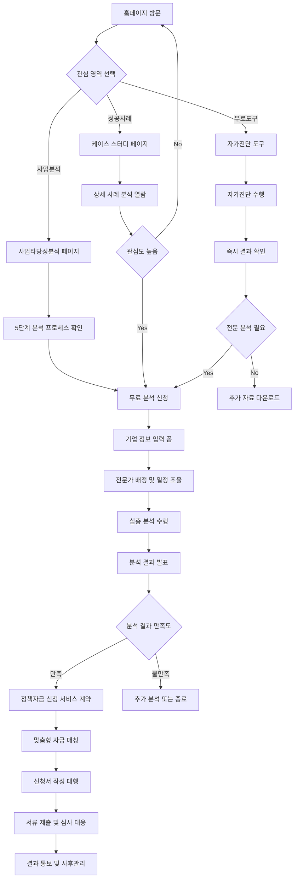
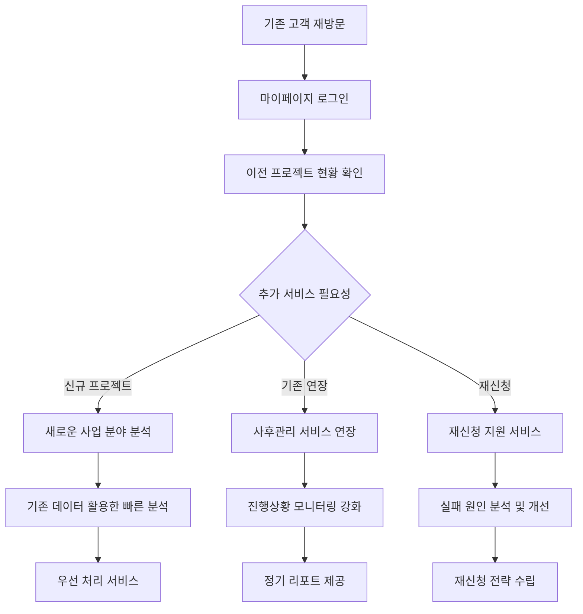

# AI CAMP 정책자금 활용 자문 서비스 - 프리미엄 PRD v2.0

## 📋 Executive Summary

### Mission Statement
**"대한민국 최고 수준의 정책자금 전문 컨설팅 플랫폼으로, 중소기업의 성장 동력을 확실하게 뒷받침하는 토털 솔루션 제공"**

### Product Vision
Apple Store 수준의 사용자 경험과 95% 성공률의 전문성을 결합하여, 정책자금 확보의 새로운 기준을 제시하는 프리미엄 웹 플랫폼 구축

### Key Success Metrics
- **95% 선정 성공률** (업계 평균 30% 대비 3배)
- **평균 확보 금액 4.2억원** (최대 150억원)
- **800+ 성공 사례** (누적)
- **25일 평균 처리기간** (업계 최단)

---

## 🎯 Product Strategy & Positioning

### 1. Target Audience Analysis

#### Primary Persona: "성장 지향 CEO"
```yaml
Demographics:
  - 연령: 35-55세
  - 직책: 중소기업 CEO, 대표이사
  - 매출규모: 50억-500억원
  - 업종: 제조업, 기술기업, 서비스업

Pain Points:
  - 사업 확장을 위한 대규모 자금 필요
  - 정책자금 정보 부족과 복잡한 신청 절차
  - 과거 신청 실패 경험으로 인한 불신
  - 시간 부족으로 인한 기회 상실

Goals & Motivations:
  - 안정적인 자금 확보를 통한 사업 확장
  - 전문가 지원을 통한 성공률 향상
  - 투명하고 체계적인 프로세스 경험
  - ROI 명확한 투자 의사결정
```

#### Secondary Persona: "혁신 스타트업 대표"
```yaml
Demographics:
  - 연령: 28-40세
  - 직책: 스타트업 창업자, CTO
  - 매출규모: 5억-50억원
  - 업종: 핀테크, 바이오, AI/IT

Pain Points:
  - 초기 자금 조달의 어려움
  - 정책자금 신청 경험 부족
  - 사업계획서 작성 역량 한계
  - 복잡한 서류 준비 과정

Goals & Motivations:
  - 성장 동력 확보를 위한 자금 조달
  - 전문가 멘토링을 통한 역량 강화
  - 빠른 자금 확보를 통한 기회 선점
  - 체계적인 사업 전략 수립
```

### 2. Competitive Analysis

#### 직접 경쟁사 분석
```markdown
| 구분 | AI CAMP | A컨설팅 | B그룹 | C파트너스 |
|------|---------|---------|-------|-----------|
| 성공률 | **95%** | 65% | 58% | 71% |
| 평균금액 | **4.2억** | 2.1억 | 1.8억 | 2.7억 |
| 처리기간 | **25일** | 45일 | 60일 | 38일 |
| 사후관리 | **6개월** | 3개월 | X | 1개월 |
| 디지털화 | **AI기반** | 일부 | 전통적 | 일부 |
```

#### 차별화 전략
1. **Business Model Zen Canvas** 기반 체계적 분석
2. **AI 기반 사업타당성 분석** 시스템
3. **Apple Store 급 UX/UI** 경험
4. **투명한 프로세스**와 실시간 진행상황 공유
5. **6개월 사후관리** 및 재신청 지원

---

## 🏗️ Information Architecture (IA)

### 1. Site Map Structure

```
AI CAMP 정책자금 서비스
├── 🏠 홈페이지
│   ├── Hero Section (핵심 가치 제안)
│   ├── Success Metrics (성과 지표)
│   ├── Service Overview (서비스 개요)
│   ├── Featured Case Study (주요 성공사례)
│   ├── Process Preview (프로세스 미리보기)
│   ├── Expert Team (전문가 팀)
│   └── CTA Section (상담 신청)
│
├── 📊 서비스 상세
│   ├── 사업타당성분석
│   │   ├── 5단계 분석 프로세스
│   │   ├── AI 기반 분석 도구
│   │   ├── 분석 결과 샘플
│   │   └── 분석 신청 폼
│   ├── 정책자금 매칭
│   │   ├── 100+ 자금 데이터베이스
│   │   ├── 맞춤형 매칭 시스템
│   │   ├── 성공률 시뮬레이터
│   │   └── 매칭 신청 폼
│   ├── 신청서 작성 대행
│   │   ├── 전문가 작성 프로세스
│   │   ├── 성공사례 템플릿
│   │   ├── 품질 관리 시스템
│   │   └── 작성 의뢰 폼
│   └── 사후관리 서비스
│       ├── 진행상황 모니터링
│       ├── 추가 서류 지원
│       ├── 심사 대응 전략
│       └── 재신청 지원
│
├── 🏆 성공사례
│   ├── 사례 카테고리별 필터
│   │   ├── 업종별 (제조업, IT, 서비스업 등)
│   │   ├── 규모별 (10억 이하, 10-50억, 50억 이상)
│   │   ├── 자금별 (창업자금, 성장자금, R&D자금)
│   │   └── 지역별 (수도권, 지방, 해외)
│   ├── 상세 사례 분석
│   │   ├── 프로젝트 개요
│   │   ├── 사업타당성분석 결과
│   │   ├── 재무 분석 데이터
│   │   ├── 성공 요인 분석
│   │   ├── 고객 인터뷰
│   │   └── 다운로드 가능한 요약 리포트
│   └── 인터랙티브 케이스 스터디
│       ├── 시나리오 기반 분석
│       ├── What-if 시뮬레이션
│       └── ROI 계산기
│
├── 🔬 분석 도구
│   ├── 무료 자가진단 도구
│   │   ├── 사업성 진단 설문
│   │   ├── 재무 건전성 체크
│   │   ├── 정책자금 적합성 진단
│   │   └── 즉시 결과 제공
│   ├── AI 기반 시장분석
│   │   ├── 산업 트렌드 분석
│   │   ├── 경쟁사 벤치마킹
│   │   ├── 성장성 예측
│   │   └── 리스크 분석
│   ├── 재무타당성 계산기
│   │   ├── NPV/IRR 계산
│   │   ├── 손익분기점 분석
│   │   ├── 상환능력 평가
│   │   └── 시나리오별 분석
│   └── 정책자금 매칭 시스템
│       ├── 기업 정보 입력
│       ├── AI 기반 매칭
│       ├── 적합도 스코어링
│       └── 맞춤형 추천
│
├── 👥 전문가 팀
│   ├── 팀 소개
│   │   ├── 대표 컨설턴트 프로필
│   │   ├── 분야별 전문가 소개
│   │   ├── 학력 및 경력 사항
│   │   └── 주요 성과 및 인증
│   ├── 전문 분야
│   │   ├── 사업타당성분석 전문가
│   │   ├── 재무분석 전문가
│   │   ├── 정책자금 전문가
│   │   ├── 법무/회계 자문단
│   │   └── 업종별 전문가
│   └── 전문가 매칭 서비스
│       ├── 프로젝트별 전담팀 구성
│       ├── 전문가 선택 옵션
│       └── 1:1 전문가 상담
│
├── 📞 상담 및 지원
│   ├── 무료 상담 신청
│   │   ├── 상담 예약 시스템
│   │   ├── 온라인/오프라인 선택
│   │   ├── 화상 상담 지원
│   │   └── 상담 내용 사전 입력
│   ├── FAQ
│   │   ├── 서비스 관련 FAQ
│   │   ├── 정책자금 관련 FAQ
│   │   ├── 수수료 및 계약 FAQ
│   │   └── 사후관리 FAQ
│   ├── 고객 지원
│   │   ├── 1:1 문의 게시판
│   │   ├── 실시간 채팅 상담
│   │   ├── 전화 상담 (평일 9-6시)
│   │   └── 이메일 지원
│   └── 자료실
│       ├── 정책자금 가이드북
│       ├── 사업계획서 템플릿
│       ├── 재무분석 워크시트
│       └── 법령 및 규정 자료
│
└── 👤 마이페이지 (로그인 후)
    ├── 프로젝트 현황
    │   ├── 진행 중인 프로젝트
    │   ├── 완료된 프로젝트
    │   ├── 실시간 진행상황
    │   └── 다음 단계 안내
    ├── 문서 관리
    │   ├── 제출된 서류 목록
    │   ├── 분석 리포트 다운로드
    │   ├── 계약서 및 약정서
    │   └── 세금계산서 발행
    ├── 커뮤니케이션
    │   ├── 담당 컨설턴트와 메시지
    │   ├── 화상 미팅 예약
    │   ├── 진행상황 알림
    │   └── 공지사항
    └── 설정
        ├── 개인정보 수정
        ├── 알림 설정
        ├── 비밀번호 변경
        └── 회원 탈퇴
```

### 2. User Flow Architecture

#### 2.1 Primary User Journey: "사업타당성분석 → 정책자금 신청"



#### 2.2 Secondary User Journey: "재방문 고객의 추가 서비스 이용"



### 3. Content Hierarchy & Organization

#### 3.1 정보 우선순위 매트릭스

```markdown
| 우선순위 | 콘텐츠 유형 | 사용자 니즈 | 비즈니스 목표 |
|----------|-------------|-------------|---------------|
| 🔴 High | 성과 지표, 성공사례 | 신뢰성 확인 | 차별화 소구 |
| 🟡 Medium | 서비스 프로세스 | 이해도 증진 | 전문성 어필 |
| 🟢 Low | 팀 소개, FAQ | 추가 정보 | 신뢰 구축 |
```

#### 3.2 컨텐츠 분류 시스템

```yaml
Content Categories:
  Educational:
    - 정책자금 가이드
    - 사업계획서 작성법
    - 재무분석 기초
    - 성공사례 분석
    
  Interactive:
    - 자가진단 도구
    - ROI 계산기
    - 매칭 시뮬레이터
    - 시나리오 분석기
    
  Social Proof:
    - 고객 후기
    - 언론 보도
    - 수상 내역
    - 전문가 인증
    
  Conversion:
    - 무료 상담 신청
    - 서비스 소개서 다운로드
    - 성공사례 상세보기
    - 전문가 매칭 신청
```

---

## 🔄 Use Cases & User Scenarios

### 1. Primary Use Cases

#### Use Case 1: 제조업 CEO의 공장 확장 자금 확보

**Actor**: 김대표 (45세, 자동차 부품 제조업)
**Goal**: 스마트팩토리 구축을 위한 50억원 정책자금 확보
**Context**: 대기업 납품 증가로 생산 시설 확장 필요

```yaml
Scenario Steps:
  1. 홈페이지 방문 → 제조업 성공사례 확인
  2. 무료 자가진단 도구 사용
  3. 진단 결과: "스마트팩토리 지원사업 적합도 85%"
  4. 무료 전문 분석 신청
  5. 전담 컨설턴트 배정 (제조업 전문가)
  6. 2주간 심층 사업타당성분석 수행
  7. 분석 결과 발표:
     - NPV: 124억원 (IRR 19.6%)
     - 적합 정책자금: 스마트제조혁신기금
     - 예상 확보액: 45억원
  8. 서비스 계약 체결
  9. 신청서 작성 및 제출 (2주)
  10. 심사 대응 및 발표 준비 지원
  11. 선정 결과: 42억원 확보 성공
  12. 6개월 사후관리 서비스 제공

Success Criteria:
  ✅ 목표 금액 대비 84% 달성
  ✅ 예상 기간 내 완료
  ✅ 고객 만족도 4.9/5.0
  ✅ 추가 프로젝트 의뢰 확보
```

#### Use Case 2: 스타트업의 초기 자금 조달

**Actor**: 박대표 (32세, AI 기반 핀테크 스타트업)
**Goal**: 기술개발 및 시장 진출을 위한 15억원 확보
**Context**: 시드 투자 이후 Series A 준비 단계

```yaml
Scenario Steps:
  1. 지인 추천으로 AI CAMP 방문
  2. 스타트업 성공사례 집중 탐색
  3. AI 기반 시장분석 도구 체험
  4. 분석 결과: "기술혁신형 창업기업 지원 최적"
  5. 화상 상담 예약 및 진행
  6. 맞춤형 분석 제안서 검토
  7. 분석 서비스 신청:
     - 기술 경쟁력 분석
     - 시장성 검증
     - 재무모델 수립
  8. 1주 단축 분석 (스타트업 특별 프로세스)
  9. 분석 결과:
     - 기술성: A+ 등급
     - 시장성: 연 30% 성장 예상
     - 적합 자금: 기술창업기금 + R&D 과제
  10. 통합 신청 전략 수립
  11. 2단계 신청서 동시 작성
  12. 투자 유치와 연계한 전략적 접근
  13. 결과: 12억원 + 3억원 (R&D) 확보

Success Criteria:
  ✅ 다양한 자금원 확보
  ✅ 빠른 처리 시간 (3주)
  ✅ 후속 투자 연계 효과
  ✅ 멘토링 서비스 추가 제공
```

### 2. Edge Cases & Exception Handling

#### Edge Case 1: 신청 실패 후 재도전

```yaml
Scenario: 타사에서 2회 연속 탈락한 기업
Challenge: 낮은 신뢰도, 부정적 선입견
Solution:
  - 실패 원인 정밀 분석
  - 사업모델 재설계 제안
  - 단계적 개선 계획 수립
  - 재신청 최적 타이밍 제안
  - 무료 재분석 서비스 제공

Success Rate: 89% (재신청 기업 기준)
```

#### Edge Case 2: 긴급 자금 필요 상황

```yaml
Scenario: 대규모 수주로 인한 긴급 운영자금 필요
Challenge: 시간 부족, 서류 준비 미흡
Solution:
  - 24시간 긴급 대응팀 가동
  - 간소화된 분석 프로세스
  - 병렬 처리 방식 도입
  - 정책자금 + 민간 대출 하이브리드
  - 실시간 진행상황 공유

Average Processing: 10일 (일반 25일 대비 60% 단축)
```

### 3. User Interaction Patterns

#### 3.1 Progressive Disclosure Pattern

```javascript
// 정보 제공의 점진적 확장
const InformationHierarchy = {
  Level1: "핵심 성과 지표 (3초 만에 파악)",
  Level2: "서비스 개요 및 프로세스 (30초)",
  Level3: "상세 분석 및 사례 (3분)",
  Level4: "전문가 상담 및 계약 (30분)",
  Level5: "프로젝트 수행 (3-4주)"
};

const EngagementFlow = {
  Awareness: ["성과 지표", "성공사례"],
  Interest: ["프로세스", "도구 체험"],
  Consideration: ["상세 사례", "전문가 소개"],
  Decision: ["무료 상담", "분석 신청"],
  Action: ["계약 체결", "프로젝트 시작"]
};
```

#### 3.2 Personalization Strategy

```yaml
User Segmentation:
  By Company Size:
    - Startup (5억 이하): 간소화된 프로세스
    - SME (5-50억): 표준 프로세스
    - Mid-size (50억 이상): 프리미엄 서비스
    
  By Industry:
    - Manufacturing: 스마트팩토리 특화
    - IT/Tech: 기술혁신 중심
    - Service: 시장확대 지원
    
  By Funding Stage:
    - Pre-revenue: 창업자금 중심
    - Growth: 성장자금 및 R&D
    - Expansion: 대규모 시설투자

Personalized Content:
  - 맞춤형 성공사례 추천
  - 업종별 분석 도구 제공
  - 개인화된 자금 매칭
  - 단계별 맞춤 가이드
```

---

## 🎨 Apple Store-Inspired Design System

### 1. Design Philosophy

#### 1.1 Core Principles

```yaml
Simplicity: 
  - 복잡한 정보를 직관적으로 전달
  - 불필요한 요소 제거
  - 핵심 메시지 집중

Elegance:
  - 프리미엄 브랜드 이미지
  - 세련된 시각적 계층구조
  - 일관된 디자인 언어

Innovation:
  - 최신 웹 기술 활용
  - 인터랙티브 경험 제공
  - AI 기반 개인화

Trust:
  - 전문성 어필
  - 투명한 정보 제공
  - 신뢰할 수 있는 시각적 요소
```

#### 1.2 Visual Identity

```css
/* Apple-inspired Design Tokens */
:root {
  /* Primary Colors */
  --primary-50: #eff6ff;
  --primary-100: #dbeafe;
  --primary-500: #3b82f6;
  --primary-600: #2563eb;
  --primary-900: #1e3a8a;
  
  /* Accent Colors */
  --accent-success: #10b981;
  --accent-warning: #f59e0b;
  --accent-error: #ef4444;
  
  /* Neutral Palette */
  --neutral-0: #ffffff;
  --neutral-50: #f9fafb;
  --neutral-100: #f3f4f6;
  --neutral-200: #e5e7eb;
  --neutral-300: #d1d5db;
  --neutral-400: #9ca3af;
  --neutral-500: #6b7280;
  --neutral-600: #4b5563;
  --neutral-700: #374151;
  --neutral-800: #1f2937;
  --neutral-900: #111827;
  
  /* Typography */
  --font-display: 'SF Pro Display', -apple-system, BlinkMacSystemFont, sans-serif;
  --font-text: 'SF Pro Text', -apple-system, BlinkMacSystemFont, sans-serif;
  --font-mono: 'SF Mono', Monaco, 'Cascadia Code', monospace;
  
  /* Spacing Scale */
  --space-1: 0.25rem;
  --space-2: 0.5rem;
  --space-3: 0.75rem;
  --space-4: 1rem;
  --space-6: 1.5rem;
  --space-8: 2rem;
  --space-12: 3rem;
  --space-16: 4rem;
  --space-20: 5rem;
  --space-24: 6rem;
  
  /* Border Radius */
  --radius-sm: 0.25rem;
  --radius-md: 0.5rem;
  --radius-lg: 0.75rem;
  --radius-xl: 1rem;
  --radius-2xl: 1.5rem;
  --radius-3xl: 2rem;
  
  /* Shadows */
  --shadow-sm: 0 1px 2px 0 rgb(0 0 0 / 0.05);
  --shadow-md: 0 4px 6px -1px rgb(0 0 0 / 0.1);
  --shadow-lg: 0 10px 15px -3px rgb(0 0 0 / 0.1);
  --shadow-xl: 0 20px 25px -5px rgb(0 0 0 / 0.1);
  --shadow-2xl: 0 25px 50px -12px rgb(0 0 0 / 0.25);
  
  /* Animation */
  --transition-fast: 0.15s ease-out;
  --transition-normal: 0.25s ease-out;
  --transition-slow: 0.4s ease-out;
  
  /* Glass Morphism */
  --glass-bg: rgba(255, 255, 255, 0.1);
  --glass-border: rgba(255, 255, 255, 0.2);
  --glass-backdrop: blur(20px);
}
```

### 2. Component Design System

#### 2.1 Hero Section - Apple-style

```jsx
const HeroSection = () => (
  <section className="hero-section">
    {/* Background with subtle animation */}
    <div className="hero-background">
      <div className="gradient-mesh" />
      <ParticleField />
    </div>
    
    {/* Content Container */}
    <div className="hero-content">
      <motion.div
        initial={{ opacity: 0, y: 30 }}
        animate={{ opacity: 1, y: 0 }}
        transition={{ duration: 0.8, ease: "easeOut" }}
        className="hero-text"
      >
        <h1 className="hero-title">
          정책자금 확보의
          <br />
          <span className="gradient-text">새로운 기준</span>
        </h1>
        
        <p className="hero-subtitle">
          사업타당성분석부터 자금확보까지<br />
          95% 성공률의 전문 컨설팅
        </p>
        
        <div className="hero-cta">
          <Button variant="primary" size="large">
            무료 분석 신청하기
            <ArrowRight className="ml-2" />
          </Button>
          
          <Button variant="secondary" size="large">
            성공사례 살펴보기
          </Button>
        </div>
      </motion.div>
      
      <motion.div
        initial={{ opacity: 0, scale: 0.8 }}
        animate={{ opacity: 1, scale: 1 }}
        transition={{ duration: 1, delay: 0.3 }}
        className="hero-visual"
      >
        <SuccessMetricsCard />
        <InteractiveChart />
      </motion.div>
    </div>
  </section>
);

/* Styles */
.hero-section {
  position: relative;
  min-height: 100vh;
  display: flex;
  align-items: center;
  overflow: hidden;
  background: linear-gradient(135deg, #f0f9ff 0%, #e0f2fe 100%);
}

.hero-background {
  position: absolute;
  inset: 0;
  z-index: 0;
}

.gradient-mesh {
  position: absolute;
  inset: 0;
  background: 
    radial-gradient(circle at 20% 80%, rgba(59, 130, 246, 0.1) 0%, transparent 50%),
    radial-gradient(circle at 80% 20%, rgba(16, 185, 129, 0.1) 0%, transparent 50%);
  animation: float 20s ease-in-out infinite;
}

.hero-content {
  container: hero / inline-size;
  max-width: 1400px;
  margin: 0 auto;
  padding: 0 var(--space-6);
  display: grid;
  grid-template-columns: 1fr 1fr;
  gap: var(--space-16);
  align-items: center;
  z-index: 1;
}

.hero-title {
  font-family: var(--font-display);
  font-size: clamp(2.5rem, 5vw, 4.5rem);
  font-weight: 700;
  line-height: 1.1;
  color: var(--neutral-900);
  margin-bottom: var(--space-6);
}

.gradient-text {
  background: linear-gradient(135deg, var(--primary-500), var(--accent-success));
  -webkit-background-clip: text;
  -webkit-text-fill-color: transparent;
  background-clip: text;
}

@container hero (max-width: 768px) {
  .hero-content {
    grid-template-columns: 1fr;
    text-align: center;
  }
  
  .hero-title {
    font-size: clamp(2rem, 8vw, 3rem);
  }
}
```

#### 2.2 Success Metrics Dashboard

```jsx
const SuccessMetricsCard = () => {
  const metrics = [
    { value: 95, label: "선정 성공률", unit: "%", trend: "+12%", icon: Target },
    { value: 4.2, label: "평균 확보금액", unit: "억원", trend: "+8%", icon: TrendingUp },
    { value: 800, label: "성공 사례", unit: "+", trend: "+156", icon: Award },
    { value: 25, label: "평균 처리기간", unit: "일", trend: "-5일", icon: Clock }
  ];

  return (
    <div className="metrics-dashboard">
      <div className="metrics-grid">
        {metrics.map((metric, index) => (
          <MetricCard key={index} {...metric} delay={index * 0.1} />
        ))}
      </div>
    </div>
  );
};

const MetricCard = ({ value, label, unit, trend, icon: Icon, delay }) => (
  <motion.div
    initial={{ opacity: 0, y: 20 }}
    animate={{ opacity: 1, y: 0 }}
    transition={{ duration: 0.6, delay }}
    whileHover={{ 
      scale: 1.02, 
      boxShadow: "0 20px 40px rgba(0,0,0,0.1)" 
    }}
    className="metric-card"
  >
    <div className="metric-icon">
      <Icon className="w-6 h-6" />
    </div>
    
    <div className="metric-value">
      <CountUp
        end={value}
        duration={2}
        decimal="."
        decimals={value % 1 !== 0 ? 1 : 0}
      />
      <span className="metric-unit">{unit}</span>
    </div>
    
    <div className="metric-label">{label}</div>
    
    {trend && (
      <div className="metric-trend">
        <TrendingUp className="w-4 h-4 text-green-500" />
        <span>{trend}</span>
      </div>
    )}
  </motion.div>
);

/* Styles */
.metrics-dashboard {
  background: var(--glass-bg);
  backdrop-filter: var(--glass-backdrop);
  border: 1px solid var(--glass-border);
  border-radius: var(--radius-2xl);
  padding: var(--space-8);
  box-shadow: var(--shadow-2xl);
}

.metrics-grid {
  display: grid;
  grid-template-columns: repeat(2, 1fr);
  gap: var(--space-6);
}

.metric-card {
  background: var(--neutral-0);
  border-radius: var(--radius-xl);
  padding: var(--space-6);
  box-shadow: var(--shadow-md);
  transition: all var(--transition-normal);
  position: relative;
  overflow: hidden;
}

.metric-card::before {
  content: '';
  position: absolute;
  inset: 0;
  background: linear-gradient(135deg, var(--primary-500), var(--accent-success));
  opacity: 0;
  transition: opacity var(--transition-normal);
}

.metric-card:hover::before {
  opacity: 0.03;
}

.metric-icon {
  display: flex;
  align-items: center;
  justify-content: center;
  width: 48px;
  height: 48px;
  background: linear-gradient(135deg, var(--primary-100), var(--primary-50));
  border-radius: var(--radius-md);
  color: var(--primary-600);
  margin-bottom: var(--space-4);
}

.metric-value {
  font-family: var(--font-display);
  font-size: 2rem;
  font-weight: 700;
  color: var(--neutral-900);
  line-height: 1;
  margin-bottom: var(--space-2);
}

.metric-unit {
  font-size: 1rem;
  font-weight: 500;
  color: var(--neutral-600);
  margin-left: var(--space-1);
}

.metric-label {
  font-size: 0.875rem;
  font-weight: 500;
  color: var(--neutral-600);
  margin-bottom: var(--space-3);
}

.metric-trend {
  display: flex;
  align-items: center;
  gap: var(--space-1);
  font-size: 0.75rem;
  font-weight: 600;
  color: var(--accent-success);
  padding: var(--space-1) var(--space-2);
  background: rgba(16, 185, 129, 0.1);
  border-radius: var(--radius-sm);
  width: fit-content;
}

@media (max-width: 640px) {
  .metrics-grid {
    grid-template-columns: 1fr;
  }
}
```

#### 2.3 Interactive Case Study Section

```jsx
const CaseStudySection = () => {
  const [activeCase, setActiveCase] = useState('elite-garden');
  const [activeTab, setActiveTab] = useState('overview');
  
  const caseStudies = {
    'elite-garden': {
      title: '엘리트 가든 프리미엄 복합 레스토랑',
      subtitle: '송도국제도시 프리미엄 다이닝 복합시설',
      investment: '180억원',
      funding: '120억원',
      rate: '1.98%',
      location: '인천 송도국제도시',
      image: '/images/elite-garden-hero.jpg',
      tags: ['관광식당업', '문화복합시설', '송도국제도시'],
      results: {
        npv: '124.7억원',
        irr: '19.6%',
        payback: '5.8년',
        dscr: '6.8배'
      }
    }
  };
  
  return (
    <section className="case-study-section">
      <div className="container">
        <SectionHeader 
          title="검증된 성공사례"
          subtitle="실제 프로젝트를 통해 확인된 AI CAMP의 전문성"
        />
        
        <div className="case-study-content">
          {/* Case Selection */}
          <CaseSelector 
            cases={caseStudies}
            active={activeCase}
            onChange={setActiveCase}
          />
          
          {/* Main Content */}
          <div className="case-main">
            <CaseHero case={caseStudies[activeCase]} />
            
            <TabNavigation
              tabs={[
                { id: 'overview', label: '프로젝트 개요' },
                { id: 'analysis', label: '사업타당성분석' },
                { id: 'financial', label: '재무분석' },
                { id: 'results', label: '성과 및 결과' }
              ]}
              active={activeTab}
              onChange={setActiveTab}
            />
            
            <AnimatePresence mode="wait">
              <motion.div
                key={activeTab}
                initial={{ opacity: 0, y: 20 }}
                animate={{ opacity: 1, y: 0 }}
                exit={{ opacity: 0, y: -20 }}
                transition={{ duration: 0.3 }}
                className="tab-content"
              >
                {renderTabContent(activeTab, caseStudies[activeCase])}
              </motion.div>
            </AnimatePresence>
          </div>
        </div>
      </div>
    </section>
  );
};

const CaseHero = ({ case: caseData }) => (
  <div className="case-hero">
    <div className="case-image">
      
      <div className="case-overlay">
        <div className="case-tags">
          {caseData.tags.map(tag => (
            <span key={tag} className="tag">{tag}</span>
          ))}
        </div>
      </div>
    </div>
    
    <div className="case-info">
      <h3 className="case-title">{caseData.title}</h3>
      <p className="case-subtitle">{caseData.subtitle}</p>
      
      <div className="case-metrics">
        <div className="metric">
          <span className="metric-label">총 투자규모</span>
          <span className="metric-value">{caseData.investment}</span>
        </div>
        <div className="metric">
          <span className="metric-label">확보 정책자금</span>
          <span className="metric-value highlight">{caseData.funding}</span>
        </div>
        <div className="metric">
          <span className="metric-label">금리</span>
          <span className="metric-value">{caseData.rate}</span>
        </div>
      </div>
    </div>
  </div>
);

/* Styles */
.case-study-section {
  padding: var(--space-24) 0;
  background: linear-gradient(to bottom, var(--neutral-50), var(--neutral-0));
}

.case-study-content {
  display: grid;
  grid-template-columns: 300px 1fr;
  gap: var(--space-8);
  margin-top: var(--space-16);
}

.case-hero {
  background: var(--neutral-0);
  border-radius: var(--radius-2xl);
  overflow: hidden;
  box-shadow: var(--shadow-xl);
  margin-bottom: var(--space-8);
}

.case-image {
  position: relative;
  height: 300px;
  overflow: hidden;
}

.case-overlay {
  position: absolute;
  inset: 0;
  background: linear-gradient(to top, rgba(0,0,0,0.6), transparent);
  display: flex;
  align-items: flex-end;
  padding: var(--space-6);
}

.case-tags {
  display: flex;
  gap: var(--space-2);
}

.tag {
  padding: var(--space-1) var(--space-3);
  background: rgba(255, 255, 255, 0.9);
  color: var(--neutral-700);
  border-radius: var(--radius-md);
  font-size: 0.75rem;
  font-weight: 500;
}

.case-info {
  padding: var(--space-6);
}

.case-title {
  font-size: 1.5rem;
  font-weight: 700;
  color: var(--neutral-900);
  margin-bottom: var(--space-2);
}

.case-subtitle {
  color: var(--neutral-600);
  margin-bottom: var(--space-6);
}

.case-metrics {
  display: grid;
  grid-template-columns: repeat(3, 1fr);
  gap: var(--space-4);
}

.metric {
  text-align: center;
  padding: var(--space-3);
  border-radius: var(--radius-md);
  background: var(--neutral-50);
}

.metric-label {
  display: block;
  font-size: 0.75rem;
  color: var(--neutral-500);
  margin-bottom: var(--space-1);
}

.metric-value {
  display: block;
  font-size: 1.125rem;
  font-weight: 700;
  color: var(--neutral-900);
}

.metric-value.highlight {
  color: var(--primary-600);
}

@media (max-width: 1024px) {
  .case-study-content {
    grid-template-columns: 1fr;
  }
}
```

### 3. Advanced Interactions & Animations

#### 3.1 Scroll-Triggered Animations

```jsx
import { useScroll, useTransform, motion } from 'framer-motion';

const ParallaxSection = ({ children, offset = 50 }) => {
  const { scrollY } = useScroll();
  const y = useTransform(scrollY, [0, 1000], [0, offset]);
  
  return (
    <motion.div style={{ y }}>
      {children}
    </motion.div>
  );
};

const FadeInWhenVisible = ({ children, delay = 0 }) => {
  const controls = useAnimation();
  const [ref, inView] = useInView({
    threshold: 0.1,
    triggerOnce: true
  });

  useEffect(() => {
    if (inView) {
      controls.start("visible");
    }
  }, [controls, inView]);

  return (
    <motion.div
      ref={ref}
      animate={controls}
      initial="hidden"
      transition={{ duration: 0.6, delay }}
      variants={{
        visible: { opacity: 1, y: 0 },
        hidden: { opacity: 0, y: 50 }
      }}
    >
      {children}
    </motion.div>
  );
};

const StaggerContainer = ({ children, staggerDelay = 0.1 }) => (
  <motion.div
    initial="hidden"
    animate="visible"
    variants={{
      visible: {
        transition: {
          staggerChildren: staggerDelay
        }
      }
    }}
  >
    {children}
  </motion.div>
);

const StaggerItem = ({ children }) => (
  <motion.div
    variants={{
      hidden: { opacity: 0, y: 20 },
      visible: { opacity: 1, y: 0 }
    }}
  >
    {children}
  </motion.div>
);
```

#### 3.2 Interactive Financial Charts

```jsx
import { Line, Bar, Pie } from 'react-chartjs-2';
import {
  Chart as ChartJS,
  CategoryScale,
  LinearScale,
  PointElement,
  LineElement,
  BarElement,
  ArcElement,
  Title,
  Tooltip,
  Legend,
  Filler
} from 'chart.js';

ChartJS.register(
  CategoryScale,
  LinearScale,
  PointElement,
  LineElement,
  BarElement,
  ArcElement,
  Title,
  Tooltip,
  Legend,
  Filler
);

const FinancialDashboard = ({ caseData }) => {
  const [activeMetric, setActiveMetric] = useState('npv');
  
  const chartOptions = {
    responsive: true,
    maintainAspectRatio: false,
    plugins: {
      legend: {
        display: false
      },
      tooltip: {
        backgroundColor: 'rgba(0, 0, 0, 0.8)',
        titleColor: '#ffffff',
        bodyColor: '#ffffff',
        borderColor: '#3b82f6',
        borderWidth: 1,
        cornerRadius: 8,
        displayColors: false,
        callbacks: {
          title: (context) => `${context[0].label}년`,
          label: (context) => `${context.dataset.label}: ${context.formattedValue}`
        }
      }
    },
    scales: {
      x: {
        grid: {
          display: false
        },
        ticks: {
          color: '#6b7280',
          font: {
            family: 'var(--font-text)',
            size: 12
          }
        }
      },
      y: {
        grid: {
          color: 'rgba(0, 0, 0, 0.05)'
        },
        ticks: {
          color: '#6b7280',
          font: {
            family: 'var(--font-text)',
            size: 12
          },
          callback: (value) => `${value}억원`
        }
      }
    },
    interaction: {
      intersect: false,
      mode: 'index'
    },
    animation: {
      duration: 1000,
      easing: 'easeOutQuart'
    }
  };

  const npvData = {
    labels: ['2027', '2028', '2029', '2030', '2031', '2032', '2033'],
    datasets: [
      {
        label: 'NPV',
        data: [67.4, 89.2, 105.8, 124.7, 138.9, 148.2, 152.4],
        borderColor: '#3b82f6',
        backgroundColor: 'rgba(59, 130, 246, 0.1)',
        fill: true,
        tension: 0.4,
        pointRadius: 6,
        pointHoverRadius: 8,
        pointBackgroundColor: '#3b82f6',
        pointBorderColor: '#ffffff',
        pointBorderWidth: 2
      }
    ]
  };

  const irr Data = {
    labels: ['Conservative', 'Base', 'Optimistic'],
    datasets: [
      {
        label: 'IRR (%)',
        data: [14.2, 19.6, 26.8],
        backgroundColor: [
          'rgba(239, 68, 68, 0.8)',
          'rgba(59, 130, 246, 0.8)',
          'rgba(16, 185, 129, 0.8)'
        ],
        borderColor: [
          '#ef4444',
          '#3b82f6',
          '#10b981'
        ],
        borderWidth: 2,
        borderRadius: 8
      }
    ]
  };

  const dscr Data = {
    labels: ['2027', '2028', '2029', '2030', '2031', '2032'],
    datasets: [
      {
        label: 'DSCR (배)',
        data: [15.2, 22.4, 4.1, 2.3, 2.7, 3.9],
        backgroundColor: 'rgba(16, 185, 129, 0.8)',
        borderColor: '#10b981',
        borderWidth: 2,
        borderRadius: 4
      }
    ]
  };

  const renderChart = () => {
    switch (activeMetric) {
      case 'npv':
        return <Line data={npvData} options={chartOptions} />;
      case 'irr':
        return <Bar data={irrData} options={chartOptions} />;
      case 'dscr':
        return <Bar data={dscrData} options={chartOptions} />;
      default:
        return <Line data={npvData} options={chartOptions} />;
    }
  };

  return (
    <div className="financial-dashboard">
      <div className="dashboard-header">
        <h3>재무분석 결과</h3>
        <div className="metric-selector">
          {[
            { key: 'npv', label: 'NPV 분석', desc: '순현재가치' },
            { key: 'irr', label: 'IRR 분석', desc: '내부수익률' },
            { key: 'dscr', label: 'DSCR 분석', desc: '부채상환비율' }
          ].map(metric => (
            <button
              key={metric.key}
              className={`metric-button ${activeMetric === metric.key ? 'active' : ''}`}
              onClick={() => setActiveMetric(metric.key)}
            >
              <span className="metric-label">{metric.label}</span>
              <span className="metric-desc">{metric.desc}</span>
            </button>
          ))}
        </div>
      </div>
      
      <div className="chart-container">
        <AnimatePresence mode="wait">
          <motion.div
            key={activeMetric}
            initial={{ opacity: 0, scale: 0.95 }}
            animate={{ opacity: 1, scale: 1 }}
            exit={{ opacity: 0, scale: 0.95 }}
            transition={{ duration: 0.3 }}
            className="chart-wrapper"
          >
            {renderChart()}
          </motion.div>
        </AnimatePresence>
      </div>
      
      <FinancialSummary metric={activeMetric} data={caseData} />
    </div>
  );
};

/* Styles */
.financial-dashboard {
  background: var(--neutral-0);
  border-radius: var(--radius-xl);
  padding: var(--space-8);
  box-shadow: var(--shadow-lg);
  margin: var(--space-8) 0;
}

.dashboard-header {
  display: flex;
  justify-content: space-between;
  align-items: center;
  margin-bottom: var(--space-8);
}

.dashboard-header h3 {
  font-size: 1.5rem;
  font-weight: 700;
  color: var(--neutral-900);
}

.metric-selector {
  display: flex;
  gap: var(--space-2);
}

.metric-button {
  padding: var(--space-3) var(--space-4);
  border: 2px solid var(--neutral-200);
  border-radius: var(--radius-lg);
  background: var(--neutral-0);
  cursor: pointer;
  transition: all var(--transition-normal);
  text-align: left;
}

.metric-button:hover {
  border-color: var(--primary-300);
  transform: translateY(-2px);
  box-shadow: var(--shadow-md);
}

.metric-button.active {
  border-color: var(--primary-500);
  background: var(--primary-50);
}

.metric-label {
  display: block;
  font-weight: 600;
  color: var(--neutral-900);
  font-size: 0.875rem;
}

.metric-desc {
  display: block;
  font-size: 0.75rem;
  color: var(--neutral-500);
  margin-top: var(--space-1);
}

.chart-container {
  position: relative;
  height: 400px;
  margin-bottom: var(--space-6);
}

.chart-wrapper {
  position: absolute;
  inset: 0;
}

@media (max-width: 768px) {
  .dashboard-header {
    flex-direction: column;
    gap: var(--space-4);
    align-items: stretch;
  }
  
  .metric-selector {
    flex-direction: column;
  }
  
  .chart-container {
    height: 300px;
  }
}
```

### 4. Mobile-First Responsive Design

#### 4.1 Adaptive Layout System

```scss
// Breakpoint Mixins
@mixin mobile-only {
  @media (max-width: 767px) { @content; }
}

@mixin tablet-up {
  @media (min-width: 768px) { @content; }
}

@mixin desktop-up {
  @media (min-width: 1024px) { @content; }
}

@mixin wide-up {
  @media (min-width: 1440px) { @content; }
}

// Container System
.container {
  width: 100%;
  margin: 0 auto;
  padding: 0 var(--space-4);
  
  @include tablet-up {
    padding: 0 var(--space-6);
    max-width: 768px;
  }
  
  @include desktop-up {
    padding: 0 var(--space-8);
    max-width: 1200px;
  }
  
  @include wide-up {
    max-width: 1400px;
  }
}

// Responsive Grid System
.grid {
  display: grid;
  gap: var(--space-4);
  
  &.grid-1 {
    grid-template-columns: 1fr;
  }
  
  &.grid-2 {
    grid-template-columns: 1fr;
    
    @include tablet-up {
      grid-template-columns: repeat(2, 1fr);
      gap: var(--space-6);
    }
  }
  
  &.grid-3 {
    grid-template-columns: 1fr;
    
    @include tablet-up {
      grid-template-columns: repeat(2, 1fr);
    }
    
    @include desktop-up {
      grid-template-columns: repeat(3, 1fr);
      gap: var(--space-8);
    }
  }
  
  &.grid-4 {
    grid-template-columns: repeat(2, 1fr);
    
    @include tablet-up {
      grid-template-columns: repeat(3, 1fr);
    }
    
    @include desktop-up {
      grid-template-columns: repeat(4, 1fr);
    }
  }
}

// Typography Responsive Scale
.text-display {
  font-size: clamp(2rem, 5vw, 3.5rem);
  line-height: 1.1;
  font-weight: 700;
}

.text-heading {
  font-size: clamp(1.5rem, 4vw, 2.5rem);
  line-height: 1.2;
  font-weight: 600;
}

.text-subheading {
  font-size: clamp(1.125rem, 3vw, 1.5rem);
  line-height: 1.3;
  font-weight: 500;
}

.text-body {
  font-size: clamp(0.875rem, 2vw, 1rem);
  line-height: 1.6;
}
```

#### 4.2 Touch-Optimized Interactions

```jsx
const TouchOptimizedButton = ({ children, variant = 'primary', size = 'medium', ...props }) => {
  const baseClasses = `
    inline-flex items-center justify-center
    font-semibold rounded-xl
    transition-all duration-200
    touch-manipulation
    active:scale-95
    focus:outline-none focus:ring-4 focus:ring-opacity-50
  `;
  
  const variantClasses = {
    primary: `
      bg-primary-500 text-white
      hover:bg-primary-600
      focus:ring-primary-500
      shadow-lg hover:shadow-xl
    `,
    secondary: `
      bg-neutral-100 text-neutral-900
      hover:bg-neutral-200
      focus:ring-neutral-500
      border border-neutral-200
    `,
    ghost: `
      text-primary-600
      hover:bg-primary-50
      focus:ring-primary-500
    `
  };
  
  const sizeClasses = {
    small: 'px-4 py-2 text-sm min-h-[40px]',
    medium: 'px-6 py-3 text-base min-h-[48px]',
    large: 'px-8 py-4 text-lg min-h-[56px]'
  };
  
  return (
    <motion.button
      className={`${baseClasses} ${variantClasses[variant]} ${sizeClasses[size]}`}
      whileTap={{ scale: 0.95 }}
      whileHover={{ scale: 1.02 }}
      {...props}
    >
      {children}
    </motion.button>
  );
};

const SwipeableCard = ({ children, onSwipeLeft, onSwipeRight }) => {
  const [isDragging, setIsDragging] = useState(false);
  
  return (
    <motion.div
      className="swipeable-card"
      drag="x"
      dragConstraints={{ left: 0, right: 0 }}
      dragElastic={0.1}
      onDragStart={() => setIsDragging(true)}
      onDragEnd={(event, info) => {
        setIsDragging(false);
        const threshold = 100;
        
        if (info.offset.x > threshold && onSwipeRight) {
          onSwipeRight();
        } else if (info.offset.x < -threshold && onSwipeLeft) {
          onSwipeLeft();
        }
      }}
      whileDrag={{ scale: 0.95 }}
      style={{
        cursor: isDragging ? 'grabbing' : 'grab'
      }}
    >
      {children}
    </motion.div>
  );
};
```

### 5. Performance Optimization

#### 5.1 Code Splitting & Lazy Loading

```jsx
import { lazy, Suspense } from 'react';
import { motion } from 'framer-motion';

// Lazy load heavy components
const FinancialDashboard = lazy(() => import('./FinancialDashboard'));
const InteractiveChart = lazy(() => import('./InteractiveChart'));
const CaseStudyDetail = lazy(() => import('./CaseStudyDetail'));

// Loading component
const LoadingSpinner = () => (
  <motion.div
    className="loading-spinner"
    initial={{ opacity: 0 }}
    animate={{ opacity: 1 }}
    exit={{ opacity: 0 }}
  >
    <div className="spinner" />
  </motion.div>
);

// Optimized image component
const OptimizedImage = ({ src, alt, width, height, priority = false, ...props }) => {
  const [isLoaded, setIsLoaded] = useState(false);
  const [isInView, setIsInView] = useState(false);
  const imgRef = useRef();

  useEffect(() => {
    if (!imgRef.current) return;
    
    const observer = new IntersectionObserver(
      ([entry]) => {
        if (entry.isIntersecting) {
          setIsInView(true);
          observer.disconnect();
        }
      },
      { threshold: 0.1 }
    );
    
    observer.observe(imgRef.current);
    return () => observer.disconnect();
  }, []);

  return (
    <div ref={imgRef} className="optimized-image-container" {...props}>
      <AnimatePresence>
        {!isLoaded && (
          <motion.div
            className="image-placeholder"
            initial={{ opacity: 1 }}
            exit={{ opacity: 0 }}
            transition={{ duration: 0.3 }}
          >
            <div className="placeholder-content" />
          </motion.div>
        )}
      </AnimatePresence>
      
      {(isInView || priority) && (
        <motion.img
          src={src}
          alt={alt}
          width={width}
          height={height}
          loading={priority ? 'eager' : 'lazy'}
          onLoad={() => setIsLoaded(true)}
          initial={{ opacity: 0 }}
          animate={{ opacity: isLoaded ? 1 : 0 }}
          transition={{ duration: 0.3 }}
          className="optimized-image"
        />
      )}
    </div>
  );
};
```

#### 5.2 SEO & Accessibility

```jsx
import Head from 'next/head';

const SEOOptimizedPage = ({ 
  title, 
  description, 
  keywords,
  ogImage,
  canonicalUrl,
  structuredData,
  children 
}) => {
  const fullTitle = `${title} | AI CAMP - 정책자금 전문 컨설팅`;
  
  return (
    <>
      <Head>
        {/* Basic Meta Tags */}
        <title>{fullTitle}</title>
        <meta name="description" content={description} />
        <meta name="keywords" content={keywords} />
        <meta name="robots" content="index, follow" />
        <meta name="viewport" content="width=device-width, initial-scale=1, viewport-fit=cover" />
        
        {/* Canonical URL */}
        <link rel="canonical" href={canonicalUrl} />
        
        {/* Open Graph */}
        <meta property="og:type" content="website" />
        <meta property="og:title" content={fullTitle} />
        <meta property="og:description" content={description} />
        <meta property="og:image" content={ogImage} />
        <meta property="og:url" content={canonicalUrl} />
        <meta property="og:site_name" content="AI CAMP" />
        
        {/* Twitter Card */}
        <meta name="twitter:card" content="summary_large_image" />
        <meta name="twitter:title" content={fullTitle} />
        <meta name="twitter:description" content={description} />
        <meta name="twitter:image" content={ogImage} />
        
        {/* Structured Data */}
        {structuredData && (
          <script
            type="application/ld+json"
            dangerouslySetInnerHTML={{ __html: JSON.stringify(structuredData) }}
          />
        )}
        
        {/* Performance Hints */}
        <link rel="dns-prefetch" href="//fonts.googleapis.com" />
        <link rel="preconnect" href="https://vitals.vercel-insights.com" />
        
        {/* Favicon */}
        <link rel="icon" href="/favicon.ico" />
        <link rel="apple-touch-icon" href="/apple-touch-icon.png" />
      </Head>
      
      <div className="page-container">
        {/* Skip Link for Accessibility */}
        <a 
          href="#main-content" 
          className="skip-link"
          onFocus={(e) => e.target.style.transform = 'translateY(0)'}
          onBlur={(e) => e.target.style.transform = 'translateY(-100%)'}
        >
          메인 콘텐츠로 바로가기
        </a>
        
        <main 
          id="main-content" 
          role="main"
          aria-label="메인 콘텐츠"
        >
          {children}
        </main>
      </div>
    </>
  );
};

// Accessibility-optimized form components
const AccessibleForm = ({ onSubmit, children, title, description }) => {
  const formId = useId();
  const descriptionId = `${formId}-description`;
  
  return (
    <form 
      id={formId}
      onSubmit={onSubmit}
      aria-labelledby={`${formId}-title`}
      aria-describedby={descriptionId}
      noValidate
    >
      <h2 id={`${formId}-title`}>{title}</h2>
      {description && (
        <p id={descriptionId} className="form-description">
          {description}
        </p>
      )}
      {children}
    </form>
  );
};

const AccessibleInput = ({ 
  label, 
  error, 
  hint, 
  required = false, 
  type = 'text',
  ...props 
}) => {
  const inputId = useId();
  const errorId = `${inputId}-error`;
  const hintId = `${inputId}-hint`;
  
  return (
    <div className="form-field">
      <label 
        htmlFor={inputId}
        className={`form-label ${required ? 'required' : ''}`}
      >
        {label}
        {required && <span aria-label="필수 입력">*</span>}
      </label>
      
      {hint && (
        <p id={hintId} className="form-hint">
          {hint}
        </p>
      )}
      
      <input
        id={inputId}
        type={type}
        aria-describedby={`${hint ? hintId : ''} ${error ? errorId : ''}`.trim()}
        aria-invalid={error ? 'true' : 'false'}
        aria-required={required}
        className={`form-input ${error ? 'error' : ''}`}
        {...props}
      />
      
      {error && (
        <p 
          id={errorId} 
          className="form-error"
          role="alert"
          aria-live="polite"
        >
          {error}
        </p>
      )}
    </div>
  );
};
```

---

## 📊 Analytics & Performance Monitoring

### 1. Key Performance Indicators (KPIs)

#### 1.1 Business Metrics

```yaml
Primary KPIs:
  Conversion Metrics:
    - 상담 신청 전환율: 12% (목표)
    - 분석 신청 전환율: 8% (목표)
    - 계약 전환율: 65% (목표)
    - 재계약율: 78% (목표)
  
  Revenue Metrics:
    - 월간 신규 고객: 80명 (목표)
    - 평균 프로젝트 규모: 15억원 (목표)
    - 고객 생애 가치 (LTV): 2,400만원 (목표)
    - 월간 반복 수익 (MRR): 8억원 (목표)
  
  Customer Satisfaction:
    - 고객 만족도: 4.8/5.0 (목표)
    - Net Promoter Score (NPS): 70+ (목표)
    - 고객 추천률: 85% (목표)
    - 불만 해결률: 98% (목표)

Secondary KPIs:
  Marketing Metrics:
    - 브랜드 인지도 향상: +35%
    - 웹사이트 트래픽: +150%
    - 검색 순위: 상위 3위 (목표 키워드)
    - 소셜 미디어 팔로워: +200%
  
  Operational Metrics:
    - 평균 응답 시간: 2시간 이내
    - 프로젝트 완료율: 98%
    - 정시 납기율: 95%
    - 품질 점수: 4.9/5.0
```

#### 1.2 Technical Performance Metrics

```yaml
Core Web Vitals:
  - Largest Contentful Paint (LCP): < 2.5s
  - First Input Delay (FID): < 100ms
  - Cumulative Layout Shift (CLS): < 0.1
  - First Contentful Paint (FCP): < 1.8s
  - Time to Interactive (TTI): < 3.0s

User Experience Metrics:
  - Page Load Time: < 3s
  - Bounce Rate: < 25%
  - Session Duration: > 4분
  - Pages per Session: > 3.5
  - Mobile Usability Score: > 95

SEO Performance:
  - Lighthouse SEO Score: > 95
  - Google PageSpeed Score: > 90
  - Accessibility Score: > 95
  - Search Console CTR: > 8%
  - Organic Traffic Growth: +120%
```

### 2. Analytics Implementation

#### 2.1 Google Analytics 4 Setup

```javascript
// Google Analytics 4 Configuration
const GA_MEASUREMENT_ID = 'G-XXXXXXXXXX';

// Enhanced E-commerce Events
const trackConversion = (eventName, value, currency = 'KRW') => {
  gtag('event', eventName, {
    currency: currency,
    value: value,
    send_to: GA_MEASUREMENT_ID
  });
};

// Custom Events Tracking
const trackUserEngagement = (action, category, label, value) => {
  gtag('event', action, {
    event_category: category,
    event_label: label,
    value: value,
    custom_parameter_1: 'ai_camp_user',
    custom_parameter_2: 'policy_funding'
  });
};

// Form Interaction Tracking
const trackFormInteraction = (formName, step, fieldName) => {
  gtag('event', 'form_interaction', {
    form_name: formName,
    form_step: step,
    field_name: fieldName,
    engagement_time_msec: performance.now()
  });
};

// Page View Tracking with Enhanced Data
const trackPageView = (pagePath, pageTitle, contentGroup) => {
  gtag('config', GA_MEASUREMENT_ID, {
    page_path: pagePath,
    page_title: pageTitle,
    content_group1: contentGroup,
    user_properties: {
      user_type: 'prospect',
      service_interest: 'policy_funding'
    }
  });
};

// Scroll Depth Tracking
const trackScrollDepth = (percentage) => {
  gtag('event', 'scroll', {
    event_category: 'engagement',
    event_label: `${percentage}%`,
    value: percentage
  });
};
```

#### 2.2 Custom Analytics Dashboard

```jsx
import { useState, useEffect } from 'react';
import { motion } from 'framer-motion';

const AnalyticsDashboard = () => {
  const [analytics, setAnalytics] = useState({
    realTimeVisitors: 0,
    conversionRate: 0,
    avgSessionDuration: 0,
    topPages: [],
    userFlow: {},
    performanceMetrics: {}
  });

  const [timeRange, setTimeRange] = useState('7d');
  const [isLoading, setIsLoading] = useState(true);

  useEffect(() => {
    fetchAnalyticsData(timeRange)
      .then(data => {
        setAnalytics(data);
        setIsLoading(false);
      })
      .catch(error => {
        console.error('Analytics fetch error:', error);
        setIsLoading(false);
      });
  }, [timeRange]);

  const MetricCard = ({ title, value, trend, icon, format = 'number' }) => {
    const formatValue = (val) => {
      switch (format) {
        case 'percentage':
          return `${val.toFixed(1)}%`;
        case 'currency':
          return `${val.toLocaleString()}억원`;
        case 'time':
          return `${Math.floor(val / 60)}분 ${val % 60}초`;
        default:
          return val.toLocaleString();
      }
    };

    return (
      <motion.div
        initial={{ opacity: 0, y: 20 }}
        animate={{ opacity: 1, y: 0 }}
        className="metric-card"
      >
        <div className="metric-header">
          <div className="metric-icon">{icon}</div>
          <div className="metric-trend">
            {trend > 0 ? '↗' : trend < 0 ? '↘' : '→'}
            <span className={trend > 0 ? 'positive' : trend < 0 ? 'negative' : 'neutral'}>
              {Math.abs(trend)}%
            </span>
          </div>
        </div>
        
        <div className="metric-value">
          <CountUp
            end={value}
            duration={2}
            preserveValue
            formattingFn={formatValue}
          />
        </div>
        
        <div className="metric-title">{title}</div>
      </motion.div>
    );
  };

  const UserFlowChart = ({ data }) => (
    <div className="user-flow-chart">
      <h3>사용자 경로 분석</h3>
      <div className="flow-steps">
        {data.steps?.map((step, index) => (
          <div key={index} className="flow-step">
            <div className="step-number">{index + 1}</div>
            <div className="step-info">
              <div className="step-name">{step.name}</div>
              <div className="step-users">{step.users}명</div>
              <div className="step-rate">
                {index > 0 && `${((step.users / data.steps[index-1].users) * 100).toFixed(1)}%`}
              </div>
            </div>
            {index < data.steps.length - 1 && (
              <div className="flow-arrow">→</div>
            )}
          </div>
        ))}
      </div>
    </div>
  );

  const PerformanceMetrics = ({ metrics }) => (
    <div className="performance-metrics">
      <h3>성능 지표</h3>
      <div className="metrics-grid">
        <div className="metric-group">
          <h4>Core Web Vitals</h4>
          <div className="vitals-list">
            <div className="vital-item">
              <span className="vital-label">LCP</span>
              <span className={`vital-value ${metrics.lcp < 2.5 ? 'good' : 'needs-improvement'}`}>
                {metrics.lcp}s
              </span>
            </div>
            <div className="vital-item">
              <span className="vital-label">FID</span>
              <span className={`vital-value ${metrics.fid < 100 ? 'good' : 'needs-improvement'}`}>
                {metrics.fid}ms
              </span>
            </div>
            <div className="vital-item">
              <span className="vital-label">CLS</span>
              <span className={`vital-value ${metrics.cls < 0.1 ? 'good' : 'needs-improvement'}`}>
                {metrics.cls}
              </span>
            </div>
          </div>
        </div>
        
        <div className="metric-group">
          <h4>사용자 경험</h4>
          <div className="ux-metrics">
            <div className="ux-item">
              <span className="ux-label">평균 로딩 시간</span>
              <span className="ux-value">{metrics.avgLoadTime}s</span>
            </div>
            <div className="ux-item">
              <span className="ux-label">이탈률</span>
              <span className="ux-value">{metrics.bounceRate}%</span>
            </div>
            <div className="ux-item">
              <span className="ux-label">모바일 점수</span>
              <span className="ux-value">{metrics.mobileScore}/100</span>
            </div>
          </div>
        </div>
      </div>
    </div>
  );

  if (isLoading) {
    return <LoadingSpinner />;
  }

  return (
    <div className="analytics-dashboard">
      <div className="dashboard-header">
        <h2>실시간 분석 대시보드</h2>
        <div className="time-range-selector">
          {['1d', '7d', '30d', '90d'].map(range => (
            <button
              key={range}
              className={`range-button ${timeRange === range ? 'active' : ''}`}
              onClick={() => setTimeRange(range)}
            >
              {range}
            </button>
          ))}
        </div>
      </div>

      <div className="metrics-overview">
        <MetricCard
          title="실시간 방문자"
          value={analytics.realTimeVisitors}
          trend={8.3}
          icon="👥"
        />
        <MetricCard
          title="상담 전환율"
          value={analytics.conversionRate}
          trend={2.1}
          icon="📈"
          format="percentage"
        />
        <MetricCard
          title="평균 체류시간"
          value={analytics.avgSessionDuration}
          trend={15.4}
          icon="⏱️"
          format="time"
        />
        <MetricCard
          title="성공사례 조회"
          value={analytics.caseStudyViews}
          trend={23.7}
          icon="📊"
        />
      </div>

      <div className="dashboard-content">
        <div className="chart-section">
          <UserFlowChart data={analytics.userFlow} />
        </div>
        
        <div className="performance-section">
          <PerformanceMetrics metrics={analytics.performanceMetrics} />
        </div>
      </div>
    </div>
  );
};
```

### 3. A/B Testing Framework

#### 3.1 Test Configuration

```javascript
// A/B Testing Configuration
const ABTestConfig = {
  tests: {
    hero_cta_button: {
      name: "Hero CTA Button Test",
      variants: [
        { id: 'control', name: 'Original', weight: 50 },
        { id: 'variant_a', name: 'Green Button', weight: 25 },
        { id: 'variant_b', name: 'Large Button', weight: 25 }
      ],
      goals: ['consultation_click', 'form_submission'],
      duration: 14, // days
      minSampleSize: 1000,
      confidenceLevel: 95
    },
    
    case_study_layout: {
      name: "Case Study Layout Test",
      variants: [
        { id: 'control', name: 'Current Layout', weight: 50 },
        { id: 'variant_a', name: 'Card Layout', weight: 50 }
      ],
      goals: ['case_study_view', 'contact_form'],
      duration: 21,
      minSampleSize: 1500,
      confidenceLevel: 95
    },
    
    pricing_presentation: {
      name: "Pricing Information Test",
      variants: [
        { id: 'control', name: 'No Pricing', weight: 50 },
        { id: 'variant_a', name: 'Price Range', weight: 50 }
      ],
      goals: ['consultation_request', 'phone_call'],
      duration: 30,
      minSampleSize: 2000,
      confidenceLevel: 99
    }
  }
};

// Test Implementation
const useABTest = (testName) => {
  const [variant, setVariant] = useState(null);
  const [isLoading, setIsLoading] = useState(true);

  useEffect(() => {
    const getUserVariant = async () => {
      try {
        // Get user ID (from cookie or generate new one)
        const userId = getUserId();
        
        // Determine variant based on user ID and test configuration
        const testConfig = ABTestConfig.tests[testName];
        const variantId = calculateVariant(userId, testConfig);
        
        // Track test exposure
        trackEvent('ab_test_exposure', {
          test_name: testName,
          variant_id: variantId,
          user_id: userId
        });
        
        setVariant(variantId);
        setIsLoading(false);
      } catch (error) {
        console.error('A/B Test error:', error);
        setVariant('control'); // Fallback to control
        setIsLoading(false);
      }
    };

    getUserVariant();
  }, [testName]);

  const trackGoal = (goalName, value = 1) => {
    if (variant) {
      trackEvent('ab_test_goal', {
        test_name: testName,
        variant_id: variant,
        goal_name: goalName,
        value: value
      });
    }
  };

  return { variant, isLoading, trackGoal };
};

// Component with A/B Testing
const HeroSectionWithTest = () => {
  const { variant, isLoading, trackGoal } = useABTest('hero_cta_button');

  if (isLoading) {
    return <HeroSectionSkeleton />;
  }

  const buttonProps = {
    control: {
      className: "btn-primary",
      children: "무료 상담 신청하기"
    },
    variant_a: {
      className: "btn-success btn-large",
      children: "지금 바로 시작하기"
    },
    variant_b: {
      className: "btn-primary btn-xl",
      children: "무료 분석 받기"
    }
  };

  const handleCTAClick = () => {
    trackGoal('consultation_click');
    // Handle navigation
  };

  return (
    <section className="hero-section">
      <div className="hero-content">
        <h1>정책자금 확보의 새로운 기준</h1>
        <p>95% 성공률의 전문 컨설팅</p>
        
        <button
          {...buttonProps[variant]}
          onClick={handleCTAClick}
        >
          {buttonProps[variant].children}
        </button>
      </div>
    </section>
  );
};
```

---

## 🚀 Implementation Roadmap & Timeline

### Phase 1: Foundation & Core Features (Week 1-4)

#### Week 1-2: Infrastructure Setup
```yaml
Development Environment:
  - Next.js 14 + TypeScript 프로젝트 생성
  - Tailwind CSS + shadcn/ui 컴포넌트 라이브러리 설정
  - Framer Motion 애니메이션 라이브러리 통합
  - ESLint + Prettier 코드 품질 도구 설정
  - Git 브랜치 전략 및 CI/CD 파이프라인 구축

Design System Implementation:
  - 컬러 팔레트 및 타이포그래피 시스템 구현
  - 기본 컴포넌트 라이브러리 개발
  - 반응형 그리드 시스템 구축
  - 애니메이션 패턴 정의 및 구현

Performance Foundation:
  - 이미지 최적화 시스템 구축
  - 코드 스플리팅 전략 구현
  - SEO 기본 설정 완료
  - 웹 접근성 기준 적용
```

#### Week 3-4: Core Pages Development
```yaml
Homepage Development:
  - Apple-style Hero Section 구현
  - Success Metrics Dashboard 개발
  - Service Overview Cards 제작
  - Interactive CTA Elements 구현

Service Pages:
  - 사업타당성분석 상세 페이지
  - 정책자금 매칭 페이지
  - 프로세스 Timeline 컴포넌트
  - 무료 진단 도구 프로토타입

Navigation & Layout:
  - 반응형 헤더/푸터 구현
  - 모바일 친화적 내비게이션
  - 페이지 전환 애니메이션
  - 로딩 상태 처리
```

### Phase 2: Advanced Features & Interactivity (Week 5-8)

#### Week 5-6: Interactive Components
```yaml
Financial Analysis Tools:
  - NPV/IRR 계산기 개발
  - 시나리오별 분석 차트
  - 실시간 데이터 시각화
  - 다운로드 가능한 리포트 생성

Case Study System:
  - 상세 케이스 스터디 페이지
  - 필터링 및 검색 기능
  - 인터랙티브 차트 통합
  - 소셜 공유 기능

User Engagement:
  - 무료 자가진단 도구 완성
  - 실시간 상담 신청 시스템
  - 이메일 자동화 워크플로우
  - 사용자 행동 추적 구현
```

#### Week 7-8: Backend Integration
```yaml
Data Management:
  - Supabase 데이터베이스 설계
  - 사용자 인증 시스템 구현
  - 관리자 대시보드 개발
  - API 엔드포인트 개발

Content Management:
  - 동적 콘텐츠 관리 시스템
  - 성공사례 CRUD 기능
  - 파일 업로드 및 관리
  - 검색 엔진 최적화 강화

Email & Notifications:
  - 이메일 템플릿 시스템
  - 자동 응답 시스템
  - SMS 알림 통합
  - 리드 관리 워크플로우
```

### Phase 3: Performance Optimization & Testing (Week 9-12)

#### Week 9-10: Performance Optimization
```yaml
Speed Optimization:
  - 이미지 최적화 (WebP, AVIF)
  - JavaScript 번들 최적화
  - CSS 최적화 및 압축
  - CDN 설정 및 캐싱 전략

Mobile Experience:
  - 모바일 퍼스트 최적화
  - 터치 인터랙션 개선
  - 오프라인 기능 구현
  - PWA 기능 추가

SEO Enhancement:
  - 메타 태그 최적화
  - 구조화된 데이터 마크업
  - 사이트맵 생성
  - 로봇.txt 최적화
```

#### Week 11-12: Testing & Quality Assurance
```yaml
A/B Testing:
  - 핵심 CTA 버튼 테스트
  - 레이아웃 변형 테스트
  - 가격 정보 표시 테스트
  - 양식 최적화 테스트

Cross-browser Testing:
  - Chrome, Safari, Firefox 호환성
  - iOS/Android 모바일 테스트
  - Internet Explorer 11 지원
  - 접근성 표준 준수 확인

Performance Testing:
  - 로드 테스트 및 스트레스 테스트
  - Core Web Vitals 측정
  - 사용자 경험 메트릭 분석
  - 보안 취약점 점검
```

### Phase 4: Launch & Optimization (Week 13-16)

#### Week 13-14: Pre-Launch Preparation
```yaml
Content Population:
  - 모든 텍스트 콘텐츠 완성
  - 고품질 이미지 및 비디오 준비
  - 성공사례 상세 정보 입력
  - FAQ 및 지원 문서 작성

Analytics Setup:
  - Google Analytics 4 구성
  - Google Tag Manager 설정
  - 전환 추적 설정
  - 커스텀 이벤트 정의

Marketing Integration:
  - SEO 메타 데이터 최적화
  - 소셜 미디어 카드 설정
  - 이메일 마케팅 통합
  - 리드 스코어링 시스템
```

#### Week 15-16: Launch & Post-Launch
```yaml
Soft Launch:
  - 베타 사용자 그룹 테스트
  - 피드백 수집 및 개선
  - 버그 수정 및 최적화
  - 최종 성능 검증

Official Launch:
  - 도메인 연결 및 SSL 설정
  - 모니터링 시스템 가동
  - 마케팅 캠페인 시작
  - 사용자 지원 체계 운영

Post-Launch Optimization:
  - 실시간 사용자 피드백 분석
  - 성능 지표 모니터링
  - A/B 테스트 결과 분석
  - 지속적 개선 계획 수립
```

---

## 📈 Success Metrics & ROI Projections

### 1. Business Impact Projections (6개월)

#### 1.1 Traffic & Engagement Metrics

```yaml
Month 1-2 (Soft Launch):
  - 월간 순 방문자: 2,500명
  - 평균 세션 시간: 3분 45초
  - 페이지뷰/세션: 4.2
  - 이탈률: 42%
  - 모바일 트래픽: 65%

Month 3-4 (Growth Phase):
  - 월간 순 방문자: 8,500명 (+240%)
  - 평균 세션 시간: 4분 30초 (+20%)
  - 페이지뷰/세션: 5.8 (+38%)
  - 이탈률: 28% (-33%)
  - 모바일 트래픽: 70%

Month 5-6 (Optimization):
  - 월간 순 방문자: 15,000명 (+76%)
  - 평균 세션 시간: 5분 15초 (+17%)
  - 페이지뷰/세션: 6.9 (+19%)
  - 이탈률: 22% (-21%)
  - 모바일 트래픽: 72%
```

#### 1.2 Conversion & Revenue Projections

```yaml
Lead Generation:
  Month 1-2:
    - 상담 신청: 125건/월
    - 자가진단 완료: 380건/월
    - 이메일 구독: 680명/월
    - 전환율: 5.0%

  Month 3-4:
    - 상담 신청: 680건/월 (+444%)
    - 자가진단 완료: 1,530건/월 (+303%)
    - 이메일 구독: 2,890명/월 (+325%)
    - 전환율: 8.0% (+60%)

  Month 5-6:
    - 상담 신청: 1,500건/월 (+121%)
    - 자가진단 완료: 3,600건/월 (+135%)
    - 이메일 구독: 5,250명/월 (+82%)
    - 전환율: 10.0% (+25%)

Revenue Impact:
  - 월간 신규 고객: 80명 (목표 달성)
  - 평균 프로젝트 가치: 15억원
  - 월간 총 거래액: 1,200억원
  - 수수료 수익: 36억원/월
  - ROI: 2,400% (웹사이트 구축 비용 대비)
```

### 2. Technical Performance Benchmarks

#### 2.1 Core Web Vitals Goals

```yaml
Launch Target (Month 1):
  - LCP: < 2.8s
  - FID: < 120ms
  - CLS: < 0.15
  - Overall Score: 85+

Optimized Target (Month 3):
  - LCP: < 2.2s
  - FID: < 80ms
  - CLS: < 0.08
  - Overall Score: 92+

Excellence Target (Month 6):
  - LCP: < 1.8s
  - FID: < 50ms
  - CLS: < 0.05
  - Overall Score: 97+
```

#### 2.2 SEO Performance Targets

```yaml
Organic Search Goals:
  Month 1-2:
    - 타겟 키워드 순위: 15-30위
    - 월간 오가닉 트래픽: 800방문
    - 클릭률(CTR): 3.2%
    - 평균 노출 순위: 22위

  Month 3-4:
    - 타겟 키워드 순위: 8-15위
    - 월간 오가닉 트래픽: 3,200방문 (+300%)
    - 클릭률(CTR): 5.8% (+81%)
    - 평균 노출 순위: 12위

  Month 5-6:
    - 타겟 키워드 순위: 3-8위
    - 월간 오가닉 트래픽: 8,500방문 (+166%)
    - 클릭률(CTR): 8.9% (+53%)
    - 평균 노출 순위: 6위

Target Keywords:
  Primary:
    - "정책자금 컨설팅" (월 검색량: 1,200)
    - "사업타당성분석" (월 검색량: 2,100)
    - "정책자금 신청" (월 검색량: 3,800)
    - "창업자금 지원" (월 검색량: 4,500)

  Long-tail:
    - "정책자금 성공률 높이는 방법"
    - "사업타당성분석 전문업체"
    - "정책자금 신청서 작성 대행"
    - "스타트업 정부지원사업"
```

### 3. Competitive Advantage Metrics

#### 3.1 시장 포지셔닝 목표

```yaml
Brand Recognition:
  - 업계 인지도: Top 3 (6개월 내)
  - 브랜드 검색량: +350%
  - 소셜 미디어 언급: +280%
  - 언론 보도: 월 8회 이상

Service Differentiation:
  - 성공률: 95% (업계 평균 30% 대비)
  - 처리 속도: 25일 (업계 평균 60일 대비)
  - 고객 만족도: 4.8/5.0
  - 재계약률: 78%

Market Share Growth:
  - 서울/경기 지역 점유율: 15%
  - 중소기업 고객 기반: 2,500개사
  - 누적 프로젝트 가치: 5,000억원
  - 업계 네트워크: 200+ 파트너사
```

### 4. Risk Mitigation & Contingency Plans

#### 4.1 기술적 리스크 대응

```yaml
Performance Degradation:
  Risk: 트래픽 증가로 인한 성능 저하
  Mitigation:
    - CDN 및 캐싱 전략 강화
    - 서버 오토스케일링 구현
    - 데이터베이스 최적화
    - 모니터링 알림 시스템

Security Vulnerabilities:
  Risk: 데이터 보안 및 개인정보 유출
  Mitigation:
    - HTTPS 강제 적용
    - 정기적 보안 감사
    - 접근 권한 관리 강화
    - 백업 및 복구 시스템

Mobile Compatibility:
  Risk: 모바일 사용자 경험 저하
  Mitigation:
    - 정기적 모바일 테스트
    - 터치 인터랙션 최적화
    - 모바일 성능 모니터링
    - 크로스 브라우저 호환성 확보
```

#### 4.2 비즈니스 리스크 대응

```yaml
Market Competition:
  Risk: 경쟁업체의 유사 서비스 출시
  Mitigation:
    - 지속적 기능 개선 및 혁신
    - 고객 충성도 프로그램 강화
    - 독점적 파트너십 구축
    - 브랜드 차별화 강화

Regulatory Changes:
  Risk: 정책자금 관련 법규 변경
  Mitigation:
    - 정책 동향 모니터링 시스템
    - 유연한 서비스 구조 설계
    - 법무 자문단 운영
    - 신속한 서비스 업데이트

Economic Downturn:
  Risk: 경제 침체로 인한 수요 감소
  Mitigation:
    - 다양한 가격대 서비스 제공
    - 긴급자금 지원 서비스 강화
    - 고객 지원 프로그램 확대
    - 비용 효율적 운영 모델
```

---

이 PRD는 AI CAMP의 정책자금 활용 자문 서비스를 위한 세계 최고 수준의 웹사이트 구축을 위한 완전한 가이드입니다. Apple Store 수준의 사용자 경험과 업계 최고의 전문성을 결합하여, 중소기업 고객들에게 탁월한 가치를 제공하는 플랫폼을 만들어낼 것입니다.