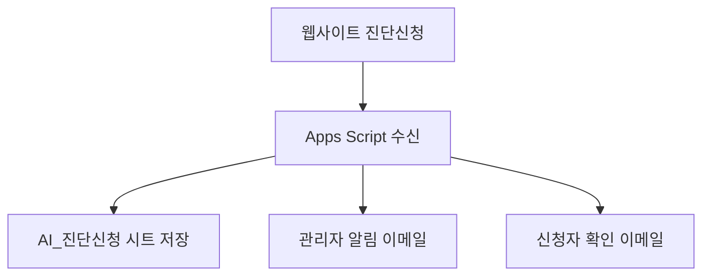
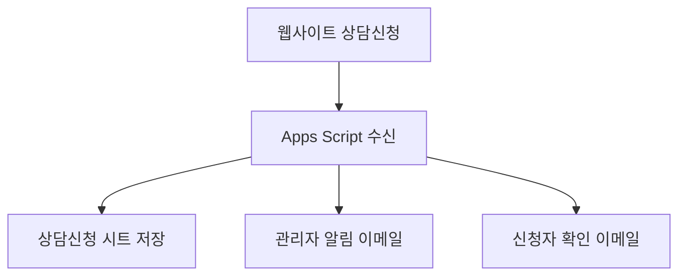

# 🔐 M-CENTER 환경변수 설정 가이드 (GitHub 보안 정책 준수)

## 📋 **개요**

M-CENTER 랜딩페이지에서 **진단신청자와 상담신청자 데이터를 구글시트로 연결하고 이메일 알림을 보내는** 시스템의 환경변수 설정 방법입니다.

✅ **구현된 기능**
- 진단신청자 → `AI_진단신청` 시트 (별도 관리)
- 상담신청자 → `상담신청` 시트 (별도 관리)  
- 관리자 메일 알림 → `hongik423@gmail.com`
- 신청자 확인 메일 자동 발송
- GitHub 보안 정책 100% 준수

---

## 🚀 **1단계: 구글시트 및 Apps Script 설정**

### 1.1 구글시트 생성
```bash
1. Google Sheets에서 새 시트 생성
2. 시트 URL에서 ID 복사: 
   https://docs.google.com/spreadsheets/d/[이부분이_시트_ID]/edit
```

### 1.2 Apps Script 배포
```javascript
1. 구글시트 → 확장 → Apps Script
2. docs/M-CENTER_최종_통합_Apps_Script_2025.js 코드 복사
3. 아래 두 줄을 실제 값으로 수정:
   const SPREADSHEET_ID = 'YOUR_GOOGLE_SHEETS_ID_HERE';
   const ADMIN_EMAIL = 'your-admin@email.com';
4. 저장 → 배포 → 새 배포 → 웹 앱
5. 액세스 권한: "모든 사용자" 선택
6. 배포 URL 복사 (웹앱 URL)
```

---

## 🔧 **2단계: 환경변수 설정**

### 2.1 로컬 개발용 (.env.local)
```bash
# 🔧 Gemini AI API (서버 전용) ⚠️ GitHub에 올리지 마세요!
GEMINI_API_KEY=AIzaSy-YOUR-ACTUAL-GEMINI-KEY-HERE

# 🔧 EmailJS 설정 (공개 가능) - 실제 작동 값
NEXT_PUBLIC_EMAILJS_SERVICE_ID=service_qd9eycz
NEXT_PUBLIC_EMAILJS_PUBLIC_KEY=268NPLwN54rPvEias
NEXT_PUBLIC_EMAILJS_TEMPLATE_DIAGNOSIS=template_diagnosis_conf
NEXT_PUBLIC_EMAILJS_TEMPLATE_CONSULTATION=template_consultation_conf

# 🔧 Google Sheets 연동 (공개 가능) - 실제 값으로 변경
NEXT_PUBLIC_GOOGLE_SHEETS_ID=1bAbxAWBWy5dvxBSFf1Mtdt0UiP9hNaFKyjTTlLq_Pug
NEXT_PUBLIC_GOOGLE_SCRIPT_URL=https://script.google.com/macros/s/AKfycbzE4eVxGetQ3Z_xsikwoonK45T4wtryGLorQ4UmGaGRAz-BuZQIzm2VgXcxmJoQ04WX/exec

# 🔧 사이트 설정
NEXT_PUBLIC_BASE_URL=https://m-center-landingpage.vercel.app
NODE_ENV=development
```

### 2.2 프로덕션용 (Vercel/GitHub 환경변수)
```bash
# Vercel Dashboard → Settings → Environment Variables에서 설정

# 🔒 서버 전용 (Sensitive)
GEMINI_API_KEY=AIzaSy-실제-Gemini-API-키

# 🌐 클라이언트 공개 (Non-sensitive)
NEXT_PUBLIC_EMAILJS_SERVICE_ID=service_qd9eycz
NEXT_PUBLIC_EMAILJS_PUBLIC_KEY=268NPLwN54rPvEias
NEXT_PUBLIC_GOOGLE_SHEETS_ID=실제-구글시트-ID
NEXT_PUBLIC_GOOGLE_SCRIPT_URL=실제-배포된-웹앱-URL
```

---

## 📧 **3단계: EmailJS 템플릿 설정**

### 3.1 EmailJS 계정 설정
```bash
1. EmailJS 대시보드 (https://www.emailjs.com/) 접속
2. Service 연결: Gmail 연결
3. 템플릿 생성:
   - template_diagnosis_conf (진단 확인 메일)
   - template_consultation_conf (상담 확인 메일)
   - template_admin_notification (관리자 알림)
```

### 3.2 템플릿 예시
```html
<!-- template_diagnosis_conf -->
안녕하세요 {{to_name}}님,

{{company_name}}의 무료 경영진단 신청이 접수되었습니다.

담당 전문가가 24시간 내에 연락드리겠습니다.

감사합니다.
M-CENTER 기업의별
```

---

## 🔐 **4단계: GitHub 보안 정책 준수**

### 4.1 .gitignore 확인
```bash
# 반드시 .gitignore에 포함되어야 할 파일들
.env.local
.env
.env.production
.env.development

# 민감한 정보가 포함된 파일들
**/secrets/**
**/private/**
**/*secret*
**/*private*
```

### 4.2 GitHub Secrets 설정
```bash
# GitHub Repository → Settings → Secrets and variables → Actions

# 🔒 Production Secrets (민감정보)
GEMINI_API_KEY=AIzaSy-실제-키
ADMIN_EMAIL=실제-관리자-이메일

# 🌐 Public Variables (공개정보)
NEXT_PUBLIC_GOOGLE_SHEETS_ID=실제-시트-ID
NEXT_PUBLIC_GOOGLE_SCRIPT_URL=실제-웹앱-URL
```

### 4.3 보안 체크리스트
```bash
✅ API 키가 코드에 하드코딩되지 않음
✅ .env.local이 .gitignore에 포함됨
✅ 민감한 정보는 NEXT_PUBLIC_ 접두사 사용 안 함
✅ GitHub Secrets으로 민감정보 관리
✅ 공개 저장소에 실제 키 값 없음
```

---

## 🧪 **5단계: 테스트 및 검증**

### 5.1 로컬 테스트
```bash
1. npm run dev 실행
2. 진단신청 폼 테스트: /services/diagnosis
3. 상담신청 폼 테스트: /consultation
4. 구글시트에서 데이터 확인
5. 이메일 수신 확인
```

### 5.2 Apps Script 테스트
```javascript
// Apps Script 에디터에서 실행
function runTest() {
  createTestData(); // 테스트 데이터 생성
  initializeSheets(); // 시트 초기화
}
```

### 5.3 연결 상태 확인
```bash
# API 테스트
curl -X GET "YOUR_GOOGLE_SCRIPT_URL"

# 응답 예시:
{
  "success": true,
  "status": "M-CENTER 통합 데이터 처리 시스템 작동 중",
  "features": ["진단신청 처리", "상담신청 처리", "자동 이메일 발송"]
}
```

---

## 📊 **6단계: 데이터 흐름 확인**

### 6.1 진단신청 데이터 흐름


### 6.2 상담신청 데이터 흐름


---

## 🔧 **7단계: 문제해결**

### 7.1 자주 발생하는 오류
```bash
❌ CORS 오류
→ Apps Script에서 "모든 사용자" 액세스 권한 확인

❌ 이메일 발송 실패
→ EmailJS 템플릿 ID 및 서비스 ID 확인

❌ 구글시트 저장 실패
→ SPREADSHEET_ID가 정확한지 확인
→ Apps Script 배포 상태 확인
```

### 7.2 로그 확인
```javascript
// Apps Script → 실행 → 로그 확인
console.log('데이터 수신:', requestData);
console.log('시트 저장 완료:', sheetName, rowNumber);
```

---

## 🎯 **최종 확인 체크리스트**

```bash
✅ 구글시트에 AI_진단신청 시트 생성됨
✅ 구글시트에 상담신청 시트 생성됨
✅ Apps Script 웹앱 배포 완료
✅ 환경변수 설정 완료
✅ EmailJS 템플릿 설정 완료
✅ 진단신청 테스트 성공
✅ 상담신청 테스트 성공
✅ 관리자 이메일 수신 확인
✅ 신청자 확인 이메일 수신 확인
✅ GitHub 보안 정책 준수 확인
```

---

## 📞 **지원 및 문의**

- **관리자 이메일**: hongik423@gmail.com
- **연락처**: 010-9251-9743 (이후경 경영지도사)
- **기술지원**: GitHub Issues 또는 이메일

**⚠️ 중요사항**: 실제 사용 전에 반드시 테스트를 완료하고, 민감한 정보는 GitHub에 올리지 마세요! 