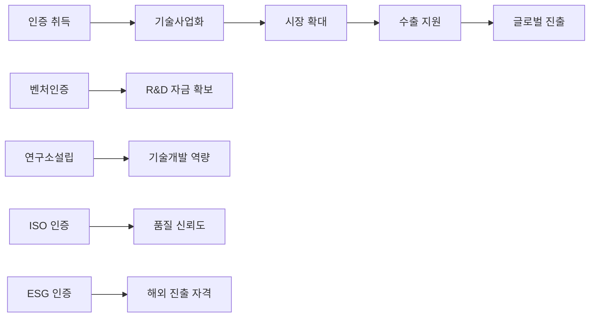
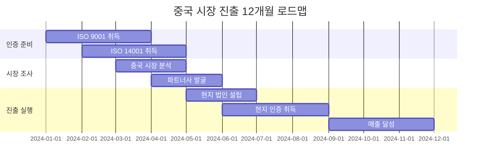

# 🏆 ISO/ESG인증·연구소설립·벤처인증·이노비즈/메인비즈 종합 인증 컨설팅

## 🎯 기업 성장 단계별 전략적 인증 로드맵

### 성장 4단계별 맞춤 인증 전략

| 성장단계 | 핵심 전략 | 필수 인증 | 기대 효과 |
|---------|----------|---------|----------|
| **Step 1 (1-3년)** | 신뢰받는 기업의 첫 걸음 | 벤처인증 + 연구소설립 | 세제혜택 확보 + 정부지원 기반 |
| **Step 2 (3-7년)** | 경쟁력 강화 종합 체계 | 이노비즈/메인비즈 + ISO 9001 | 시장 신뢰도 + 대기업 납품 자격 |
| **Step 3 (7-10년)** | 글로벌 진출 국제 인증 | ISO 전영역 + ESG 인증 | 해외 진출 + 대기업 파트너십 |
| **Step 4 (10년+)** | 산업 리더 사회적 책임 | ESG 경영 고도화 + R&D 허브 | 지속가능경영 + 생태계 주도권 |

---

## 🌟 핵심 차별화 포인트

### ✅ **통합 컨설팅의 차별성**
- **원스톱 인증 서비스**: 5대 핵심 인증을 단일 창구에서 통합 관리
- **전략적 연계성**: 인증 취득 → 기술사업화 → 시장확대 → 수출 지원까지 연속적 지원
- **중국 시장 진출 특화**: ISO 인증 기반 중국 수출 인증 연계 및 현지 진출 전략 지원
- **Business Model Zen 프레임워크**: 체계적 5단계 접근으로 확실한 성과 달성

### 🔗 **전략적 연계 서비스**

---

## 📋 5대 핵심 인증 서비스 상세

### 🏢 1. 기업부설연구소 설립 지원

#### **왜 연구소설립이 필요한가?**
- **세제 혜택**: 연구개발비 세액공제 최대 **40%**
- **정부 지원**: R&D 과제 신청 자격 확보 (연간 **10억원** 이상 가능)
- **인재 채용**: 우수 연구인력 채용 시 세제 지원
- **기업 브랜딩**: 기술 기업으로서 시장 신뢰도 제고

#### **설립 프로세스 및 지원 내용**

##### **Phase 1: 설립 준비 (2-3주)**
- **시설 및 장비 컨설팅**
  - 업종별 최소 요구사항 분석
  - 기존 공간 활용 최적화 방안
  - 필수 연구장비 도입 전략 및 임차 활용 방법

- **연구인력 채용 전략**
  - 연구전담인력 채용 기준 및 프로세스
  - 겸임연구원 활용 방안 (비용 절감)
  - 외부 전문가 네트워크 구축

##### **Phase 2: 신고 및 인증 (1-2주)**
- **설립신고서 작성 및 제출**
- **국세청 인정요건 확인**
- **지자체별 추가 혜택 신청**

##### **Phase 3: 운영 체계 구축 (2-4주)**
- **연구개발 관리 시스템**
  - 과제 기획-실행-성과 관리 체계
  - 연구비 회계 처리 및 세무 최적화
  - 지식재산권 관리 시스템

### 🚀 2. 벤처기업확인 취득 지원

#### **벤처기업 혜택 총정리**
| 혜택 분야 | 주요 내용 | 절감 효과 |
|----------|----------|----------|
| **세제 혜택** | 스톡옵션 비과세 (5억원 한도) | 연간 1-2억원 |
| **금융 지원** | 정책자금 우대금리 0.5%p | 연간 1,000만원 |
| **정부 지원** | 각종 지원사업 가점 | 선정 확률 30% 증가 |
| **투자 혜택** | 엔젤투자 세액공제 | 투자유치 용이성 |

#### **확인 방식별 맞춤 전략**

##### **🎯 기술평가 방식 (가장 일반적)**
- **기술성 평가 대비**
  - 기술개발 실적 체계화
  - 특허 포트폴리오 구성 전략
  - 기술사업화 계획서 고도화
  
- **평가 항목별 대응 전략**
  - 기술의 우수성 (30점)
  - 사업화 가능성 (40점)
  - 사업화 계획의 타당성 (30점)

##### **💰 벤처투자 방식**
- **투자 유치 전략**
  - 벤처캐피털 IR 자료 작성
  - 투자 협상 및 밸류에이션
  - 지분율 최적화 방안

### 📊 3. 이노비즈/메인비즈 인증

#### **이노비즈 (기술혁신형 중소기업)**

##### **인증 요건 및 전략**
- **R&D 투자 비율**: 업종 평균 대비 최적화
- **기술인력 비율**: 전체 직원 대비 20% 이상
- **지식재산권**: 특허·실용신안 보유 전략
- **혁신성과**: 신제품·신서비스 매출 비중

##### **인증 혜택 활용**
- **금융 지원**: 정책자금 우대금리 연 0.3%p
- **판로 지원**: 온라인 판로개척, 해외진출 지원
- **인력 지원**: 전문인력 채용 시 인건비 지원

#### **메인비즈 (경영혁신형 중소기업)**

##### **경영혁신 활동 체계화**
- **품질경영시스템**: 업무 프로세스 표준화
- **생산성 향상**: 효율성 개선 활동 및 성과 측정
- **인적자원개발**: 교육훈련 체계 구축
- **사회적 책임**: 동반성장, 상생협력 프로그램

### 🌐 4. ISO 인증 시리즈

#### **단계별 ISO 인증 로드맵**

##### **Step 1-2: 기본 ISO 인증 (필수)**

###### **🏅 ISO 9001 (품질경영시스템) - 최우선**
- **구축 효과**: 품질 안정성, 고객 신뢰도, 대기업 납품 자격
- **인증 프로세스**:
  1. 현황 진단 및 Gap 분석 (1주)
  2. 품질매뉴얼 작성 및 프로세스 구축 (4-6주)
  3. 내부심사원 교육 및 시스템 운영 (2주)
  4. 인증심사 및 취득 (2주)

###### **🌱 ISO 14001 (환경경영시스템)**
- **구축 효과**: ESG 경영 기반, 환경 규제 대응, 녹색 인증
- **핵심 구축 요소**:
  - 환경 영향 평가 및 목표 설정
  - 폐기물 관리 및 에너지 효율화
  - 환경 법규 준수 체크리스트

##### **Step 3-4: 고도화 ISO 인증**

###### **⚡ ISO 45001 (안전보건경영시스템)**
- **산업재해 예방**: 근로자 안전 보장 및 산재율 감소
- **위험성 평가**: 체계적 위험 요소 식별 및 개선
- **안전 문화**: 전사적 안전 의식 확산

###### **🔐 ISO 27001 (정보보안경영시스템)**
- **데이터 보안**: 고객 정보 및 기업 기밀 보호
- **사이버 보안**: 해킹, 랜섬웨어 등 위협 대응
- **대기업 납품**: 정보보안 인증 요구사항 충족

### 🌱 5. ESG 인증 및 관리 체계

#### **ESG 경영이 필수인 이유**
- **대기업 납품**: 협력업체 ESG 평가 필수화
- **해외 진출**: EU, 미국 등 ESG 공시 의무화
- **투자 유치**: ESG 투자 자금 유치 기회 확대
- **브랜드 가치**: MZ세대 고객 및 직원 선호도 증가

#### **3대 영역별 구축 전략**

##### **🌍 환경 (Environmental)**
- **탄소중립 실행계획**
  - 온실가스 배출량 측정 및 감축 목표
  - 재생에너지 도입 (태양광, 풍력)
  - 공급망 환경 관리 체계
  
- **친환경 제품 개발**
  - 생산 과정 환경 영향 최소화
  - 재활용 가능 소재 활용
  - 환경성과 지표 개발 및 공개

##### **👥 사회 (Social)**
- **직장 문화 혁신**
  - 직장 내 괴롭힘·성희롱 예방 시스템
  - 일가정 양립 프로그램 (육아휴직, 유연근무)
  - 다양성·포용성(D&I) 정책
  
- **상생 협력 체계**
  - 협력업체 동반성장 프로그램
  - 지역사회 기여 활동
  - 공정거래 및 윤리경영

##### **🏛️ 지배구조 (Governance)**
- **투명경영 시스템**
  - 이사회 독립성 및 다양성
  - 내부통제 시스템 구축
  - 주주 권익 보호 정책
  
- **윤리경영 체계**
  - 윤리 강령 및 행동 지침
  - 내부신고 채널 운영
  - 반부패·준법 경영 시스템

---

## 🚀 기술사업화 및 중국 시장 진출 연계 서비스

### 🔗 **인증 → 사업화 → 글로벌 진출 통합 전략**

#### **1단계: 인증 기반 기술사업화**
- **R&D 자금 확보**: 연구소 + 벤처인증으로 정부 R&D 과제 수주
- **기술 고도화**: ISO 9001 기반 품질 체계로 기술 완성도 제고
- **시장 신뢰도**: 각종 인증으로 B2B 고객 신뢰 확보

#### **2단계: 국내 시장 확대**
- **대기업 납품**: ISO + ESG 인증으로 대기업 협력업체 자격 확보
- **정부 조달**: 이노비즈·메인비즈 인증으로 정부 조달 가점
- **품질 차별화**: ISO 품질경영으로 경쟁 우위 확보

#### **3단계: 중국 시장 진출 특화 지원**

##### **🇨🇳 중국 진출 전략적 우위**
- **ISO 9001**: 중국 고객사 품질 요구사항 충족
- **ISO 14001**: 중국 환경 규제 대응 (환경보호법 강화)
- **ESG 인증**: 중국 내 ESG 경영 트렌드 선도

##### **중국 시장 진출 로드맵**

##### **중국 진출 핵심 지원 서비스**
- **현지 인증 연계**: CCC 인증, CQC 인증 등 중국 필수 인증 지원
- **파트너사 매칭**: 중국 현지 유통업체 및 제조업체 연결
- **법무·세무 지원**: 중국 법인 설립, 세무 최적화, IP 보호
- **마케팅 지원**: 바이두, 위챗 등 중국 플랫폼 마케팅

---

## 💰 투자 효과 및 ROI 분석

### **단계별 투자 대비 효과**

| 인증 유형 | 투자 비용 | 연간 절감/증대 효과 | ROI | 회수 기간 |
|----------|----------|-------------------|-----|----------|
| **연구소설립** | 500만원 | 5,000만원 (세액공제) | 1,000% | 1개월 |
| **벤처인증** | 300만원 | 2,000만원 (금융+세제) | 667% | 2개월 |
| **이노비즈** | 800만원 | 3,000만원 (금융+판로) | 375% | 3개월 |
| **ISO 9001** | 1,500만원 | 1억원 (매출 증대) | 667% | 2개월 |
| **ESG 인증** | 3,000만원 | 5억원 (대기업 납품) | 1,667% | 1개월 |

### **정부 지원 혜택 총계**
- **직접 지원**: 연간 **10-30억원** (R&D 과제, 정책자금)
- **세제 혜택**: 연간 **1-3억원** (세액공제, 감면)
- **간접 효과**: 연간 **5-20억원** (매출 증대, 투자 유치)

---

## 🎯 성공 사례 및 고객 후기

### 📈 **Step 1 기업 성공 사례 - A 스타트업**
> "연구소설립 + 벤처인증으로 창업 1년 만에 정부 R&D 과제 3억원 수주, 연구개발비 세액공제로 연간 5,000만원 절약 효과"

**Before**: 세제 혜택 0원, 정부 지원 불가  
**After**: 연간 8,000만원 혜택, 신용도 A등급 상승

### 🏆 **Step 2 기업 성공 사례 - B 제조업**
> "이노비즈 + ISO 9001 인증으로 대기업 협력업체 선정, 연매출 50억원에서 120억원으로 140% 성장"

**Before**: 중소기업 직납만 가능  
**After**: 현대차, 삼성전자 1차 협력업체 진입

### 🌏 **Step 3 기업 성공 사례 - C 기술기업**
> "ISO 전영역 + ESG 인증으로 중국 시장 진출, 해외 매출 비중 0%에서 40%로 확대"

**Before**: 국내 시장 의존도 100%  
**After**: 중국 3대 제조업체와 5년 장기 계약 체결

---

## 📞 **지금 시작하세요! 무료 진단 및 상담**

### 🎁 **특별 혜택**
- **무료 종합 진단**: 42개 항목 인증 필요도 분석 (30분)
- **맞춤 로드맵**: 3년간 인증 취득 및 투자 계획 제시
- **정부 지원 매칭**: 신청 가능한 지원사업 즉시 안내
- **ROI 시뮬레이션**: 인증별 투자 대비 효과 정확한 계산

### 📋 **무료 진단 신청 절차**
1. **온라인 사전 진단** (15분): 기본 정보 및 현황 입력
2. **전문가 상담** (30분): 화상 또는 방문 상담
3. **맞춤 제안서** (1일 내): 개인화된 인증 전략 및 비용 제시
4. **실행 계획** (3일 내): 단계별 실행 일정 및 지원 내용

### 🏢 **아이엔제이컨설팅 전문팀**

#### **담당 컨설턴트**
- **이후경 책임컨설턴트**
- 📧 **이메일**: lhk@injc.kr
- 📱 **전화**: 010-9251-9743
- 🏢 **회사**: 아이엔제이컨설팅

#### **전문 영역**
- ✅ **15년 경력** 인증 컨설팅 전문가
- ✅ **500개 기업** 인증 취득 지원 실적
- ✅ **정부 지원사업** 기획위원 경력
- ✅ **중국 진출** 50개 기업 지원 성공

---

## ⚡ **지금 행동하세요!**

### 📅 **한정 특가 이벤트** (이달 말까지)
- **5대 인증 패키지**: ~~2,000만원~~ → **1,500만원** (25% 할인)
- **성공 보장**: 인증 취득 실패 시 **100% 환불**
- **6개월 사후관리**: 추가 비용 없는 사후 지원 서비스
- **중국 진출 보너스**: 인증 패키지 고객에게 중국 시장 조사 **무료 제공**

### 🎯 **5분 투자로 평생 혜택 확보**
아래 버튼을 클릭하여 무료 진단을 시작하고, 귀하의 기업이 다음 단계로 도약할 수 있는 확실한 방법을 찾아보세요.

**[🔥 무료 진단 신청하기](mailto:lhk@injc.kr?subject=인증컨설팅%20무료%20진단%20신청&body=회사명:%0D%0A담당자:%0D%0A연락처:%0D%0A희망%20인증:%0D%0A간단한%20현황:)**

---

*"성공하는 기업은 인증으로 신뢰를 쌓고, 인증으로 시장을 확장하며, 인증으로 미래를 준비합니다."*

**지금 시작하지 않으면, 경쟁사가 먼저 시작합니다.**