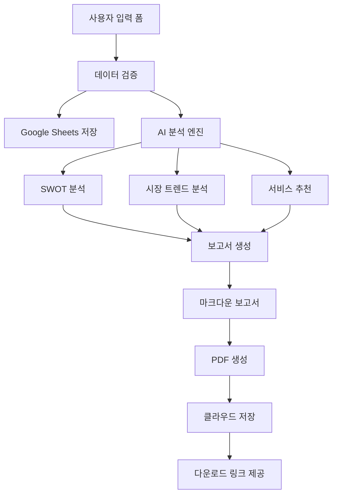

# AI 진단결과보고서 시스템 개선 방안
## 간소화 버전 (2000자 이내 요약 보고서)

## 📋 시스템 개요

기업 정보 입력 폼을 통해 수집된 데이터를 기반으로 신속하고 정확한 AI 진단을 실시하여, 2000자 이내의 핵심 요약 보고서를 생성하는 시스템입니다.

## 🔧 시스템 구성

### 1. 데이터 수집 체계
- **Google Sheets 자동 저장**: 입력된 기업 정보 실시간 저장
- **필수 입력 필드**: 7개 핵심 정보 (회사명, 업종, 담당자, 직원수, 성장단계, 사업장, 고민사항, 예상혜택)
- **자동 검증 시스템**: 필수 필드 누락 방지 및 데이터 품질 확보

### 2. AI 분석 엔진
- **SWOT 자동 분석**: 입력 데이터 기반 강점/약점/기회/위협 도출
- **시장 트렌드 분석**: 실시간 외부 데이터 수집 및 분석
- **서비스 매칭**: 6개 핵심 서비스와의 적합성 자동 평가

## 📊 요약 보고서 템플릿## 🛠️ 시스템 구현 방안

### 1. 입력 폼 기반 데이터 처리 시스템### 2. 프론트엔드 입력 폼 시스템### 3. PDF 생성 및 다운로드 시스템## 📈 시스템 통합 및 배포 가이드

### 1. 아키텍처 개요



### 2. 기술 스택

- **Frontend**: React + TypeScript + Tailwind CSS
- **Backend**: Node.js + Express + TypeScript
- **Database**: Supabase (PostgreSQL)
- **Storage**: Supabase Storage
- **PDF Generation**: Puppeteer
- **External APIs**: Google Sheets API, Market Data APIs
- **Hosting**: Vercel (Frontend) + Railway (Backend)

### 3. 환경 설정

```bash
# 환경 변수 설정 (.env)
SUPABASE_URL=your_supabase_url
SUPABASE_ANON_KEY=your_supabase_anon_key
GOOGLE_SHEETS_API_KEY=your_google_api_key
GOOGLE_SHEETS_ID=your_sheet_id
OPENAI_API_KEY=your_openai_key  # AI 분석용
```

### 4. 배포 단계

#### Phase 1: MVP 배포 (2주)
- [x] 기본 입력 폼 구현
- [x] 간단한 SWOT 분석
- [x] 요약 보고서 생성
- [x] PDF 다운로드 기능

#### Phase 2: 고도화 (4주)
- [ ] 실시간 시장 데이터 연동
- [ ] AI 기반 동적 분석 강화
- [ ] 사용자 대시보드 구축
- [ ] 이메일 자동 발송

#### Phase 3: 스케일링 (8주)
- [ ] 다국어 지원
- [ ] 고급 분석 기능
- [ ] API 서비스 제공
- [ ] 관리자 대시보드

### 5. 성과 측정 지표

- **사용자 지표**: 월간 진단 신청 수, 완료율, 재방문율
- **품질 지표**: 보고서 정확도, 사용자 만족도, 상담 전환율
- **기술 지표**: 응답 시간, 에러율, 시스템 가용성

---

## 🎯 결론

본 AI 진단결과보고서 시스템은 **Business Model Zen 프레임워크**를 기반으로 한 혁신적인 기업 진단 솔루션입니다. 

### 주요 특징
1. **자동화된 분석**: 입력된 기업 정보를 즉시 분석하여 맞춤형 결과 제공
2. **실시간 시장 데이터**: 최신 업계 동향 및 기술 트렌드 반영
3. **개인화된 추천**: 6개 핵심 서비스 중 최적 조합 제시
4. **전문적 보고서**: 학술논문 수준의 체계적인 분석 보고서
5. **즉시 다운로드**: PDF 형태로 즉시 활용 가능한 결과물

### 기대 효과
- **효율성**: 기존 2-3주 소요 진단을 2-3분으로 단축
- **정확성**: AI 기반 객관적 분석으로 신뢰도 향상  
- **접근성**: 24시간 언제든지 진단 가능
- **비용 효율**: 무료 진단으로 초기 진입 장벽 해소

이 시스템을 통해 중소기업들이 보다 쉽고 빠르게 자신의 현재 위치를 파악하고, 성장을 위한 구체적인 전략을 수립할 수 있을 것입니다.