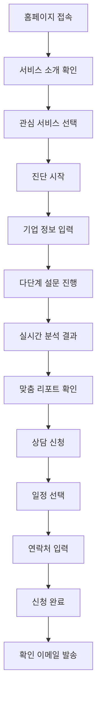
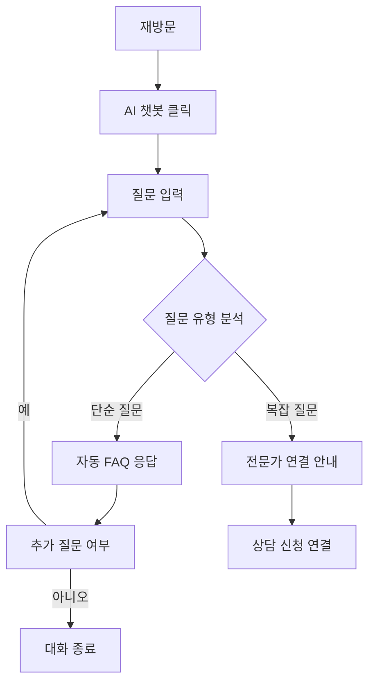
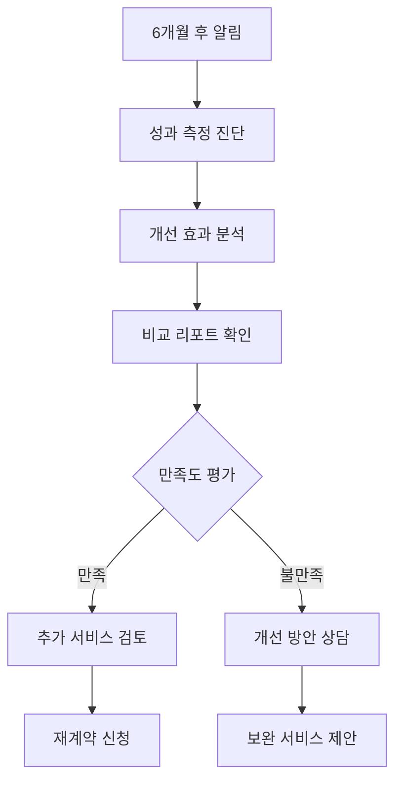

# 경영지도센터 통합 플랫폼 IA (Information Architecture) 문서

## 📋 목차
1. [사이트맵](#사이트맵)
2. [사용자 플로우](#사용자-플로우)
3. [네비게이션 구조](#네비게이션-구조)
4. [페이지 계층구조](#페이지-계층구조)
5. [콘텐츠 구성](#콘텐츠-구성)
6. [상호작용 패턴](#상호작용-패턴)
7. [URL 구조](#url-구조)
8. [컴포넌트 계층구조](#컴포넌트-계층구조)

---

## 🗺️ 사이트맵

### 1차 구조 (메인 카테고리)
```
경영지도센터 통합 플랫폼
├── 홈
├── 서비스 소개
├── 진단 및 상담
├── 성공사례
├── 회사소개
└── 고객지원
```

### 2차 상세 구조
```
📁 경영지도센터 통합 플랫폼
│
├── 🏠 홈
│   ├── 메인 배너 (Business Model Zen 소개)
│   ├── 5대 핵심 서비스 개요
│   ├── 성장 단계별 가이드
│   ├── 실시간 성과 지표
│   ├── 고객 후기
│   └── 빠른 진단 시작
│
├── 💼 서비스 소개
│   ├── Business Model Zen 프레임워크
│   ├── 🤖 AI 활용 생산성향상
│   │   ├── 서비스 개요
│   │   ├── 성장 단계별 전략
│   │   ├── 20주 프로그램 상세
│   │   ├── 기대 효과
│   │   └── 진단 시작하기
│   ├── 🏭 경매활용 공장구매
│   │   ├── 서비스 개요
│   │   ├── 단계별 지원 프로세스
│   │   ├── 투자 효과 분석
│   │   ├── 성공 사례
│   │   └── 진단 시작하기
│   ├── 🚀 기술사업화/기술창업
│   │   ├── 서비스 개요
│   │   ├── 4단계 성장 전략
│   │   ├── 정부 지원 연계
│   │   ├── 성과 목표
│   │   └── 진단 시작하기
│   ├── 🏆 인증지원
│   │   ├── 서비스 개요
│   │   ├── 5대 핵심 인증
│   │   ├── 단계별 인증 로드맵
│   │   ├── 투자 효과
│   │   └── 진단 시작하기
│   └── 💻 웹사이트 구축
│       ├── 서비스 개요
│       ├── 단계별 디지털 전략
│       ├── 기술 구현 방안
│       ├── ROI 시뮬레이션
│       └── 진단 시작하기
│
├── 📊 진단 및 상담
│   ├── 종합 진단 시스템
│   │   ├── 서비스 선택
│   │   ├── 기업 정보 입력
│   │   ├── 다단계 진단 (29-42문항)
│   │   ├── 실시간 분석 결과
│   │   └── 맞춤 리포트 다운로드
│   ├── 상담 신청
│   │   ├── 상담 유형 선택
│   │   ├── 일정 선택
│   │   ├── 연락처 정보
│   │   └── 확인 및 완료
│   ├── AI 챗봇 상담
│   │   ├── 실시간 Q&A
│   │   ├── FAQ 자동 응답
│   │   └── 전문가 연결
│   └── 진단 결과 조회
│       ├── 이전 진단 이력
│       ├── 재진단 신청
│       └── 성과 비교 분석
│
├── 📈 성공사례
│   ├── 업종별 사례
│   │   ├── 제조업
│   │   ├── 서비스업
│   │   ├── IT/기술업
│   │   └── 기타 업종
│   ├── 서비스별 사례
│   │   ├── AI 활용 성공사례
│   │   ├── 공장구매 성공사례
│   │   ├── 기술창업 성공사례
│   │   ├── 인증 취득 사례
│   │   └── 웹사이트 구축 사례
│   ├── 성장 단계별 사례
│   │   ├── Step 1 (1-3년)
│   │   ├── Step 2 (3-7년)
│   │   ├── Step 3 (7-10년)
│   │   └── Step 4 (10년 이상)
│   └── 고객 후기
│       ├── 세무사 후기
│       ├── 기업 대표 후기
│       └── 동영상 후기
│
├── 🏢 회사소개
│   ├── 경영지도센터 소개
│   ├── 경영지도센터 비전
│   ├── 전문가 팀 소개
│   ├── 연혁 및 실적
│   ├── 파트너사 네트워크
│   └── 오시는 길
│
└── 🎧 고객지원
    ├── FAQ
    │   ├── 서비스 관련
    │   ├── 진단 관련
    │   ├── 상담 관련
    │   └── 결제 관련
    ├── 공지사항
    ├── 자료실
    │   ├── 가이드북
    │   ├── 체크리스트
    │   ├── 템플릿
    │   └── 법령 정보
    ├── 1:1 문의
    ├── 연락처 정보
    └── 개인정보처리방침
```

---

## 🔄 사용자 플로우

### 주요 사용자 여정 (세무사 페르소나 기준)

#### 플로우 1: 첫 방문 → 진단 → 상담 신청


#### 플로우 2: 재방문 → AI 챗봇 이용


#### 플로우 3: 성과 확인 → 재계약


### 상세 사용자 플로우

#### 진단 시스템 상세 플로우
| 단계 | 사용자 액션 | 시스템 응답 | 소요 시간 |
|------|-------------|-------------|-----------|
| 1 | 서비스 선택 | 해당 서비스 진단 페이지 이동 | 30초 |
| 2 | 기업 정보 입력 | 입력 검증 및 임시 저장 | 2분 |
| 3 | 1단계 설문 (5문항) | 진행률 표시, 다음 단계 활성화 | 3분 |
| 4 | 2-7단계 설문 (24-37문항) | 실시간 저장, 이전/다음 버튼 | 10분 |
| 5 | 분석 처리 | 로딩 애니메이션, 진행률 표시 | 30초 |
| 6 | 결과 확인 | 점수화 결과, 그래프 시각화 | 5분 |
| 7 | 리포트 다운로드 | PDF 생성 및 이메일 발송 | 1분 |

---

## 🧭 네비게이션 구조

### 상단 네비게이션 (Top Bar)
```
[로고] [홈] [서비스소개 ▼] [진단및상담 ▼] [성공사례] [회사소개] [고객지원 ▼] [📞 상담신청] [🤖 AI챗봇]
```

#### 메인 네비게이션 상세
| 메뉴 | 서브메뉴 | 깊이 | 접근성 |
|------|---------|------|--------|
| **홈** | - | 1 | 항상 접근 |
| **서비스소개** | AI활용, 공장구매, 기술창업, 인증지원, 웹사이트구축 | 2 | 드롭다운 |
| **진단및상담** | 종합진단, 상담신청, AI챗봇, 결과조회 | 2 | 드롭다운 |
| **성공사례** | - | 1 | 직접 접근 |
| **회사소개** | - | 1 | 직접 접근 |
| **고객지원** | FAQ, 공지사항, 자료실, 1:1문의 | 2 | 드롭다운 |

#### 드롭다운 메뉴 구조
```
서비스소개 ▼
├── 🤖 AI 활용 생산성향상
├── 🏭 경매활용 공장구매  
├── 🚀 기술사업화/기술창업
├── 🏆 인증지원
└── 💻 웹사이트 구축

진단및상담 ▼
├── 📊 종합 진단 시스템
├── 📅 상담 신청
├── 🤖 AI 챗봇 상담
└── 📈 진단 결과 조회

고객지원 ▼
├── ❓ FAQ
├── 📢 공지사항
├── 📁 자료실
└── 💬 1:1 문의
```

### 보조 네비게이션

#### 1. 빠른 액션 버튼 (우측 상단)
```
[📞 무료상담신청] [🤖 AI챗봇] [📊 빠른진단]
```

#### 2. 플로팅 액션 버튼 (모바일)
```
💬 (AI 챗봇 - 우하단 고정)
```

#### 3. 페이지 내 네비게이션
```
📍 현재 위치: 홈 > 서비스소개 > AI 활용 생산성향상
```

### 반응형 네비게이션

#### 데스크톱 (1200px 이상)
- 전체 메뉴 가로 배치
- 드롭다운 서브메뉴 표시
- 우측 상단 액션 버튼 배치

#### 태블릿 (768px - 1199px)
- 주요 메뉴만 표시
- 서브메뉴는 클릭 시 확장
- 액션 버튼 크기 조정

#### 모바일 (767px 이하)
- 햄버거 메뉴로 전환
- 플로팅 챗봇 버튼
- 스와이프 제스처 지원

---

## 📊 페이지 계층구조

### 레벨 1: 메인 페이지
| 페이지명 | 역할 | 주요 CTA | 중요도 |
|----------|------|----------|--------|
| **홈페이지** | 서비스 소개 및 첫 인상 | 진단 시작하기 | 최고 |

### 레벨 2: 카테고리 페이지  
| 페이지명 | 역할 | 주요 CTA | 중요도 |
|----------|------|----------|--------|
| **서비스소개** | 5대 서비스 총괄 소개 | 서비스별 진단 | 높음 |
| **진단및상담** | 진단 및 상담 허브 | 진단 시작 | 최고 |
| **성공사례** | 신뢰도 구축 | 상담 신청 | 중간 |
| **회사소개** | 브랜드 신뢰성 | 연락하기 | 중간 |
| **고객지원** | 사후 서비스 | 문의하기 | 중간 |

### 레벨 3: 상세 페이지
| 페이지명 | 상위 카테고리 | 역할 | 주요 CTA |
|----------|---------------|------|----------|
| **AI 활용 생산성향상** | 서비스소개 | 서비스 상세 설명 | AI 진단 시작 |
| **경매활용 공장구매** | 서비스소개 | 서비스 상세 설명 | 공장구매 진단 |
| **기술사업화 경영지도** | 서비스소개 | 서비스 상세 설명 | 기술창업 진단 |
| **인증지원** | 서비스소개 | 서비스 상세 설명 | 인증 진단 |
| **웹사이트 구축** | 서비스소개 | 서비스 상세 설명 | 웹사이트 진단 |

### 레벨 4: 기능 페이지
| 페이지명 | 상위 페이지 | 역할 | 진입 경로 |
|----------|-------------|------|-----------|
| **진단 시스템** | 각 서비스 페이지 | 실제 진단 수행 | CTA 버튼 |
| **상담 신청** | 진단 결과 | 전문가 상담 예약 | 진단 완료 후 |
| **결과 리포트** | 진단 시스템 | 분석 결과 제공 | 진단 완료 시 |

### 접근성 고려사항

#### 키보드 네비게이션
- Tab 순서: 로고 → 메인메뉴 → 서브메뉴 → 액션버튼 → 콘텐츠
- Skip to main content 링크 제공
- Focus 표시 명확화

#### 스크린 리더 지원
- 의미있는 헤딩 구조 (H1, H2, H3)
- Alt 텍스트 제공
- ARIA 라벨 활용

---

## 📝 콘텐츠 구성

### 홈페이지 콘텐츠 구조

#### 1. 히어로 섹션
```
[메인 타이틀]: "Business Model Zen으로 기업 성장의 5단계를 완성하세요"
[서브 타이틀]: "AI, 공장구매, 기술창업, 인증, 웹사이트 - 5대 영역 통합 솔루션"
[주요 CTA]: [무료 진단 시작하기] [전문가 상담 신청]
[배경]: Business Model Zen 프레임워크 시각화
```

#### 2. 5대 핵심 서비스 섹션
| 서비스 | 헤드라인 | 핵심 메시지 | CTA |
|--------|----------|-------------|-----|
| **AI 활용** | "업무 효율성 40% 향상" | "20주 프로그램으로 AI 혁신 완성" | AI 진단하기 |
| **공장구매** | "시장가 대비 40% 절약" | "경매 활용 스마트 투자 전략" | 공장진단하기 |
| **기술창업** | "평균 5억원 자금 확보" | "정부지원 연계 기술사업화" | 창업진단하기 |
| **인증지원** | "연간 5천만원 세제혜택" | "벤처·ISO·ESG 통합 인증" | 인증진단하기 |
| **웹사이트** | "온라인 매출 30% 증대" | "AI 기반 디지털 혁신" | 웹진단하기 |

#### 3. 성장 단계별 가이드
```
[Step 1] 창업~3년: 안정적 기반 구축
[Step 2] 3~7년: 성장 동력 강화  
[Step 3] 7~10년: 시장 주도 지위
[Step 4] 10년+: 지속가능 성장
```

#### 4. 실시간 성과 지표
```
✅ 완료된 진단: 1,247건
🏆 성공 프로젝트: 324건  
💰 고객 절약 효과: 127억원
⭐ 고객 만족도: 94.2%
```

### 서비스 상세 페이지 콘텐츠 템플릿

#### 공통 구조
```
1. 서비스 히어로
   - 성장 단계별 헤드라인
   - 핵심 효과 수치
   - 진단 시작 CTA

2. Business Model Zen 적용
   - 🔍 가치 발견 (현황 진단)
   - 💡 가치 창출 (솔루션 설계)  
   - 🚀 가치 제공 (실행 지원)
   - 💰 가치 포착 (성과 측정)
   - 🔄 가치 교정 (사후 관리)

3. 단계별 상세 프로세스
   - Phase별 주요 활동
   - 예상 기간 및 비용
   - 기대 효과

4. 성공 사례
   - 고객 인터뷰
   - 성과 지표
   - Before & After

5. 진단 및 상담 CTA
   - 무료 진단 시작
   - 전문가 상담 신청
   - 관련 자료 다운로드
```

### 진단 시스템 콘텐츠

#### 진단 인트로
```
[제목]: "AI 활용 생산성 혁신 진단"
[설명]: "29개 질문으로 귀하의 AI 활용 현황을 정확히 진단합니다"
[소요시간]: "약 15분"
[진행단계]: "7단계 (기업정보 → 현황분석 → 역량평가 → 계획수립)"
```

#### 질문 카테고리
```
Step 1: 현재 AI 활용 현황 (5문항)
Step 2: 업무 효율성 현황 (5문항)  
Step 3: 조직 현황 (4문항)
Step 4: 기술 수용성 (4문항)
Step 5: 해외 사업 현황 (4문항)
Step 6: 투자 의향 (3문항)
Step 7: 개인정보 (4문항)
```

### 콘텐츠 톤 앤 매너

#### 브랜드 보이스
- **전문적이면서 친근함**: 복잡한 내용도 쉽게 설명
- **신뢰감과 안정감**: 정확한 수치와 근거 제시
- **실용적 접근**: 실무에 바로 적용 가능한 솔루션
- **성과 중심**: 구체적 효과와 ROI 명시

#### 문체 가이드
- **높임말 사용**: "~습니다", "~세요" 형태
- **능동적 표현**: "지원합니다", "제공합니다"  
- **구체적 수치**: "40% 향상", "5억원 확보"
- **액션 지향**: "시작하세요", "확인하세요"

---

## 🎯 상호작용 패턴

### 주요 인터랙션 컴포넌트

#### 1. 진단 시스템 인터랙션
```javascript
// 진단 진행 패턴
const diagnosisInteraction = {
  progressBar: {
    display: "7단계 중 3단계 진행 중",
    percentage: "42%",
    animation: "부드러운 채움 애니메이션"
  },
  
  questionTransition: {
    type: "slide",
    direction: "left-to-right",
    duration: "300ms",
    easing: "ease-in-out"
  },
  
  validation: {
    realTime: true,
    errorMessage: "빨간색 텍스트, 입력란 하단 표시",
    successState: "녹색 체크마크"
  },
  
  autoSave: {
    interval: "30초마다",
    indicator: "우상단 '저장됨' 표시",
    recovery: "페이지 새로고침 시 이어서 진행"
  }
};
```

#### 2. AI 챗봇 인터랙션
```javascript
const chatbotInteraction = {
  launcher: {
    position: "우하단 고정",
    style: "플로팅 원형 버튼",
    animation: "주기적 펄스 효과",
    notification: "신규 메시지 시 빨간 점"
  },
  
  chatWindow: {
    size: "320px × 480px",
    position: "우하단에서 팝업",
    animation: "slide-up",
    header: "AI 상담사 | 온라인"
  },
  
  messageFlow: {
    userMessage: "우측 정렬, 파란색 말풍선",
    botMessage: "좌측 정렬, 회색 말풍선",
    typing: "점 3개 애니메이션",
    timestamp: "메시지 하단 작은 글씨"
  },
  
  quickReplies: {
    display: "버튼 형태로 하단 표시",
    action: "클릭 시 자동 입력",
    examples: ["서비스 문의", "상담 신청", "진단하기"]
  }
};
```

#### 3. 상담 신청 폼 인터랙션
```javascript
const consultationForm = {
  layout: "단계별 다중 페이지",
  
  step1: {
    title: "상담 유형 선택",
    options: "카드 형태 선택지",
    interaction: "호버 시 그림자 효과"
  },
  
  step2: {
    title: "기업 정보 입력",
    fields: "자동완성 지원",
    validation: "실시간 검증"
  },
  
  step3: {
    title: "상담 일정 선택", 
    calendar: "인터랙티브 달력",
    timeSlots: "가능한 시간 버튼 표시"
  },
  
  confirmation: {
    summary: "입력 정보 요약 표시",
    edit: "각 단계별 수정 링크",
    submit: "최종 확인 버튼"
  }
};
```

### 피드백 및 상태 표시

#### 로딩 상태
| 상황 | 인디케이터 | 메시지 | 예상 시간 |
|------|------------|--------|-----------|
| **진단 분석** | 원형 프로그레스 바 | "분석 중입니다..." | 30초 |
| **리포트 생성** | 선형 진행률 | "리포트를 생성하고 있습니다" | 45초 |
| **이메일 발송** | 스피너 | "이메일을 발송하고 있습니다" | 10초 |
| **챗봇 응답** | 타이핑 애니메이션 | "답변을 준비중입니다" | 3초 |

#### 성공 상태
```
✅ 진단이 완료되었습니다!
📧 결과 리포트가 이메일로 발송되었습니다.
📅 상담이 성공적으로 예약되었습니다.
```

#### 오류 상태
```
❌ 일시적인 오류가 발생했습니다. 잠시 후 다시 시도해주세요.
⚠️ 입력하신 정보를 다시 확인해주세요.
🔄 인터넷 연결을 확인하고 새로고침해주세요.
```

### 접근성 인터랙션

#### 키보드 네비게이션
- **Tab 키**: 다음 요소로 이동
- **Shift + Tab**: 이전 요소로 이동  
- **Enter/Space**: 버튼 활성화
- **Esc**: 모달/드롭다운 닫기
- **Arrow Keys**: 선택 옵션 이동

#### 포커스 관리
- 명확한 포커스 표시 (파란색 테두리)
- 모달 열림 시 포커스 트랩
- 페이지 이동 시 메인 콘텐츠로 포커스

---

## 🔗 URL 구조

### URL 네이밍 원칙
- **한글 → 영문 변환**: SEO 최적화
- **의미있는 구조**: 계층 관계 명확 표현
- **단순하고 직관적**: 사용자가 쉽게 이해
- **일관된 패턴**: 예측 가능한 구조

### 1단계: 메인 페이지
```
https://injc.kr/
```

### 2단계: 주요 카테고리
```
https://injc.kr/services/          # 서비스 소개
https://injc.kr/diagnosis/         # 진단 및 상담  
https://injc.kr/cases/             # 성공사례
https://injc.kr/about/             # 회사소개
https://injc.kr/support/           # 고객지원
```

### 3단계: 서비스별 상세 페이지
```
https://injc.kr/services/ai-productivity/        # AI 활용 생산성향상
https://injc.kr/services/factory-auction/        # 경매활용 공장구매
https://injc.kr/services/tech-startup/           # 기술사업화/기술창업
https://injc.kr/services/certification/          # 인증지원
https://injc.kr/services/website-development/    # 웹사이트 구축
```

### 4단계: 기능별 페이지
```
# 진단 시스템
https://injc.kr/diagnosis/ai-productivity/       # AI 활용 진단
https://injc.kr/diagnosis/factory-auction/       # 공장구매 진단
https://injc.kr/diagnosis/tech-startup/          # 기술창업 진단
https://injc.kr/diagnosis/certification/         # 인증 진단
https://injc.kr/diagnosis/website/               # 웹사이트 진단

# 상담 관련
https://injc.kr/consultation/request/            # 상담 신청
https://injc.kr/consultation/schedule/           # 일정 선택
https://injc.kr/consultation/confirm/            # 예약 확인

# 결과 관련
https://injc.kr/results/report/:id/              # 진단 리포트
https://injc.kr/results/comparison/:id/          # 성과 비교
https://injc.kr/results/download/:id/            # 리포트 다운로드
```

### 5단계: 세부 콘텐츠
```
# 성공사례
https://injc.kr/cases/industry/manufacturing/    # 제조업 사례
https://injc.kr/cases/industry/service/          # 서비스업 사례
https://injc.kr/cases/service/ai-productivity/   # AI 활용 사례
https://injc.kr/cases/stage/step1/               # Step 1 사례

# 고객지원
https://injc.kr/support/faq/                     # FAQ
https://injc.kr/support/faq/diagnosis/           # 진단 관련 FAQ
https://injc.kr/support/notices/                 # 공지사항
https://injc.kr/support/downloads/               # 자료실
https://injc.kr/support/contact/                 # 1:1 문의
```

### URL 매개변수 구조

#### 진단 시스템 상태 관리
```
https://injc.kr/diagnosis/ai-productivity/?step=3&session=abc123
```

#### 검색 및 필터링
```
https://injc.kr/cases/?industry=manufacturing&service=ai&stage=step2
```

#### 추적 및 분석
```
https://injc.kr/services/ai-productivity/?utm_source=google&utm_medium=cpc&utm_campaign=ai_productivity
```

### SEO 최적화 URL 가이드

#### 포함해야 할 요소
- 핵심 키워드 포함
- 지역 정보 (서울, 경기 등)
- 서비스 특성 (컨설팅, 진단 등)

#### 예시 SEO 친화적 URL
```
https://injc.kr/services/ai-productivity-consulting-seoul/
https://injc.kr/diagnosis/factory-auction-gyeonggi/
https://injc.kr/cases/tech-startup-success-manufacturing/
```

---

## 🧱 컴포넌트 계층구조

### 최상위 레이아웃 컴포넌트

```
App
├── Header
│   ├── Logo
│   ├── MainNavigation
│   │   ├── NavigationItem
│   │   └── DropdownMenu
│   └── ActionButtons
│       ├── ConsultationButton
│       └── ChatbotButton
├── Main
│   └── PageContent (동적)
├── FloatingChatbot
└── Footer
    ├── CompanyInfo
    ├── QuickLinks
    ├── ContactInfo
    └── SocialMedia
```

### 페이지별 컴포넌트 구조

#### 홈페이지 컴포넌트
```
HomePage
├── HeroSection
│   ├── MainTitle
│   ├── SubTitle
│   ├── CTAButtons
│   └── BackgroundAnimation
├── ServicesOverview
│   ├── ServiceCard (×5)
│   │   ├── ServiceIcon
│   │   ├── ServiceTitle
│   │   ├── ServiceDescription
│   │   └── ServiceCTA
│   └── ViewAllButton
├── GrowthStageGuide
│   ├── StageCard (×4)
│   │   ├── StageNumber
│   │   ├── StageTitle
│   │   ├── StageDescription
│   │   └── StageFeatures
│   └── StageSelector
├── PerformanceMetrics
│   ├── MetricCard (×4)
│   │   ├── MetricIcon
│   │   ├── MetricNumber
│   │   └── MetricLabel
│   └── CountupAnimation
├── CustomerTestimonials
│   ├── TestimonialSlider
│   │   ├── TestimonialCard
│   │   │   ├── CustomerPhoto
│   │   │   ├── CustomerName
│   │   │   ├── CustomerTitle
│   │   │   └── TestimonialText
│   │   └── SliderControls
│   └── ViewAllButton
└── QuickDiagnosisCTA
    ├── CTATitle
    ├── CTADescription
    └── StartDiagnosisButton
```

#### 진단 시스템 컴포넌트
```
DiagnosisSystem
├── DiagnosisHeader
│   ├── ServiceTitle
│   ├── ProgressIndicator
│   │   ├── StepNumber
│   │   ├── StepTitle
│   │   └── ProgressBar
│   └── EstimatedTime
├── DiagnosisContent
│   ├── QuestionContainer
│   │   ├── QuestionTitle
│   │   ├── QuestionDescription
│   │   └── QuestionInput
│   │       ├── RadioGroup
│   │       ├── CheckboxGroup
│   │       ├── ScaleSlider
│   │       └── TextInput
│   └── ValidationMessage
├── DiagnosisNavigation
│   ├── PreviousButton
│   ├── NextButton
│   ├── SaveDraftButton
│   └── ExitButton
├── DiagnosisResults
│   ├── AnalysisHeader
│   ├── ScoreVisualization
│   │   ├── RadarChart
│   │   ├── ProgressCircles
│   │   └── ScoreLegend
│   ├── RecommendationsList
│   │   ├── RecommendationCard
│   │   │   ├── Priority
│   │   │   ├── Title
│   │   │   ├── Description
│   │   │   └── ExpectedImpact
│   │   └── ViewDetailsButton
│   └── ReportActions
│       ├── DownloadPDFButton
│       ├── EmailReportButton
│       └── ScheduleConsultationButton
└── LoadingState
    ├── LoadingSpinner
    ├── LoadingMessage
    └── ProgressPercentage
```

#### AI 챗봇 컴포넌트
```
ChatbotWidget
├── ChatbotLauncher
│   ├── ChatIcon
│   ├── NotificationBadge
│   └── PulseAnimation
├── ChatWindow
│   ├── ChatHeader
│   │   ├── BotAvatar
│   │   ├── BotName
│   │   ├── OnlineStatus
│   │   └── CloseButton
│   ├── MessageContainer
│   │   ├── MessageList
│   │   │   ├── UserMessage
│   │   │   │   ├── MessageText
│   │   │   │   ├── MessageTime
│   │   │   │   └── MessageStatus
│   │   │   └── BotMessage
│   │   │       ├── BotAvatar
│   │   │       ├── MessageText
│   │   │       ├── MessageTime
│   │   │       └── MessageActions
│   │   └── TypingIndicator
│   ├── QuickReplies
│   │   └── QuickReplyButton (×n)
│   └── MessageInput
│       ├── TextInput
│       ├── SendButton
│       └── AttachmentButton
└── ChatbotState
    ├── ConnectingState
    ├── ErrorState
    └── OfflineState
```

### 공통 UI 컴포넌트

#### 기본 요소
```
CommonComponents
├── Buttons
│   ├── PrimaryButton
│   ├── SecondaryButton
│   ├── OutlineButton
│   └── IconButton
├── Forms
│   ├── Input
│   ├── Select
│   ├── Checkbox
│   ├── Radio
│   ├── DatePicker
│   └── FileUpload
├── Feedback
│   ├── Alert
│   ├── Toast
│   ├── Modal
│   └── Tooltip
├── Navigation
│   ├── Breadcrumb
│   ├── Pagination
│   └── TabMenu
├── DataDisplay
│   ├── Table
│   ├── Card
│   ├── Badge
│   └── Avatar
└── Layout
    ├── Container
    ├── Grid
    ├── Stack
    └── Spacer
```

### 컴포넌트 재사용 전략

#### Props 기반 커스터마이징
```typescript
interface ButtonProps {
  variant: 'primary' | 'secondary' | 'outline';
  size: 'small' | 'medium' | 'large';
  disabled?: boolean;
  loading?: boolean;
  icon?: ReactNode;
  children: ReactNode;
  onClick: () => void;
}

interface ServiceCardProps {
  service: {
    id: string;
    title: string;
    description: string;
    icon: string;
    targetStage: string[];
    expectedEffect: string;
  };
  variant: 'compact' | 'detailed';
  showCTA?: boolean;
}
```

#### 상태 관리 패턴
```typescript
// 진단 시스템 상태
interface DiagnosisState {
  currentStep: number;
  totalSteps: number;
  responses: Record<string, any>;
  isLoading: boolean;
  errors: Record<string, string>;
  autoSaveStatus: 'saved' | 'saving' | 'error';
}

// 챗봇 상태  
interface ChatbotState {
  isOpen: boolean;
  messages: Message[];
  isTyping: boolean;
  connectionStatus: 'connected' | 'connecting' | 'disconnected';
  unreadCount: number;
}
```

### 반응형 컴포넌트 설계

#### 브레이크포인트 기반 렌더링
```typescript
const useResponsive = () => {
  const [breakpoint, setBreakpoint] = useState('desktop');
  
  useEffect(() => {
    const updateBreakpoint = () => {
      if (window.innerWidth < 768) setBreakpoint('mobile');
      else if (window.innerWidth < 1200) setBreakpoint('tablet');
      else setBreakpoint('desktop');
    };
    
    updateBreakpoint();
    window.addEventListener('resize', updateBreakpoint);
    return () => window.removeEventListener('resize', updateBreakpoint);
  }, []);
  
  return breakpoint;
};

// 사용 예시
const NavigationMenu = () => {
  const breakpoint = useResponsive();
  
  if (breakpoint === 'mobile') {
    return <HamburgerMenu />;
  }
  
  return <FullNavigationMenu />;
};
```

---

## 📋 결론 및 구현 가이드

### 개발 우선순위

#### Phase 1: 핵심 기능 (8주)
1. **기본 레이아웃 및 네비게이션** (1-2주)
   - Header, Footer, 반응형 네비게이션
   - 기본 페이지 라우팅 구조

2. **진단 시스템** (3-5주)
   - 다단계 설문 폼
   - 실시간 검증 및 저장
   - 결과 분석 및 리포트 생성

3. **AI 챗봇** (6-7주)
   - 기본 Q&A 기능
   - FAQ 자동 응답
   - 전문가 연결 기능

4. **상담 신청 시스템** (8주)
   - 상담 예약 폼
   - 이메일 자동 발송
   - 일정 관리 연동

#### Phase 2: 고도화 기능 (6주)
1. **콘텐츠 관리 시스템** (9-10주)
2. **성과 추적 대시보드** (11-12주)  
3. **고급 분석 기능** (13-14주)

#### Phase 3: 최적화 및 확장 (4주)
1. **성능 최적화** (15-16주)
2. **SEO 및 접근성 개선** (17주)
3. **모바일 앱 버전** (18주)

### 기술적 고려사항

#### 성능 최적화
- **코드 스플리팅**: 페이지별 번들 분리
- **이미지 최적화**: WebP 포맷, 적응형 이미지
- **캐싱 전략**: Service Worker 활용
- **CDN 활용**: 정적 자원 전역 배포

#### 보안 고려사항
- **데이터 암호화**: 민감 정보 로컬 저장 시 암호화
- **입력 검증**: XSS, 인젝션 공격 방지
- **HTTPS 강제**: 모든 통신 암호화
- **개인정보 보호**: GDPR 준수 설계

#### 확장성 고려사항
- **모듈화 설계**: 기능별 독립적 개발 가능
- **API 설계**: RESTful API 구조
- **다국어 지원**: i18n 프레임워크 적용
- **A/B 테스트**: 실험 기능 내장

이 IA 문서를 기반으로 개발을 진행하면 사용자 경험이 우수하고 확장 가능한 플랫폼을 구축할 수 있을 것입니다.

---

**문서 작성일**: 2025년 6월 15일  
**문서 버전**: v1.0  
**검토자**: 경영지도센터 UX팀