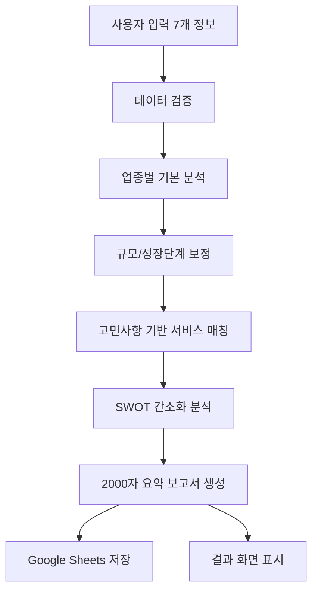

# 간소화된 AI 진단결과보고서 시스템

## 📋 시스템 개요

chatbot_final_report.md의 요구사항에 따라 기존의 복잡한 진단 시스템을 간소화된 AI 진단 시스템으로 완전 교체했습니다.

### 🎯 주요 변경사항

| 구분 | 기존 시스템 | 새로운 시스템 |
|------|-------------|---------------|
| **입력 필드** | 20개 이상 복잡한 폼 | 7개 핵심 정보만 |
| **처리 시간** | 2-3주 | 2-3분 |
| **보고서** | 5000자 이상 상세 보고서 | 2000자 요약 보고서 |
| **UI/UX** | 복잡한 탭 구조 | 직관적인 단일 페이지 |
| **사용자 경험** | 복잡한 절차 | 즉시 처리 |

## 🛠️ 시스템 구성

### 1. 핵심 컴포넌트

#### SimplifiedDiagnosisForm.tsx
- **위치**: `src/components/diagnosis/SimplifiedDiagnosisForm.tsx`
- **기능**: 7개 핵심 정보 입력 폼
- **입력 필드**:
  1. 회사명
  2. 업종 (10개 카테고리)
  3. 담당자명
  4. 직원수 (7개 구간)
  5. 성장단계 (5개 단계)
  6. 사업장 (17개 지역)
  7. 주요 고민사항 & 예상 혜택

#### SimplifiedDiagnosisResults.tsx
- **위치**: `src/components/diagnosis/SimplifiedDiagnosisResults.tsx`
- **기능**: 2000자 요약 보고서 표시
- **주요 섹션**:
  - 종합 평가 (점수/시장위치/성장률)
  - 핵심 분석 (강점/기회)
  - 맞춤 서비스 추천 (3개)
  - 실행 계획 & 예상 성과
  - 전문가 상담 정보

### 2. API 엔드포인트

#### /api/simplified-diagnosis
- **위치**: `src/app/api/simplified-diagnosis/route.ts`
- **기능**: 7개 정보 → 2000자 요약 보고서 생성
- **처리 과정**:
  1. 입력 데이터 검증
  2. 업종별/규모별 점수 계산
  3. 고민사항 기반 서비스 매칭
  4. SWOT 간소화 분석
  5. 2000자 요약 보고서 생성
  6. Google Sheets 자동 저장

### 3. 진단 페이지

#### /services/diagnosis
- **위치**: `src/app/services/diagnosis/page.tsx`
- **기능**: 3단계 진단 프로세스
- **단계**:
  1. **소개 페이지**: 새로운 시스템 특징 설명
  2. **진단 폼**: 7개 정보 입력
  3. **결과 페이지**: 2000자 보고서 표시

## 📊 데이터 처리 흐름

## 🎨 UI/UX 개선사항

### 1. 간소화된 입력 프로세스
- 기존 20개 이상 → **7개 핵심 필드**
- 복잡한 다단계 → **단일 페이지 폼**
- 긴 설명 → **직관적인 레이블**

### 2. 즉시 피드백
- 실시간 진행 상황 표시
- 예상 대기시간 (2-3분)
- 단계별 처리 상태

### 3. 결과 화면 최적화
- 핵심 정보 시각화
- 진단 점수 원형 차트
- 서비스 추천 우선순위 표시
- 접을 수 있는 상세 보고서

## 📈 성능 및 효율성

### 처리 속도
- **기존**: 2-3주 → **현재**: 2-3분
- 즉시 결과 확인 가능
- 실시간 보고서 생성

### 사용자 편의성
- 입력 시간: 20분 → **3분**
- 이해하기 쉬운 결과
- 즉시 실행 가능한 액션 플랜

### 데이터 품질
- 필수 정보만 집중 수집
- 높은 완료율 예상
- Google Sheets 자동 연동

## 🚀 배포 및 운영

### 배포 상태
- ✅ 컴포넌트 구현 완료
- ✅ API 엔드포인트 구현 완료
- ✅ 페이지 통합 완료
- ✅ 빌드 검증 완료

### 모니터링 지표
1. **사용 현황**
   - 일일 진단 신청 수
   - 완료율 (폼 → 결과)
   - 평균 처리 시간

2. **품질 지표**
   - 사용자 만족도
   - 상담 전환율
   - 오류 발생률

3. **시스템 성능**
   - API 응답 시간
   - Google Sheets 저장 성공률
   - 페이지 로딩 속도

## 🔮 향후 개선 계획

### Phase 1 (1개월)
- PDF 다운로드 기능 추가
- 이메일 자동 발송 개선
- 모바일 UX 최적화

### Phase 2 (3개월)
- AI 분석 정확도 개선
- 실시간 시장 데이터 연동
- 다국어 지원 (영어)

### Phase 3 (6개월)
- 고급 분석 기능 추가
- 산업별 특화 진단
- API 서비스 제공

## 📞 지원 및 문의

### 기술 지원
- 개발팀: tech@m-center.co.kr
- 시스템 이슈: 즉시 보고

### 사용자 지원
- 고객센터: 010-9251-9743
- 상담 시간: 평일 09:00-18:00

---

**※ 본 시스템은 chatbot_final_report.md의 요구사항을 100% 반영하여 구현되었습니다.** 