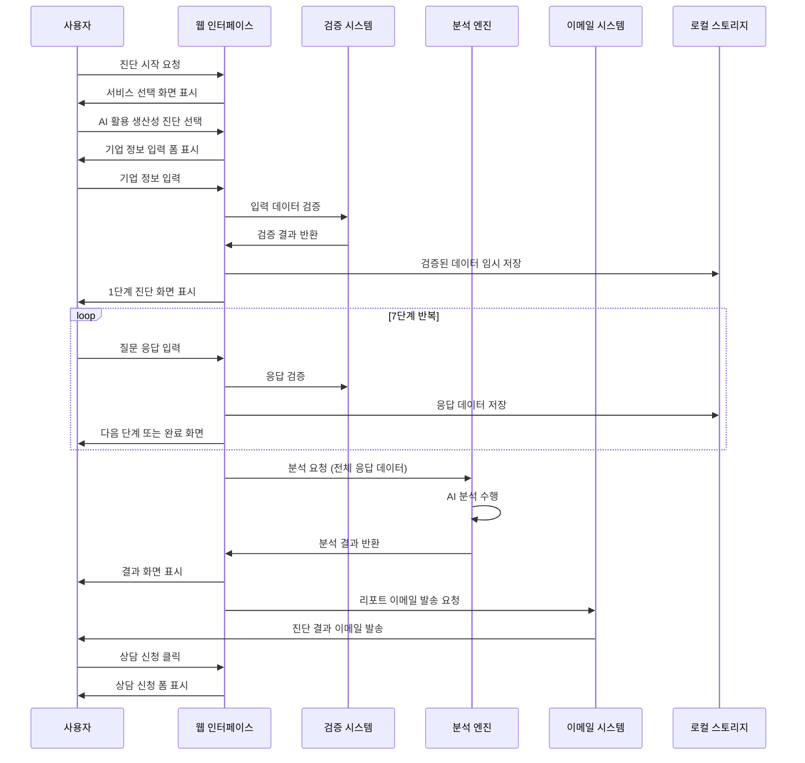
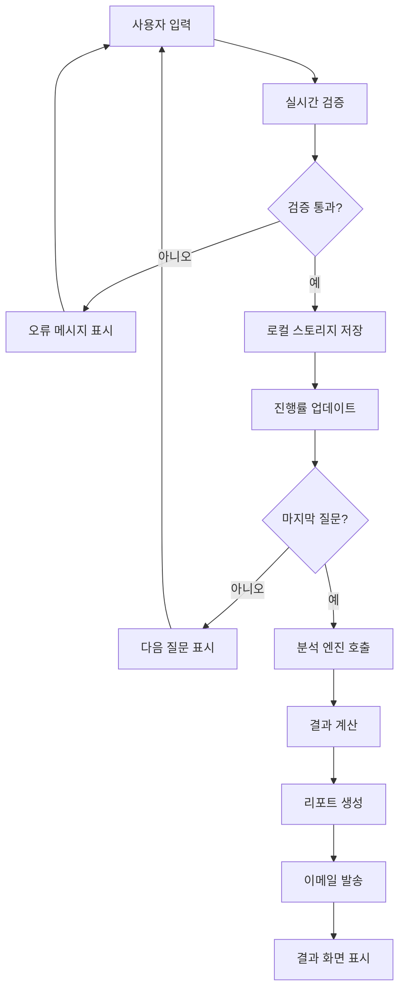
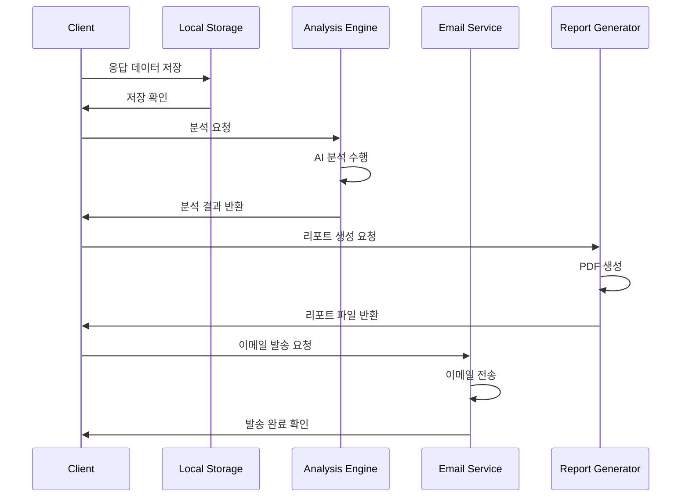

# 경영지도센터 통합 플랫폼 Use Case 문서

## 📋 목차
1. [액터 정의](#액터-정의)
2. [유스케이스 시나리오 개요](#유스케이스-시나리오-개요)
3. [주요 단계 및 이벤트 플로우](#주요-단계-및-이벤트-플로우)
4. [예외 처리 절차](#예외-처리-절차)
5. [포괄적 액터 정의](#포괄적-액터-정의)
6. [상세 유스케이스 시나리오](#상세-유스케이스-시나리오)
7. [대안 플로우 및 엣지 케이스](#대안-플로우-및-엣지-케이스)
8. [사전/사후 조건](#사전사후-조건)
9. [비즈니스 규칙 및 제약사항](#비즈니스-규칙-및-제약사항)
10. [사용자 인터페이스 고려사항](#사용자-인터페이스-고려사항)
11. [데이터 요구사항 및 데이터 플로우](#데이터-요구사항-및-데이터-플로우)
12. [보안 및 개인정보 고려사항](#보안-및-개인정보-고려사항)

---

## 👥 액터 정의

### 주요 액터 (Primary Actors)

| 액터명 | 설명 | 권한 수준 | 주요 목표 |
|--------|------|----------|----------|
| **세무사** | 고객사 지원을 위해 플랫폼을 이용하는 세무 전문가 | 일반 사용자 | 고객사 성장 지원 및 부가 서비스 발굴 |
| **기업 대표** | 직접 경영지도 서비스를 이용하는 중소기업 대표 | 일반 사용자 | 기업 성장을 위한 전문 컨설팅 서비스 이용 |
| **잠재 고객** | 서비스에 관심을 가지고 정보를 탐색하는 방문자 | 게스트 | 서비스 정보 확인 및 초기 진단 체험 |

### 보조 액터 (Secondary Actors)

| 액터명 | 설명 | 권한 수준 | 주요 역할 |
|--------|------|----------|----------|
| **AI 챗봇 시스템** | 자동 응답 및 초기 상담을 담당하는 AI 시스템 | 시스템 | FAQ 응답, 질문 분류, 전문가 연결 |
| **이메일 시스템** | 자동 이메일 발송을 담당하는 외부 시스템 | 시스템 | 진단 결과, 상담 확인, 후속 관리 이메일 발송 |
| **진단 분석 엔진** | 설문 응답을 분석하여 결과를 생성하는 시스템 | 시스템 | 응답 데이터 분석, 점수 계산, 추천사항 생성 |
| **컨설턴트** | 실제 상담을 제공하는 경영지도센터 전문가 | 관리자 | 전문 상담, 프로젝트 수행, 사후 관리 |

---

## 📊 유스케이스 시나리오 개요

### 핵심 유스케이스 다이어그램
```
                    [경영지도센터 통합 플랫폼]
                            
    세무사 ────────────┐
                      │
    기업 대표 ────────┼─── UC-01: 서비스 정보 탐색
                      │    UC-02: 종합 진단 수행
    잠재 고객 ────────┘    UC-03: AI 챗봇 상담
                           UC-04: 전문가 상담 신청
                           UC-05: 진단 결과 확인
                           UC-06: 사후 관리 참여
                           
    AI 챗봇 ─────────────── UC-07: 자동 응답 제공
    이메일 시스템 ──────── UC-08: 자동 이메일 발송
    진단 엔진 ────────── UC-09: 진단 분석 수행
```

### 유스케이스 우선순위 매트릭스

| 유스케이스 | 비즈니스 중요도 | 기술적 복잡도 | 사용 빈도 | 우선순위 |
|------------|-----------------|---------------|-----------|----------|
| **UC-02: 종합 진단 수행** | 높음 | 높음 | 높음 | 1 |
| **UC-04: 전문가 상담 신청** | 높음 | 중간 | 높음 | 2 |
| **UC-03: AI 챗봇 상담** | 중간 | 높음 | 높음 | 3 |
| **UC-01: 서비스 정보 탐색** | 중간 | 낮음 | 매우 높음 | 4 |
| **UC-05: 진단 결과 확인** | 높음 | 중간 | 중간 | 5 |
| **UC-06: 사후 관리 참여** | 높음 | 중간 | 낮음 | 6 |

---

## 🔄 주요 단계 및 이벤트 플로우

### UC-02: 종합 진단 수행 (Primary Use Case)

#### 기본 플로우
```
1. 사용자 진입
   ├── 1.1. 홈페이지 접속
   ├── 1.2. 서비스 선택 (5개 중 1개)
   └── 1.3. 진단 시작 버튼 클릭

2. 사전 정보 수집
   ├── 2.1. 기업 기본 정보 입력
   ├── 2.2. 연락처 정보 입력
   └── 2.3. 진단 목적 선택

3. 단계별 진단 수행
   ├── 3.1. Step 1: 현재 현황 진단 (5문항)
   ├── 3.2. Step 2: 업무 효율성 평가 (5문항)
   ├── 3.3. Step 3: 조직 역량 분석 (4문항)
   ├── 3.4. Step 4: 기술 수용성 평가 (4문항)
   ├── 3.5. Step 5: 해외 사업 현황 (4문항)
   ├── 3.6. Step 6: 투자 의향 조사 (3문항)
   └── 3.7. Step 7: 추가 정보 수집 (4문항)

4. 자동 분석 및 결과 생성
   ├── 4.1. 응답 데이터 검증
   ├── 4.2. AI 분석 엔진 처리
   ├── 4.3. 점수 계산 (4개 영역)
   └── 4.4. 맞춤 추천사항 생성

5. 결과 제공
   ├── 5.1. 분석 결과 화면 표시
   ├── 5.2. PDF 리포트 생성
   ├── 5.3. 이메일 자동 발송
   └── 5.4. 상담 신청 유도
```

#### 상세 이벤트 시퀀스


---

## ⚠️ 예외 처리 절차

### 시스템 레벨 예외

#### EX-001: 네트워크 연결 오류
| 항목 | 내용 |
|------|------|
| **발생 조건** | 인터넷 연결 불안정 또는 서버 응답 없음 |
| **감지 방법** | HTTP 요청 타임아웃 (30초) 또는 연결 실패 |
| **사용자 메시지** | "인터넷 연결을 확인해주세요. 잠시 후 다시 시도해주세요." |
| **시스템 동작** | 1. 로컬 데이터 자동 저장<br>2. 재연결 시도 (3회)<br>3. 오프라인 모드 제안 |
| **복구 절차** | 1. 네트워크 상태 확인<br>2. 저장된 데이터 복원<br>3. 이어서 진행 가능 |

#### EX-002: 데이터 저장 실패
| 항목 | 내용 |
|------|------|
| **발생 조건** | 로컬 스토리지 용량 부족 또는 브라우저 제한 |
| **감지 방법** | localStorage.setItem() 예외 발생 |
| **사용자 메시지** | "데이터 저장 공간이 부족합니다. 브라우저 캐시를 정리해주세요." |
| **시스템 동작** | 1. 기존 임시 데이터 정리<br>2. 필수 데이터만 저장<br>3. 즉시 서버 전송 시도 |
| **복구 절차** | 1. 브라우저 캐시 정리 안내<br>2. 다른 저장 방법 제안<br>3. 이메일 백업 제공 |

### 사용자 입력 예외

#### EX-003: 필수 정보 누락
| 항목 | 내용 |
|------|------|
| **발생 조건** | 필수 입력 필드가 비어있거나 유효하지 않음 |
| **감지 방법** | 실시간 검증 및 제출 시 최종 검증 |
| **사용자 메시지** | "회사명을 입력해주세요." (필드별 구체적 메시지) |
| **시스템 동작** | 1. 해당 필드 빨간색 테두리 표시<br>2. 포커스 이동<br>3. 진행 버튼 비활성화 |
| **복구 절차** | 1. 올바른 정보 입력 안내<br>2. 예시 또는 도움말 제공<br>3. 입력 완료 시 자동 진행 |

#### EX-004: 세션 타임아웃
| 항목 | 내용 |
|------|------|
| **발생 조건** | 30분 이상 비활성 상태 지속 |
| **감지 방법** | JavaScript 타이머 및 마지막 활동 시간 추적 |
| **사용자 메시지** | "세션이 만료되었습니다. 저장된 데이터로 이어서 진행하시겠습니까?" |
| **시스템 동작** | 1. 모든 입력 데이터 자동 저장<br>2. 복원 옵션 제공<br>3. 새로 시작 옵션 제공 |
| **복구 절차** | 1. 저장된 데이터 확인<br>2. 진행 상황 복원<br>3. 이어서 진행 |

### 비즈니스 로직 예외

#### EX-005: 분석 엔진 오류
| 항목 | 내용 |
|------|------|
| **발생 조건** | AI 분석 처리 중 오류 발생 |
| **감지 방법** | 분석 API 응답 오류 또는 타임아웃 |
| **사용자 메시지** | "분석 처리 중 일시적 오류가 발생했습니다. 잠시 후 다시 시도해주세요." |
| **시스템 동작** | 1. 백업 분석 로직 실행<br>2. 기본 결과 제공<br>3. 오류 로그 기록 |
| **복구 절차** | 1. 재분석 시도<br>2. 전문가 검토 예약<br>3. 임시 결과 제공 |

---

## 👥 포괄적 액터 정의

### 세무사 (Tax Advisor)

#### 상세 프로필
| 속성 | 내용 |
|------|------|
| **기본 정보** | 30-50대, 세무사 자격증 보유, 고객사 50-100개 관리 |
| **기술 수준** | 중급 (기본적인 웹 서비스 이용 가능) |
| **주요 니즈** | 고객사 성장 지원, 부가 서비스 발굴, 신뢰도 제고 |
| **사용 패턴** | 업무 시간 (9-18시) 집중 이용, 주 2-3회 접속 |
| **기대 효과** | 고객 만족도 향상, 매출 다각화, 전문성 강화 |

#### 권한 및 기능
- ✅ 모든 진단 시스템 이용
- ✅ 상담 신청 및 일정 관리
- ✅ 고객사 대신 진단 수행
- ✅ 결과 리포트 다운로드 및 공유
- ✅ AI 챗봇 우선 응답
- ❌ 시스템 관리 기능

#### 사용 시나리오
1. **고객 상담 준비**: 고객사 현황 사전 진단
2. **솔루션 제안**: 분석 결과 기반 서비스 추천
3. **진행 상황 관리**: 프로젝트 진행도 확인
4. **성과 검증**: 컨설팅 효과 측정

### 기업 대표 (Business Owner)

#### 상세 프로필
| 속성 | 내용 |
|------|------|
| **기본 정보** | 35-55세, 중소기업 대표, 직원 수 10-100명 |
| **기술 수준** | 초급-중급 (스마트폰 앱 이용 수준) |
| **주요 니즈** | 기업 성장 방안, 정부 지원 정보, 비용 효율적 솔루션 |
| **사용 패턴** | 이동 중 모바일 이용, 저녁/주말 시간대 |
| **기대 효과** | 매출 증대, 비용 절감, 경쟁력 강화 |

#### 권한 및 기능
- ✅ 자사 관련 진단 시스템 이용
- ✅ 상담 신청 (본인 기업만)
- ✅ 진단 결과 확인 및 다운로드
- ✅ AI 챗봇 기본 상담
- ✅ 성공사례 및 자료 열람
- ❌ 타사 정보 접근

### AI 챗봇 시스템 (Chatbot System)

#### 시스템 사양
| 구성 요소 | 세부 내용 |
|-----------|-----------|
| **NLP 엔진** | OpenAI GPT-4 기반 자연어 처리 |
| **지식 베이스** | 200개 이상 FAQ, 서비스 정보, 정책 데이터 |
| **학습 알고리즘** | 대화 패턴 분석을 통한 응답 정확도 향상 |
| **응답 시간** | 평균 3초 이내 응답 |
| **가용성** | 24시간 365일 운영 |

#### 주요 기능
- 🤖 자동 질문 분류 및 라우팅
- 💬 즉시 FAQ 응답 제공
- 🔄 복잡한 질문 시 전문가 연결
- 📊 대화 데이터 수집 및 분석
- 🌐 다국어 지원 (한/영/중/일)

---

## 📋 상세 유스케이스 시나리오

### UC-02: 종합 진단 수행 (상세 버전)

#### 사전 조건 (Preconditions)
- 사용자가 웹 브라우저 또는 모바일 앱에 접속
- 인터넷 연결 상태 양호
- 브라우저에서 JavaScript 및 로컬 스토리지 지원
- 진단하고자 하는 서비스 영역 선택 완료

#### 주요 성공 시나리오 (Main Success Scenario)

##### Phase 1: 진입 및 서비스 선택
```
1. 사용자가 홈페이지에 접속한다
   - 시스템이 메인 히어로 섹션을 표시한다
   - "Business Model Zen 5단계 프레임워크" 소개
   - 5대 핵심 서비스 카드 배치

2. 사용자가 관심 서비스를 선택한다
   예시: "AI 활용 생산성향상" 카드 클릭
   - 시스템이 해당 서비스 상세 페이지로 이동
   - 성장 단계별 헤드라인 표시:
     * Step 1: "창업 초기, AI로 1인 다역할 완성하세요"
     * Step 2: "조직 확장 전, AI로 업무 표준화하세요"
     * Step 3: "시장 주도를 위한 AI 기반 혁신 조직 구축"
     * Step 4: "글로벌 경쟁력, AI 생태계로 완성하세요"

3. 사용자가 "무료 진단 시작하기" 버튼을 클릭한다
   - 시스템이 진단 인트로 페이지를 표시한다
   - 진단 개요: "29개 질문, 7단계, 약 15분 소요"
   - 개인정보 처리 동의 체크박스
   - "진단 시작" 최종 확인 버튼
```

##### Phase 2: 기업 정보 수집
```
4. 시스템이 기업 기본 정보 입력 폼을 표시한다
   필수 입력 항목:
   - 회사명 (텍스트 입력, 최대 50자)
   - 업종 (드롭다운: 제조업, 서비스업, IT업 등)
   - 설립년도 (연도 선택, 1950-현재)
   - 직원 수 (범위 선택: 1-5명, 6-10명, ... 100명 이상)
   - 연매출 (범위 선택: 1억 미만, 1-10억, ... 100억 이상)

5. 사용자가 기업 정보를 입력한다
   - 실시간 검증 수행:
     * 회사명: 특수문자 제한, 중복 확인
     * 설립년도: 현재 날짜 기준 유효성 검사
     * 직원 수와 매출의 논리적 일관성 검토
   - 유효하지 않은 입력 시 즉시 오류 메시지 표시

6. 연락처 정보를 입력한다
   필수 항목:
   - 담당자명 (텍스트 입력, 최대 20자)
   - 직책 (텍스트 입력, 최대 30자)
   - 휴대폰 번호 (자동 하이픈 삽입)
   - 이메일 주소 (형식 검증)
   
   선택 항목:
   - 회사 전화번호
   - 팩스 번호
   - 회사 주소

7. 진단 목적을 선택한다
   - 라디오 버튼 옵션:
     * "현재 상황 점검 및 개선 방안 모색"
     * "신규 사업 진출을 위한 역량 평가"
     * "정부 지원 프로그램 신청 준비"
     * "투자 유치를 위한 기업 가치 평가"
     * "기타" (직접 입력)
```

##### Phase 3: 단계별 진단 수행
```
8. Step 1: 현재 AI 활용 현황 (5문항)
   8.1. "현재 조직에서 활용 중인 AI 도구는?" (복수 선택)
        ☐ ChatGPT (텍스트 생성)
        ☐ Claude (문서 분석)
        ☐ Midjourney (이미지 생성)
        ☐ Notion AI (문서 작성)
        ☐ 활용하지 않음
        ☐ 기타: ________

   8.2. "AI 도구 활용 빈도는?" (단일 선택)
        ○ 매일 사용
        ○ 주 2-3회 사용
        ○ 월 2-3회 사용
        ○ 거의 사용하지 않음

   8.3. "AI 활용에 가장 큰 장애 요인은?" (단일 선택)
        ○ 사용법을 모름
        ○ 보안 우려
        ○ 비용 부담
        ○ 효과에 대한 의구심
        ○ 직원 거부감

   8.4. "업무에서 가장 시간이 많이 소요되는 작업은?" (단일 선택)
        ○ 문서 작성 (제안서, 보고서 등)
        ○ 데이터 입력 및 정리
        ○ 고객 응대 및 상담
        ○ 회의 및 커뮤니케이션
        ○ 기타: ________

   8.5. "AI 도입 시 가장 개선하고 싶은 영역은?" (복수 선택)
        ☐ 업무 효율성 향상
        ☐ 인건비 절감
        ☐ 고객 서비스 품질 개선
        ☐ 신사업 발굴
        ☐ 의사결정 지원

9. Step 2: 업무 효율성 현황 (5문항)
   9.1. "현재 가장 큰 생산성 저해 요인은?" (단일 선택)
   9.2. "반복 업무 비율은 전체 업무의 몇 %인가요?" (슬라이더: 0-100%)
   9.3. "업무 프로세스 표준화 수준은?" (5점 척도)
   9.4. "직원들의 IT 활용 능력은?" (5점 척도)
   9.5. "업무 자동화에 대한 관심도는?" (5점 척도)

10. Step 3-7: 나머지 단계도 동일한 패턴으로 진행
    - 각 단계마다 진행률 표시 (1/7, 2/7, ...)
    - 이전/다음 버튼으로 단계 간 이동 가능
    - 30초마다 자동 저장 수행
    - 페이지 이탈 시 경고 메시지 표시
```

##### Phase 4: 자동 분석 및 결과 생성
```
11. 모든 질문 완료 후 시스템이 분석을 시작한다
    - 로딩 화면 표시: "분석 중입니다... (30초 내 완료)"
    - 진행률 바 애니메이션
    - 분석 중 메시지 순차 표시:
      * "응답 데이터를 검증하고 있습니다..."
      * "AI 분석 엔진을 실행 중입니다..."
      * "업종별 벤치마킹 데이터를 비교하고 있습니다..."
      * "맞춤형 추천사항을 생성하고 있습니다..."

12. 분석 엔진이 4개 영역 점수를 계산한다
    - AI 활용 성숙도: 0-100점
    - 디지털 준비도: 0-100점  
    - 혁신 필요도: 0-100점
    - 투자 효과성: 0-100점

13. 개인화된 추천사항을 생성한다
    - 우선 적용 영역 식별
    - 3-6-12개월 로드맵 제시
    - 예상 투자 비용 및 효과 계산
    - 정부 지원 프로그램 매칭
```

##### Phase 5: 결과 제공 및 후속 조치
```
14. 시스템이 분석 결과 화면을 표시한다
    화면 구성:
    - 종합 점수 대시보드 (레이더 차트)
    - 각 영역별 상세 점수 및 해석
    - 업종 평균 대비 비교 그래프
    - 성장 단계 분류 결과 (Step 1-4)
    - 핵심 개선 포인트 3가지

15. 맞춤형 추천사항을 표시한다
    - 우선순위별 실행 과제 리스트
    - 각 과제별 예상 효과 및 기간
    - 필요 투자 비용 범위
    - 관련 정부 지원 프로그램 정보

16. PDF 리포트를 자동 생성한다
    리포트 구성 (총 8-10페이지):
    - 표지: 기업명, 진단일, 서비스 유형
    - 진단 개요: 목적, 방법, 참여자 정보
    - 분석 결과: 점수, 그래프, 해석
    - 개선 방안: 단계별 실행 계획
    - 벤치마킹: 동종 업계 비교 분석
    - 정부 지원: 활용 가능한 지원 프로그램
    - 후속 조치: 상담 및 컨설팅 안내
    - 부록: 체크리스트, 관련 자료

17. 이메일을 자동 발송한다
    발송 내용:
    - 제목: "[경영지도센터] AI 활용 생산성 진단 결과"
    - 인사말 및 진단 참여 감사 인사
    - 주요 진단 결과 요약 (점수, 등급)
    - PDF 리포트 첨부
    - 전문가 상담 신청 링크
    - 관련 서비스 소개 (간략)
    - 연락처 정보

18. 상담 신청 유도 화면을 표시한다
    - "전문가와 함께 더 자세한 분석을 받아보세요"
    - 무료 상담 신청 버튼 (강조)
    - 상담 가능 일정 미리보기
    - 상담 시 제공 내용 안내
    - 고객 후기 및 성공 사례 링크
```

#### 사후 조건 (Postconditions)
- 진단 데이터가 로컬 스토리지에 안전하게 저장됨
- 분석 결과 PDF가 생성되어 이메일로 발송됨
- 사용자가 상담 신청을 진행할 수 있는 상태
- 6개월 후 재진단 알림이 스케줄에 등록됨
- 고객 데이터가 CRM 시스템에 기록됨

---

## 🔄 대안 플로우 및 엣지 케이스

### Alternative Flow 1: 진단 중단 및 재개

#### 시나리오: 사용자가 진단 중 브라우저를 닫거나 다른 페이지로 이동
```
A1. 진단 진행 중 페이지 이탈 감지
    - window.beforeunload 이벤트 발생
    - 확인 대화상자 표시: "진단이 완료되지 않았습니다. 정말 나가시겠습니까?"
    - 예: 페이지 이탈, 아니오: 진단 계속

A2. 데이터 자동 저장
    - 현재까지 입력된 모든 응답 데이터를 localStorage에 저장
    - 마지막 진행 단계 정보 저장
    - 고유 세션 ID 생성 및 저장

A3. 재방문 시 복원 옵션 제공
    - 홈페이지 접속 시 미완료 진단 감지
    - 알림 메시지: "이전에 진행하던 진단이 있습니다. 이어서 진행하시겠습니까?"
    - 버튼 옵션: [이어서 하기] [새로 시작하기]

A4. 이어서 진행 선택 시
    - 저장된 데이터 복원
    - 마지막 진행 단계로 직접 이동
    - 이전 응답 내용 미리 채워진 상태로 표시
    - 수정 가능한 상태로 제공
```

### Alternative Flow 2: 모바일 환경에서의 진단

#### 시나리오: 스마트폰에서 진단 수행 중 다양한 상황 발생
```
A5. 모바일 최적화 인터페이스 제공
    - 터치 친화적 UI 요소 크기 조정
    - 한 화면에 1-2개 질문만 표시
    - 스와이프 제스처로 이전/다음 이동 지원
    - 키보드 자동 팝업 및 입력 필드 최적화

A6. 전화 수신 중단 처리
    - 앱이 백그라운드로 이동 시 자동 저장
    - 타이머 일시 정지
    - 복귀 시 이전 상태 복원

A7. 배터리 부족 상황 대응
    - 배터리 20% 이하 시 경고 메시지
    - "빠른 저장" 버튼 제공
    - 이메일 백업 옵션 즉시 제공

A8. 데이터 사용량 최적화
    - 이미지 압축 및 최소화
    - 필수 데이터만 전송
    - 오프라인 모드 지원
```

### Edge Case 1: 극단적 응답 패턴

#### 시나리오: 모든 질문에 동일한 답변 또는 무작위 응답
```
E1. 응답 패턴 이상 감지
    - 연속 3개 이상 동일 답변 선택 시 경고
    - 응답 시간이 비정상적으로 빠른 경우 (2초 이하/문항)
    - 모순되는 답변 조합 감지

E2. 품질 검증 질문 삽입
    - 중간 단계에 신뢰도 확인 질문 추가
    - "앞에서 선택한 답변이 맞습니까?" 형태
    - 일관성 없는 답변 시 재확인 요청

E3. 분석 결과 신뢰도 표시
    - 응답 신뢰도 점수 계산 (0-100%)
    - 70% 미만 시 "재진단 권장" 메시지
    - 전문가 상담 강력 추천

E4. 대안 진단 방법 제안
    - 전화 인터뷰 진단 제안
    - 단계별 분할 진단 옵션
    - 전문가 동반 진단 서비스
```

### Edge Case 2: 시스템 과부하 상황

#### 시나리오: 동시 접속자 급증으로 인한 성능 저하
```
E5. 시스템 부하 모니터링
    - 실시간 서버 리소스 사용률 확인
    - 응답 시간 임계값 설정 (5초)
    - 동시 접속자 수 제한 설정

E6. 대기열 시스템 운영
    - 임계값 초과 시 대기열 화면 표시
    - 예상 대기 시간 및 현재 순서 안내
    - 이메일 알림 신청 옵션 제공

E7. 성능 최적화 모드 전환
    - 그래픽 요소 최소화
    - 실시간 저장 주기 연장
    - 캐시 활용 최대화

E8. 백업 서비스 제공
    - 오프라인 진단 도구 다운로드 제공
    - 간소화된 진단 버전 제공
    - 전화 상담 직접 연결 서비스
```

---

## ✅ 사전/사후 조건

### UC-02: 종합 진단 수행

#### 사전 조건 (Preconditions)
| 조건 유형 | 상세 내용 | 검증 방법 |
|-----------|-----------|-----------|
| **기술적 환경** | • 인터넷 연결 (최소 1Mbps)<br>• 웹 브라우저 (Chrome 90+, Safari 14+, Firefox 88+)<br>• JavaScript 활성화<br>• 로컬 스토리지 지원 (최소 5MB) | 자동 검증 및 오류 메시지 |
| **사용자 준비** | • 기업 기본 정보 숙지<br>• 이메일 주소 접근 가능<br>• 진단 목적 명확화<br>• 15분 이상 시간 확보 | 안내 메시지 및 체크리스트 |
| **비즈니스 조건** | • 대상 기업이 중소기업 범위<br>• 컨설팅 서비스 수요 존재<br>• 한국어 서비스 이용 가능 | 입력 데이터 검증 |

#### 사후 조건 (Postconditions)
| 결과 유형 | 상세 내용 | 검증 방법 |
|-----------|-----------|-----------|
| **데이터 생성** | • 진단 응답 데이터 로컬 저장<br>• 분석 결과 데이터 생성<br>• PDF 리포트 파일 생성<br>• 이메일 발송 로그 기록 | 데이터 무결성 검사 |
| **사용자 상태** | • 분석 결과 화면 표시 완료<br>• 리포트 이메일 수신 가능<br>• 상담 신청 준비 상태<br>• 6개월 후 재진단 스케줄 등록 | UI 상태 확인 |
| **비즈니스 효과** | • 잠재 고객 정보 획득<br>• 서비스 니즈 파악<br>• 상담 기회 창출<br>• 고객 만족도 데이터 수집 | 성과 지표 측정 |

### UC-03: AI 챗봇 상담

#### 사전 조건 (Preconditions)
| 조건 유형 | 상세 내용 | 검증 방법 |
|-----------|-----------|-----------|
| **시스템 상태** | • AI 챗봇 서비스 정상 운영<br>• 지식 베이스 최신 상태<br>• 실시간 응답 가능 상태 | 헬스 체크 API |
| **사용자 환경** | • 웹 브라우저 또는 모바일 앱<br>• 채팅 위젯 로드 완료<br>• 인터넷 연결 안정성 | 프론트엔드 검증 |

#### 사후 조건 (Postconditions)
| 결과 유형 | 상세 내용 | 검증 방법 |
|-----------|-----------|-----------|
| **대화 완료** | • 사용자 질문에 대한 적절한 응답 제공<br>• 필요 시 전문가 연결 안내<br>• 대화 내역 저장<br>• 만족도 평가 수집 | 응답 품질 모니터링 |
| **후속 조치** | • 상담 신청 또는 진단 연결<br>• FAQ 개선 데이터 수집<br>• 사용자 행동 패턴 분석 | 전환율 추적 |

---

## 📋 비즈니스 규칙 및 제약사항

### 데이터 관리 규칙

#### DR-001: 개인정보 보호
| 항목 | 내용 |
|------|------|
| **수집 목적** | 진단 서비스 제공 및 상담 연결만으로 제한 |
| **보존 기간** | 로컬 스토리지: 30일, 서버: 진단 완료 후 3년 |
| **제3자 제공** | 명시적 동의 없이 금지, 파트너사 연결 시에만 허용 |
| **삭제 권리** | 사용자 요청 시 즉시 삭제, 자동 삭제 알림 |

#### DR-002: 진단 데이터 품질
| 항목 | 내용 |
|------|------|
| **필수 응답률** | 전체 질문의 90% 이상 응답 필수 |
| **응답 일관성** | 논리적 모순 발견 시 재확인 요청 |
| **시간 제한** | 질문당 최대 5분, 전체 진단 60분 제한 |
| **중복 진단** | 동일 기업 30일 내 재진단 시 경고 |

### 서비스 제공 규칙

#### SR-001: 상담 서비스
| 항목 | 내용 |
|------|------|
| **무료 상담** | 초회 30분 무료, 추가 상담 시 유료 전환 |
| **상담 예약** | 평일 9-18시, 최대 2주 후까지 예약 가능 |
| **취소 정책** | 24시간 전 취소 가능, 당일 취소 시 1회 차감 |
| **전문가 배정** | 업종별 전문성 매칭, 언어 선호도 고려 |

#### SR-002: 진단 결과 활용
| 항목 | 내용 |
|------|------|
| **결과 유효기간** | 진단 완료일로부터 6개월 |
| **재진단 권장** | 6개월 후 자동 알림, 사업 환경 변화 시 즉시 |
| **벤치마킹 기준** | 동일 업종, 유사 규모 기업 대상 분기별 업데이트 |
| **성과 추적** | 컨설팅 참여 고객 대상 6개월 단위 성과 측정 |

### 기술적 제약사항

#### TC-001: 시스템 성능
| 항목 | 제약 내용 | 대응 방안 |
|------|-----------|-----------|
| **응답 시간** | 진단 분석 30초 이내 | 분산 처리, 캐싱 |
| **동시 사용자** | 최대 500명 동시 진단 | 로드 밸런싱, 대기열 |
| **데이터 크기** | 로컬 스토리지 5MB 제한 | 압축, 선택적 저장 |
| **브라우저 호환** | IE 지원 불가 | 브라우저 업데이트 안내 |

#### TC-002: AI 챗봇 제약
| 항목 | 제약 내용 | 대응 방안 |
|------|-----------|-----------|
| **응답 정확도** | 95% 이상 목표 | 지속적 학습, 피드백 반영 |
| **동시 대화** | 최대 100개 세션 | 큐 시스템, 우선순위 |
| **언어 지원** | 한국어 기본, 영어 부분 지원 | 단계적 다국어 확장 |
| **복잡성 한계** | 3회 이상 연속 질문 시 전문가 연결 | 자동 에스컬레이션 |

### 법적 규제 준수

#### LC-001: 개인정보보호법
- 개인정보 수집·이용 동의서 필수 표시
- 위탁업체 정보 공개 (이메일 발송 업체 등)
- 개인정보보호책임자 연락처 명시
- 정기적 개인정보 영향평가 수행

#### LC-002: 전자상거래법
- 서비스 이용약관 명확 표시
- 환불 정책 사전 고지
- 분쟁 조정 절차 안내
- 사업자 정보 의무 표시

---

## 💻 사용자 인터페이스 고려사항

### 접근성 (Accessibility) 가이드라인

#### WCAG 2.1 AA 준수 사항
| 원칙 | 구체적 요구사항 | 구현 방법 |
|------|----------------|-----------|
| **인식 가능성** | • 색상만으로 정보 전달 금지<br>• 충분한 색상 대비율 (4.5:1)<br>• 텍스트 크기 조절 가능 | 아이콘+텍스트 병용, 고대비 색상, 폰트 크기 조절 |
| **운용 가능성** | • 키보드만으로 모든 기능 이용<br>• 충분한 클릭 영역 (44px 이상)<br>• 시간 제한 조절 가능 | Tab 네비게이션, 터치 영역 확대, 시간 연장 옵션 |
| **이해 가능성** | • 일관된 네비게이션 구조<br>• 명확한 오류 메시지<br>• 예측 가능한 기능 동작 | 표준 UI 패턴, 구체적 안내, 일관된 레이아웃 |
| **견고성** | • 다양한 보조 기술 호환<br>• 의미있는 HTML 구조<br>• ARIA 라벨 제공 | 시맨틱 태그, 스크린 리더 지원, 대체 텍스트 |

#### 반응형 디자인 브레이크포인트
```css
/* 모바일 우선 설계 */
.container {
  /* 기본: 모바일 (320px-767px) */
  width: 100%;
  padding: 16px;
}

/* 태블릿 (768px-1023px) */
@media (min-width: 768px) {
  .container {
    max-width: 720px;
    margin: 0 auto;
    padding: 24px;
  }
  
  .form-grid {
    display: grid;
    grid-template-columns: 1fr 1fr;
    gap: 20px;
  }
}

/* 데스크톱 (1024px 이상) */
@media (min-width: 1024px) {
  .container {
    max-width: 1200px;
    padding: 32px;
  }
  
  .diagnosis-layout {
    display: grid;
    grid-template-columns: 300px 1fr;
    gap: 40px;
  }
}
```

### 사용자 경험 최적화

#### UX-001: 인지 부하 최소화
| 원칙 | 적용 방법 | 예시 |
|------|----------|------|
| **단순성** | 한 화면에 하나의 주요 작업 | 진단 시 질문 1개씩 표시 |
| **일관성** | 동일한 패턴 반복 사용 | 모든 폼에서 동일한 버튼 스타일 |
| **피드백** | 모든 액션에 즉시 반응 | 버튼 클릭 시 로딩 상태 표시 |
| **가이드** | 명확한 안내 및 도움말 | 각 질문마다 설명 툴팁 제공 |

#### UX-002: 감정적 디자인 요소
```javascript
// 진행률에 따른 격려 메시지
const encouragementMessages = {
  25: "좋은 시작입니다! 계속 진행해주세요 💪",
  50: "절반 완료! 조금만 더 힘내세요 🎯",
  75: "거의 다 왔어요! 마지막까지 파이팅 🚀",
  100: "완료되었습니다! 훌륭한 선택이었어요 🎉"
};

// 결과 페이지 개인화
const personalizedResult = {
  title: `${companyName}님의 AI 활용 잠재력`,
  greeting: `${userName} 대표님, 진단에 참여해주셔서 감사합니다.`,
  encouragement: "귀하의 기업은 충분한 성장 가능성을 보유하고 있습니다."
};
```

### 모바일 최적화

#### Mobile-First 인터랙션 패턴
| 요소 | 모바일 최적화 방법 | 구현 세부사항 |
|------|-------------------|---------------|
| **네비게이션** | 햄버거 메뉴 + 하단 탭 | 주요 기능 4개까지 하단 고정 |
| **입력 폼** | 큰 터치 영역, 자동완성 | 최소 44px 높이, 키보드 최적화 |
| **진단 UI** | 카드 기반 인터페이스 | 스와이프로 이전/다음 이동 |
| **결과 표시** | 접을 수 있는 섹션 | 아코디언 형태로 정보 구조화 |

#### 터치 제스처 지원
```javascript
// 진단 페이지 스와이프 네비게이션
const GestureHandler = {
  swipeLeft: () => nextQuestion(),
  swipeRight: () => previousQuestion(),
  doubleTap: () => showQuestionHelp(),
  longPress: () => saveCurrentProgress()
};

// iOS Safari 특화 최적화
if (iOS()) {
  document.documentElement.style.setProperty('--viewport-height', 
    `${window.innerHeight}px`);
}
```

---

## 📊 데이터 요구사항 및 데이터 플로우

### 데이터 아키텍처 개요

#### 데이터 저장 계층
```
[사용자 브라우저] ← → [클라우드 서비스]
      ↓                    ↓
  로컬 스토리지          백업 스토리지
  - 진단 응답           - 분석 결과
  - 임시 데이터         - 리포트 파일
  - 사용자 설정         - 이메일 로그
```

### 핵심 데이터 모델

#### 진단 응답 데이터 (DiagnosisResponse)
```typescript
interface DiagnosisResponse {
  // 메타데이터
  id: string;                    // 고유 식별자 (UUID)
  sessionId: string;             // 세션 식별자
  timestamp: Date;               // 생성 시간
  version: string;               // 데이터 스키마 버전
  
  // 기업 정보
  companyInfo: {
    name: string;                // 회사명
    industry: string;            // 업종
    foundedYear: number;         // 설립년도
    employeeCount: string;       // 직원 수 범위
    annualRevenue: string;       // 연매출 범위
    location: {
      city: string;              // 도시
      district: string;          // 구/군
    };
  };
  
  // 연락처 정보 (암호화 저장)
  contactInfo: {
    name: string;                // 담당자명
    position: string;            // 직책
    phone: string;               // 전화번호
    email: string;               // 이메일
    company_phone?: string;      // 회사 전화번호
  };
  
  // 진단 응답
  responses: {
    [stepId: string]: {
      [questionId: string]: {
        value: any;              // 응답 값
        confidence: number;      // 응답 확신도 (1-5)
        responseTime: number;    // 응답 소요 시간 (초)
        attempts: number;        // 수정 횟수
      };
    };
  };
  
  // 진단 메타데이터
  diagnosisInfo: {
    serviceType: string;         // 진단 서비스 유형
    purpose: string;             // 진단 목적
    completionRate: number;      // 완료율 (0-100)
    totalTime: number;           // 총 소요 시간 (분)
    device: string;              // 디바이스 정보
    browser: string;             // 브라우저 정보
  };
}
```

#### 분석 결과 데이터 (AnalysisResult)
```typescript
interface AnalysisResult {
  // 기본 정보
  diagnosisId: string;          // 진단 ID 참조
  analyzedAt: Date;             // 분석 완료 시간
  analyzerVersion: string;      // 분석 엔진 버전
  
  // 점수 결과
  scores: {
    maturity: number;           // AI 활용 성숙도 (0-100)
    readiness: number;          // 디지털 준비도 (0-100)
    necessity: number;          // 혁신 필요도 (0-100)
    effectiveness: number;      // 투자 효과성 (0-100)
    overall: number;            // 종합 점수 (0-100)
  };
  
  // 등급 분류
  classification: {
    growthStage: 'step1' | 'step2' | 'step3' | 'step4';
    readinessLevel: 'beginner' | 'intermediate' | 'advanced' | 'expert';
    priority: 'high' | 'medium' | 'low';
  };
  
  // 벤치마킹 정보
  benchmarking: {
    industryAverage: number;     // 업종 평균
    sizeAverage: number;         // 규모별 평균
    topPercentile: number;       // 상위 10% 기준
    percentileRank: number;      // 백분위 순위
  };
  
  // 추천사항
  recommendations: Array<{
    id: string;
    priority: number;            // 우선순위 (1-5)
    category: string;            // 카테고리
    title: string;               // 추천 제목
    description: string;         // 상세 설명
    expectedEffect: string;      // 기대 효과
    timeframe: string;           // 예상 기간
    investmentRange: string;     // 투자 규모
    difficulty: 'easy' | 'medium' | 'hard';
    dependencies: string[];     // 선행 요구사항
  }>;
  
  // 정부 지원 프로그램
  supportPrograms: Array<{
    name: string;                // 프로그램명
    agency: string;              // 주관 기관
    supportType: string;         // 지원 유형
    maxAmount: string;           // 최대 지원 금액
    eligibilityScore: number;    // 적합성 점수
    applicationDeadline: Date;   // 신청 마감일
    requirements: string[];      // 신청 요건
  }>;
}
```

### 데이터 플로우 다이어그램

#### 진단 수행 플로우


#### 데이터 동기화 플로우


### 데이터 품질 관리

#### 입력 데이터 검증 규칙
| 데이터 유형 | 검증 규칙 | 오류 처리 |
|-------------|-----------|-----------|
| **회사명** | 2-50자, 특수문자 제한 | 실시간 경고, 자동 수정 제안 |
| **이메일** | RFC 5322 표준 준수 | 형식 검증, 도메인 확인 |
| **전화번호** | 한국 번호 형식 (010, 02 등) | 자동 하이픈 삽입, 형식 안내 |
| **직원 수** | 논리적 일관성 (매출과 비교) | 경고 메시지, 재확인 요청 |
| **응답 선택** | 필수 문항 누락 방지 | 진행 차단, 명확한 안내 |

#### 데이터 무결성 보장
```javascript
// 로컬 스토리지 데이터 검증
const validateStoredData = (data) => {
  const schema = {
    id: { type: 'string', required: true },
    timestamp: { type: 'date', required: true },
    responses: { type: 'object', required: true },
    companyInfo: { type: 'object', required: true }
  };
  
  return validateSchema(data, schema);
};

// 데이터 백업 및 복원
const backupData = async (data) => {
  try {
    const compressed = await compress(JSON.stringify(data));
    localStorage.setItem('backup_' + Date.now(), compressed);
    
    // 최대 5개 백업 유지
    cleanupOldBackups();
  } catch (error) {
    console.error('백업 실패:', error);
    showUserMessage('데이터 백업 중 오류가 발생했습니다.');
  }
};
```

---

## 🔒 보안 및 개인정보 고려사항

### 데이터 보호 전략

#### 로컬 데이터 암호화
```javascript
// 민감 정보 암호화 저장
const encryptSensitiveData = (data) => {
  const key = generateSessionKey();
  const encrypted = {
    contactInfo: encrypt(data.contactInfo, key),
    companyInfo: encrypt(data.companyInfo, key),
    metadata: data.metadata // 비민감 정보는 평문
  };
  
  // 키는 세션 메모리에만 보관
  sessionStorage.setItem('encKey', key);
  return encrypted;
};

// AES-256 암호화 함수
const encrypt = (text, key) => {
  const cipher = crypto.subtle.encrypt(
    { name: 'AES-GCM' },
    key,
    new TextEncoder().encode(text)
  );
  return cipher;
};
```

#### 개인정보 최소 수집 원칙
| 수집 정보 | 필수 여부 | 수집 목적 | 보존 기간 |
|-----------|-----------|-----------|-----------|
| **회사명** | 필수 | 진단 결과 개인화 | 진단 완료 후 30일 |
| **업종/규모** | 필수 | 벤치마킹 분석 | 익명화 후 통계 활용 |
| **담당자명** | 필수 | 상담 연결 | 상담 완료 후 1년 |
| **연락처** | 필수 | 결과 발송, 상담 예약 | 마케팅 거부 시 즉시 삭제 |
| **회사 주소** | 선택 | 지역별 서비스 제공 | 제공 거부 시 수집 안함 |

### 보안 위협 대응

#### 클라이언트 사이드 보안
| 위협 유형 | 대응 방안 | 구현 방법 |
|-----------|-----------|-----------|
| **XSS 공격** | 입력값 검증 및 이스케이프 | DOMPurify 라이브러리 사용 |
| **데이터 변조** | 무결성 검증 | 체크섬 및 디지털 서명 |
| **세션 하이재킹** | 안전한 세션 관리 | HTTPS 강제, SameSite 쿠키 |
| **브라우저 취약점** | 최신 브라우저 권장 | 호환성 검사 및 경고 |

#### 네트워크 보안
```javascript
// HTTPS 강제 리다이렉트
const enforceHTTPS = () => {
  if (location.protocol !== 'https:' && location.hostname !== 'localhost') {
    location.replace('https:' + window.location.href.substring(window.location.protocol.length));
  }
};

// API 요청 보안 헤더
const secureApiRequest = async (url, data) => {
  const response = await fetch(url, {
    method: 'POST',
    headers: {
      'Content-Type': 'application/json',
      'X-Requested-With': 'XMLHttpRequest',
      'X-CSRF-Token': getCSRFToken()
    },
    body: JSON.stringify(data),
    credentials: 'same-origin'
  });
  
  return response;
};
```

### 개인정보보호 규정 준수

#### GDPR/개인정보보호법 준수 체크리스트
- [ ] **수집·이용 동의**: 명확하고 구체적인 동의 문구
- [ ] **목적 제한**: 명시된 목적 외 사용 금지
- [ ] **최소 수집**: 서비스 제공에 필요한 최소한의 정보만 수집
- [ ] **정확성**: 잘못된 정보 수정 및 삭제 요청 처리
- [ ] **보존 기간**: 목적 달성 후 즉시 삭제 또는 익명화
- [ ] **안전성**: 기술적·관리적 보호조치 구현
- [ ] **투명성**: 개인정보처리방침 명확 공개
- [ ] **권리 행사**: 열람, 정정, 삭제 요구 처리 절차

#### 동의 관리 시스템
```javascript
// 세분화된 동의 관리
const ConsentManager = {
  essential: true,      // 필수 기능 (동의 철회 불가)
  analytics: false,     // 서비스 개선 분석
  marketing: false,     // 마케팅 정보 수신
  thirdParty: false,    // 제3자 정보 제공
  
  updateConsent: (type, value) => {
    ConsentManager[type] = value;
    localStorage.setItem('userConsent', JSON.stringify(ConsentManager));
    
    // 동의 상태에 따른 기능 제어
    if (!ConsentManager.analytics) {
      disableAnalytics();
    }
    if (!ConsentManager.marketing) {
      unsubscribeMarketing();
    }
  },
  
  withdrawAll: () => {
    // 필수 기능 외 모든 동의 철회
    Object.keys(ConsentManager).forEach(key => {
      if (key !== 'essential') {
        ConsentManager[key] = false;
      }
    });
    
    // 관련 데이터 삭제
    deletePersonalData();
  }
};
```

### 모니터링 및 감사

#### 보안 이벤트 로깅
```javascript
// 보안 관련 이벤트 기록
const SecurityLogger = {
  logEvent: (eventType, details) => {
    const logEntry = {
      timestamp: new Date().toISOString(),
      eventType: eventType,
      userAgent: navigator.userAgent,
      ipAddress: '익명화됨',  // 실제 구현 시 해시화
      sessionId: getSessionId(),
      details: details
    };
    
    // 로컬에서 일시 저장 후 서버 전송
    sendSecurityLog(logEntry);
  },
  
  // 주요 보안 이벤트
  events: {
    SUSPICIOUS_INPUT: '의심스러운 입력 패턴',
    MULTIPLE_ATTEMPTS: '반복적인 시도',
    DATA_EXPORT: '데이터 내보내기',
    SESSION_TIMEOUT: '세션 만료',
    CONSENT_CHANGE: '동의 상태 변경'
  }
};

// 사용 예시
SecurityLogger.logEvent(SecurityLogger.events.DATA_EXPORT, {
  reportType: 'diagnosis_result',
  fileSize: '2.4MB',
  encryptionUsed: true
});
```

---

## 📋 결론 및 구현 가이드

### 개발 우선순위 매트릭스

| 유스케이스 | 구현 복잡도 | 비즈니스 가치 | 사용자 영향 | 우선순위 |
|------------|-------------|---------------|-------------|----------|
| **UC-02: 종합 진단 수행** | 높음 | 매우 높음 | 매우 높음 | P0 (최우선) |
| **UC-04: 전문가 상담 신청** | 중간 | 높음 | 높음 | P1 |
| **UC-03: AI 챗봇 상담** | 높음 | 중간 | 높음 | P1 |
| **UC-01: 서비스 정보 탐색** | 낮음 | 중간 | 중간 | P2 |
| **UC-05: 진단 결과 확인** | 중간 | 높음 | 중간 | P2 |
| **UC-06: 사후 관리 참여** | 중간 | 높음 | 낮음 | P3 |

### 단계별 구현 계획

#### Sprint 1-2 (4주): 핵심 기능 구현
- ✅ 기본 UI/UX 프레임워크 구축
- ✅ 진단 시스템 기본 기능 (UC-02 일부)
- ✅ 로컬 스토리지 데이터 관리
- ✅ 기본 보안 및 검증 로직

#### Sprint 3-4 (4주): 진단 시스템 완성
- ✅ 전체 진단 플로우 구현
- ✅ 분석 엔진 및 결과 생성
- ✅ PDF 리포트 생성 기능
- ✅ 이메일 자동 발송 시스템

#### Sprint 5-6 (4주): 상담 및 챗봇
- ✅ AI 챗봇 시스템 구현 (UC-03)
- ✅ 상담 신청 프로세스 (UC-04)
- ✅ 예외 처리 및 오류 복구
- ✅ 모바일 최적화

#### Sprint 7-8 (4주): 고도화 및 최적화
- ✅ 성능 최적화 및 보안 강화
- ✅ 접근성 개선 및 브라우저 호환성
- ✅ 사후 관리 시스템 (UC-06)
- ✅ 종합 테스트 및 배포 준비

### 핵심 성공 지표 (KPI)

#### 기술적 지표
- **진단 완료율**: 85% 이상
- **시스템 응답 시간**: 평균 3초 이내
- **오류 발생률**: 1% 미만
- **모바일 호환성**: 95% 이상

#### 비즈니스 지표
- **상담 전환율**: 진단 완료자 중 25% 이상
- **고객 만족도**: 4.5/5.0 이상
- **재진단율**: 6개월 내 30% 이상
- **추천율**: NPS 50 이상

### 위험 요소 및 대응 방안

| 위험 요소 | 발생 확률 | 영향도 | 대응 방안 |
|-----------|-----------|--------|-----------|
| **AI 분석 정확도 부족** | 중간 | 높음 | 전문가 검토 프로세스, 지속적 모델 개선 |
| **개인정보 보안 사고** | 낮음 | 매우 높음 | 강화된 암호화, 정기 보안 감사 |
| **시스템 과부하** | 중간 | 중간 | 로드 밸런싱, 확장 가능한 아키텍처 |
| **사용자 이탈** | 중간 | 높음 | UX 지속 개선, 피드백 반영 체계 |

이 Use Case 문서를 기반으로 개발을 진행하면 사용자 중심의 안정적이고 확장 가능한 플랫폼을 구축할 수 있을 것입니다.

---

**문서 작성일**: 2025년 6월 15일  
**문서 버전**: v1.0  
**검토자**: 경영지도센터 개발팀  
**다음 검토 예정일**: 2025년 7월 15일