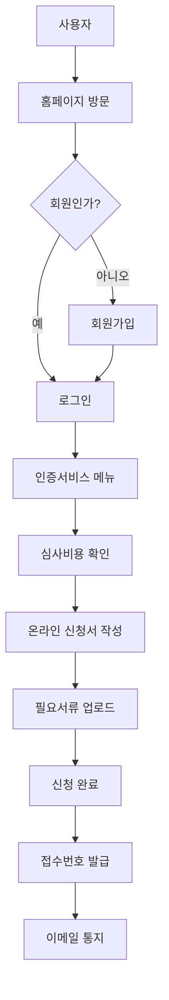
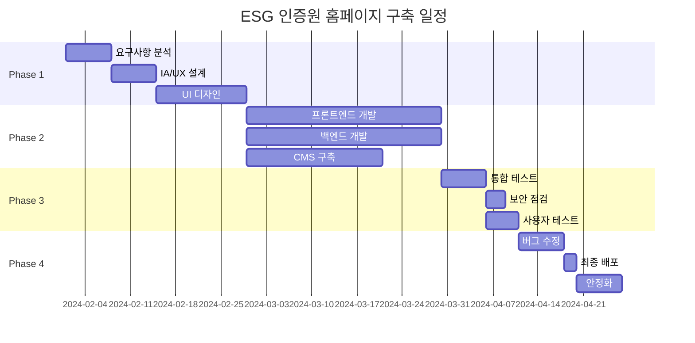

# ESG 인증원 홈페이지 구축 PRD
## Product Requirements Document

---

## 목차
1. [프로젝트 개요](#1-프로젝트-개요)
2. [이해관계자 및 타겟 사용자](#2-이해관계자-및-타겟-사용자)
3. [정보 구조 (IA)](#3-정보-구조-ia)
4. [기능 요구사항](#4-기능-요구사항)
5. [유스케이스](#5-유스케이스)
6. [디자인 요구사항](#6-디자인-요구사항)
7. [기술 요구사항](#7-기술-요구사항)
8. [보안 및 규정 준수](#8-보안-및-규정-준수)
9. [성과 측정 지표](#9-성과-측정-지표)
10. [프로젝트 일정](#10-프로젝트-일정)
11. [부록](#11-부록)

---

## 1. 프로젝트 개요

### 1.1 프로젝트 명
**ESG 인증원 홈페이지 구축 프로젝트**

### 1.2 프로젝트 배경
- ESG 인증원은 한국인정지원센터(KAB)로부터 인정받은 ESG 경영시스템 시범 인증기관
- 기존 www.esgrr.co.kr 사이트의 전면 개편 필요
- 디지털 전환 시대에 맞는 현대적이고 사용자 친화적인 웹사이트 구축 필요

### 1.3 프로젝트 목적
1. **전문성 강화**: ESG 경영시스템 시범 인증기관으로서의 전문성과 신뢰성 표현
2. **접근성 향상**: 인증 서비스의 투명성과 접근성 제공
3. **사용자 경험 개선**: 고객 중심의 직관적인 사용자 경험 제공
4. **비즈니스 성장**: 온라인 인증 신청 및 교육 신청 증가

### 1.4 핵심 메시지
- "고객에게 최적의 적합성 평가 서비스 제공"
- "공평성을 최고의 가치로 신뢰받는 인증서비스 제공"
- "인증의 전문성을 통한 인증프로세스의 완전성을 추구"

### 1.5 프로젝트 범위
- 반응형 웹사이트 디자인 및 개발
- CMS(Content Management System) 구축
- 온라인 인증 신청 시스템
- 교육 신청 및 관리 시스템
- 문서 관리 시스템

---

## 2. 이해관계자 및 타겟 사용자

### 2.1 주요 이해관계자
| 이해관계자 | 역할 | 주요 관심사 |
|-----------|------|------------|
| ESG 인증원 경영진 | 의사결정 | 브랜드 이미지, ROI |
| 인증팀 | 운영 관리 | 업무 효율성, 정확성 |
| 교육팀 | 교육 운영 | 교육 신청 관리 |
| IT팀 | 기술 지원 | 시스템 안정성, 보안 |

### 2.2 타겟 사용자 페르소나

#### 페르소나 1: 김대표 (중소기업 대표이사)
- **나이**: 45-55세
- **특징**: ISO 인증 필요성 인지, 비용 민감
- **니즈**: 명확한 인증 절차, 투명한 비용 정보
- **페인포인트**: 복잡한 인증 절차, 불명확한 비용

#### 페르소나 2: 이과장 (품질관리 담당자)
- **나이**: 35-45세
- **특징**: 실무 담당자, 상세 정보 필요
- **니즈**: 기술 자료, 신청서 양식, FAQ
- **페인포인트**: 자료 찾기 어려움, 문의 응답 지연

#### 페르소나 3: 박심사원 (인증 심사원)
- **나이**: 40-50세
- **특징**: 전문가, 정기적 사이트 방문
- **니즈**: 심사원 등록, 일정 관리, 자료 다운로드
- **페인포인트**: 복잡한 등록 절차

---

## 3. 정보 구조 (IA)

### 3.1 사이트맵

```
🏠 HOME
│
├── 📋 회사소개
│   ├── 기관소개
│   │   ├── 인사말
│   │   ├── 연혁
│   │   ├── 조직도
│   │   └── 품질방침
│   ├── 공평성 선언
│   └── 오시는 길
│
├── 🏆 인증서비스
│   ├── 인증절차
│   │   ├── 인증 프로세스
│   │   ├── 심사 단계별 안내
│   │   └── 필요 서류
│   ├── 심사비용 및 신청
│   │   ├── 비용 안내
│   │   ├── 온라인 신청
│   │   └── 신청서 다운로드
│   └── 기업준수사항
│       ├── 고객과의 약속
│       ├── 인증마크 사용 가이드
│       └── 사후관리
│
├── 📚 교육서비스
│   └── 교육소개
│       ├── 교육 과정 안내
│       ├── 교육 일정
│       ├── 교육 신청
│       └── 교육 자료실
│
├── 💬 고객서비스
│   ├── 공지사항
│   ├── 불만 및 이의제기
│   │   ├── 처리 절차
│   │   └── 온라인 접수
│   └── FAQ
│
└── 📁 자료실
    ├── ISO자료
    │   ├── ISO 9001
    │   ├── ISO 14001
    │   ├── ISO 45001
    │   └── ESG 경영시스템
    └── 심사원리스트
```

### 3.2 URL 구조
```
www.esgrr.co.kr/
├── /company/
│   ├── /about/
│   ├── /impartiality/
│   └── /location/
├── /certification/
│   ├── /process/
│   ├── /cost-application/
│   └── /compliance/
├── /education/
│   └── /overview/
├── /customer/
│   ├── /notice/
│   ├── /complaint/
│   └── /faq/
└── /resources/
    ├── /iso-documents/
    └── /auditor-list/
```

---

## 4. 기능 요구사항

### 4.1 공통 기능

#### 4.1.1 헤더 (Header)
```
기능 ID: COM-001
우선순위: 필수
```
- **로고**: 클릭 시 홈으로 이동
- **주 메뉴**: 드롭다운 메뉴 지원
- **유틸리티 메뉴**: 로그인, 회원가입
- **연락처 정보**: 전화번호 상시 표시
- **검색**: 통합 검색 기능

#### 4.1.2 푸터 (Footer)
```
기능 ID: COM-002
우선순위: 필수
```
- **회사 정보**: 주소, 전화, 이메일, 사업자등록번호
- **빠른 메뉴**: 주요 페이지 링크
- **인증 마크**: KAB, IAF MLA 마크 표시
- **정책**: 개인정보처리방침, 이용약관
- **SNS 링크**: 공식 SNS 계정 연결

### 4.2 홈페이지 (메인)

#### 4.2.1 히어로 섹션
```
기능 ID: HOME-001
우선순위: 필수
```
- **메인 비주얼**: 3-5개 슬라이드, 자동 재생
- **CTA 버튼**: "인증 신청하기" 프라이머리 버튼
- **핵심 메시지**: ESG 인증원의 비전과 미션

#### 4.2.2 서비스 소개
```
기능 ID: HOME-002
우선순위: 필수
```
- **인증 서비스 카드**: ISO 9001, 14001, 45001, ESG
- **호버 효과**: 카드 호버 시 상세 정보 표시
- **바로가기 링크**: 각 서비스 상세 페이지로 연결

#### 4.2.3 공지사항 위젯
```
기능 ID: HOME-003
우선순위: 필수
```
- **최신 공지**: 최근 5개 표시
- **더보기**: 공지사항 목록 페이지로 이동
- **NEW 아이콘**: 7일 이내 게시글 표시

### 4.3 회사소개

#### 4.3.1 기관소개
```
기능 ID: COMP-001
우선순위: 필수
```
- **인사말**: 대표이사 인사말과 사진
- **연혁**: 타임라인 형식으로 표현
- **조직도**: 인터랙티브 조직도
- **품질방침**: 3대 원칙 시각화

#### 4.3.2 공평성 선언
```
기능 ID: COMP-002
우선순위: 필수
```
- **4대 핵심 원칙**: 아이콘과 함께 표현
- **다운로드**: PDF 문서 다운로드 기능

#### 4.3.3 오시는 길
```
기능 ID: COMP-003
우선순위: 필수
```
- **지도**: 네이버/카카오 지도 API 연동
- **교통 정보**: 대중교통, 자가용 안내
- **주변 시설**: 주요 랜드마크 표시

### 4.4 인증서비스

#### 4.4.1 인증절차
```
기능 ID: CERT-001
우선순위: 필수
```
- **프로세스 다이어그램**: 단계별 시각화
- **단계별 설명**: 클릭 시 상세 정보 표시
- **소요 기간**: 각 단계별 예상 기간
- **다운로드**: 절차 안내서 PDF 다운로드

#### 4.4.2 심사비용 및 신청
```
기능 ID: CERT-002
우선순위: 필수
```
- **비용 계산기**: 인원수 입력 시 자동 계산
- **온라인 신청 폼**: 
  - 기업 정보 입력
  - 인증 규격 선택
  - 첨부 파일 업로드 (최대 10MB/파일)
- **신청서 다운로드**: HWP, DOC, PDF 형식 제공
- **진행 상태 조회**: 신청 번호로 조회

#### 4.4.3 기업준수사항
```
기능 ID: CERT-003
우선순위: 중요
```
- **체크리스트**: 인터랙티브 체크리스트
- **문서 다운로드**: 
  - 고객과의 약속
  - 인증마크 사용 가이드라인
  - 사후관리 안내서

### 4.5 교육서비스

#### 4.5.1 교육소개
```
기능 ID: EDU-001
우선순위: 중요
```
- **교육 과정 목록**: 필터링 및 정렬 기능
- **교육 일정 캘린더**: 월별 교육 일정 표시
- **온라인 신청**: 
  - 과정 선택
  - 수강생 정보 입력
  - 결제 (추후 구현)
- **교육 자료 다운로드**: 로그인 사용자만 가능

### 4.6 고객서비스

#### 4.6.1 공지사항
```
기능 ID: CS-001
우선순위: 필수
```
- **목록**: 페이지네이션, 검색, 카테고리 필터
- **상세보기**: 조회수, 첨부파일 다운로드
- **이전글/다음글**: 네비게이션

#### 4.6.2 불만 및 이의제기
```
기능 ID: CS-002
우선순위: 필수
```
- **처리 프로세스**: 7단계 프로세스 시각화
- **온라인 접수 폼**:
  - 유형 선택 (불만/이의제기)
  - 내용 작성 (최소 100자)
  - 첨부파일 업로드
  - 접수번호 발급
- **처리 현황 조회**: 접수번호로 진행상황 확인

#### 4.6.3 FAQ
```
기능 ID: CS-003
우선순위: 중요
```
- **카테고리별 분류**: 인증, 심사, 비용, 기타
- **검색**: 키워드 검색
- **아코디언 UI**: 질문 클릭 시 답변 표시

### 4.7 자료실

#### 4.7.1 ISO자료
```
기능 ID: RES-001
우선순위: 중요
```
- **자료 분류**: ISO 9001, 14001, 45001, ESG
- **파일 목록**: 
  - 제목, 등록일, 조회수, 다운로드 수
  - 파일 형식 아이콘 표시
- **다운로드**: 로그인 사용자만 가능
- **검색 및 필터링**

#### 4.7.2 심사원리스트
```
기능 ID: RES-002
우선순위: 중요
```
- **심사원 목록**: 
  - 성명, 자격구분, 심사자격, 계약구분
  - 페이지네이션
- **검색**: 이름, 자격으로 검색
- **엑셀 다운로드**: 전체 목록 다운로드

### 4.8 회원 기능

#### 4.8.1 회원가입
```
기능 ID: MEM-001
우선순위: 필수
```
- **가입 유형**: 개인/기업 선택
- **필수 정보**: 
  - ID (이메일)
  - 비밀번호 (8자 이상, 특수문자 포함)
  - 이름/회사명
  - 연락처
- **약관 동의**: 필수/선택 약관
- **이메일 인증**: 가입 완료 메일 발송

#### 4.8.2 로그인
```
기능 ID: MEM-002
우선순위: 필수
```
- **로그인 폼**: ID/PW 입력
- **자동 로그인**: 체크박스
- **ID/PW 찾기**: 이메일/휴대폰 인증
- **소셜 로그인**: 네이버, 카카오 (선택사항)

#### 4.8.3 마이페이지
```
기능 ID: MEM-003
우선순위: 중요
```
- **회원정보 수정**
- **신청 내역**: 인증 신청, 교육 신청 내역
- **다운로드 이력**: 자료 다운로드 이력
- **문의 내역**: 불만/이의제기 접수 내역

### 4.9 관리자 기능

#### 4.9.1 대시보드
```
기능 ID: ADM-001
우선순위: 필수
```
- **통계**: 방문자, 신청 현황, 다운로드 수
- **최근 활동**: 신규 신청, 문의사항
- **빠른 메뉴**: 주요 관리 기능 바로가기

#### 4.9.2 콘텐츠 관리
```
기능 ID: ADM-002
우선순위: 필수
```
- **게시물 관리**: CRUD 기능
- **파일 관리**: 업로드, 삭제, 분류
- **메뉴 관리**: 메뉴 구조 수정
- **팝업 관리**: 팝업 등록 및 기간 설정

#### 4.9.3 회원 관리
```
기능 ID: ADM-003
우선순위: 필수
```
- **회원 목록**: 검색, 필터링, 엑셀 다운로드
- **권한 관리**: 회원 등급 설정
- **활동 로그**: 회원별 활동 이력

#### 4.9.4 신청 관리
```
기능 ID: ADM-004
우선순위: 필수
```
- **인증 신청 관리**: 
  - 신청 목록 및 상태 관리
  - 심사원 배정
  - 일정 관리
- **교육 신청 관리**:
  - 수강생 관리
  - 출결 관리
  - 수료증 발급

---

## 5. 유스케이스

### 5.1 인증 신청 프로세스



### 5.2 주요 시나리오

#### 시나리오 1: 신규 기업의 ISO 9001 인증 신청
```
사용자: 김대표 (중소기업 대표)
목표: ISO 9001 인증 신청

1. 홈페이지 접속
2. 인증서비스 > 인증절차 확인
3. 심사비용 계산기로 예상 비용 확인
4. 회원가입 진행
5. 온라인 신청서 작성
   - 기업 정보 입력
   - ISO 9001 선택
   - 인원수 입력 (45명)
6. 필요 서류 업로드
   - 사업자등록증
   - 조직도
   - 프로세스 맵
7. 신청 완료 및 접수번호 확인
8. 이메일로 안내사항 수신
```

#### 시나리오 2: 불만사항 접수
```
사용자: 이과장 (기존 인증 기업)
목표: 심사 관련 불만사항 접수

1. 홈페이지 로그인
2. 고객서비스 > 불만 및 이의제기
3. 처리 프로세스 확인
4. 온라인 접수 클릭
5. 불만사항 작성
   - 유형: 불만
   - 내용: 심사 일정 관련 불만
   - 증빙자료 첨부
6. 접수 완료
7. 접수번호로 처리현황 조회
```

#### 시나리오 3: 교육 신청
```
사용자: 박과장 (품질관리팀)
목표: ISO 9001 내부심사원 교육 신청

1. 교육서비스 메뉴 클릭
2. 교육 과정 목록에서 'ISO 9001 내부심사원' 선택
3. 교육 일정 확인
4. 온라인 신청 클릭
5. 수강생 정보 입력
6. 신청 완료
7. 마이페이지에서 신청 내역 확인
```

---

## 6. 디자인 요구사항

### 6.1 브랜드 아이덴티티

#### 6.1.1 핵심 가치
- **친환경성**: ESG의 환경적 책임 표현
- **안정성**: 신뢰할 수 있는 인증기관 이미지
- **전문성**: 전문적이고 균형잡힌 브랜드 인상

#### 6.1.2 디자인 원칙
1. **Clean & Modern**: 깔끔하고 현대적인 디자인
2. **Trust & Professional**: 신뢰감과 전문성 표현
3. **User-Friendly**: 직관적이고 사용하기 쉬운 인터페이스
4. **Responsive**: 모든 디바이스에서 최적화된 경험

### 6.2 컬러 시스템

#### 6.2.1 프라이머리 컬러
```css
/* Primary Colors */
--main-green: #1d9132;    /* 로고 녹색 - ESG 환경적 가치 */
--main-brown: #994908;    /* 로고 갈색 - 안정성과 신뢰감 */
```

#### 6.2.2 세컨더리 컬러
```css
/* Secondary Colors */
--light-green: #4CAF50;   /* 버튼, 강조 요소 */
--dark-green: #0d4f1a;    /* 헤더, 푸터 배경 */
--light-brown: #D4A574;   /* 배경 포인트 */
--dark-brown: #5D2A04;    /* 텍스트 강조 */
```

#### 6.2.3 뉴트럴 컬러
```css
/* Neutral Colors */
--white: #FFFFFF;         /* 배경 */
--light-gray: #F8F9FA;    /* 섹션 구분 */
--medium-gray: #6C757D;   /* 보조 텍스트 */
--dark-gray: #343A40;     /* 메인 텍스트 */
```

#### 6.2.4 시스템 컬러
```css
/* System Colors */
--success: #1d9132;       /* 성공 (메인 그린 활용) */
--warning: #FFC107;       /* 경고 */
--error: #DC3545;         /* 오류 */
--info: #17A2B8;          /* 정보 */
```

### 6.3 타이포그래피

#### 6.3.1 폰트 시스템
```css
/* Font Family */
--font-primary: 'Noto Sans KR', sans-serif;   /* 본문 */
--font-heading: 'Noto Sans KR', sans-serif;   /* 제목 */
--font-english: 'Roboto', sans-serif;         /* 영문 */

/* Font Sizes */
--text-xs: 12px;
--text-sm: 14px;
--text-base: 16px;
--text-lg: 18px;
--text-xl: 20px;
--text-2xl: 24px;
--text-3xl: 30px;
--text-4xl: 36px;

/* Font Weights */
--font-regular: 400;
--font-medium: 500;
--font-bold: 700;
```

### 6.4 UI 컴포넌트

#### 6.4.1 버튼
```css
/* Primary Button */
.btn-primary {
    background: var(--main-green);
    color: white;
    padding: 12px 24px;
    border-radius: 4px;
    font-weight: 500;
    transition: all 0.3s ease;
}

.btn-primary:hover {
    background: var(--dark-green);
    transform: translateY(-2px);
    box-shadow: 0 4px 8px rgba(0,0,0,0.1);
}

/* Secondary Button */
.btn-secondary {
    background: white;
    color: var(--main-brown);
    border: 2px solid var(--main-brown);
    padding: 10px 22px;
}
```

#### 6.4.2 카드
```css
.card {
    background: white;
    border-radius: 8px;
    padding: 24px;
    box-shadow: 0 2px 8px rgba(0,0,0,0.08);
    transition: all 0.3s ease;
}

.card:hover {
    transform: translateY(-4px);
    box-shadow: 0 8px 16px rgba(0,0,0,0.12);
}
```

### 6.5 레이아웃 시스템

#### 6.5.1 그리드 시스템
```css
/* Container */
.container {
    max-width: 1200px;
    margin: 0 auto;
    padding: 0 20px;
}

/* Grid */
.grid {
    display: grid;
    gap: 24px;
}

.grid-cols-2 { grid-template-columns: repeat(2, 1fr); }
.grid-cols-3 { grid-template-columns: repeat(3, 1fr); }
.grid-cols-4 { grid-template-columns: repeat(4, 1fr); }
```

#### 6.5.2 반응형 브레이크포인트
```css
/* Breakpoints */
--mobile: 320px;
--tablet: 768px;
--desktop: 1024px;
--wide: 1440px;
```

### 6.6 애니메이션 및 인터랙션

#### 6.6.1 트랜지션
```css
/* Standard Transitions */
--transition-fast: 0.2s ease;
--transition-base: 0.3s ease;
--transition-slow: 0.5s ease;
```

#### 6.6.2 호버 효과
- 버튼: 색상 변경 + 그림자 + Y축 이동
- 카드: 그림자 강화 + Y축 이동
- 링크: 언더라인 애니메이션
- 이미지: 스케일 효과

### 6.7 아이콘 시스템
- **아이콘 라이브러리**: Font Awesome 6.0
- **사용 원칙**: 
  - 의미가 명확한 아이콘 사용
  - 텍스트와 함께 사용 권장
  - 일관된 크기와 스타일 유지

---

## 7. 기술 요구사항

### 7.1 프론트엔드

#### 7.1.1 기술 스택
- **Framework**: React 18.x 또는 Next.js 13.x
- **스타일링**: Tailwind CSS 3.x
- **상태관리**: Context API 또는 Redux Toolkit
- **폼 관리**: React Hook Form
- **HTTP 클라이언트**: Axios

#### 7.1.2 브라우저 지원
- Chrome (최신 2개 버전)
- Firefox (최신 2개 버전)
- Safari (최신 2개 버전)
- Edge (최신 2개 버전)
- Internet Explorer 11 (제한적 지원)

### 7.2 백엔드

#### 7.2.1 기술 스택
- **언어**: Node.js 18.x 또는 PHP 8.x
- **프레임워크**: Express.js 또는 Laravel
- **데이터베이스**: MySQL 8.0 또는 PostgreSQL 14
- **캐싱**: Redis
- **파일 저장소**: AWS S3 또는 로컬 스토리지

#### 7.2.2 API 설계
- **아키텍처**: RESTful API
- **인증**: JWT 토큰 기반
- **문서화**: Swagger/OpenAPI 3.0

### 7.3 인프라

#### 7.3.1 호스팅
- **웹 서버**: Nginx 또는 Apache
- **SSL**: Let's Encrypt SSL 인증서
- **CDN**: CloudFlare 또는 AWS CloudFront

#### 7.3.2 도메인
- **주 도메인**: www.esgrr.co.kr
- **서브도메인**: 
  - api.esgrr.co.kr (API 서버)
  - admin.esgrr.co.kr (관리자)

### 7.4 성능 요구사항
- **페이지 로드 시간**: 3초 이내
- **Time to Interactive**: 5초 이내
- **Core Web Vitals**:
  - LCP: 2.5초 이내
  - FID: 100ms 이내
  - CLS: 0.1 이하

### 7.5 SEO 요구사항
- **메타 태그**: 동적 생성
- **사이트맵**: XML 사이트맵 자동 생성
- **robots.txt**: 적절한 크롤링 규칙
- **구조화된 데이터**: Schema.org 마크업
- **Open Graph**: 소셜 미디어 공유 최적화

---

## 8. 보안 및 규정 준수

### 8.1 보안 요구사항

#### 8.1.1 인증 및 권한
- **비밀번호 정책**: 
  - 최소 8자 이상
  - 대소문자, 숫자, 특수문자 포함
  - 3개월마다 변경 권고
- **세션 관리**: 30분 미활동 시 자동 로그아웃
- **2단계 인증**: 관리자 계정 필수

#### 8.1.2 데이터 보호
- **암호화**: 
  - 전송: TLS 1.2 이상
  - 저장: AES-256 암호화
- **개인정보 마스킹**: 주민번호, 전화번호 등
- **백업**: 일일 백업, 30일 보관

#### 8.1.3 보안 취약점 대응
- **OWASP Top 10** 대응
- **정기 보안 점검**: 분기별
- **침투 테스트**: 연 1회

### 8.2 규정 준수

#### 8.2.1 개인정보보호
- **개인정보보호법** 준수
- **개인정보 처리방침** 명시
- **동의 절차** 구현
- **파기 정책** 수립

#### 8.2.2 접근성
- **웹 접근성 지침** (WCAG 2.1 Level AA)
- **키보드 네비게이션** 지원
- **스크린 리더** 호환성
- **명도 대비** 4.5:1 이상

---

## 9. 성과 측정 지표

### 9.1 비즈니스 KPI
| 지표 | 목표 | 측정 방법 |
|-----|------|----------|
| 월간 방문자 수 | 10,000명 | Google Analytics |
| 온라인 인증 신청 | 월 50건 | 시스템 통계 |
| 교육 신청 | 월 30건 | 시스템 통계 |
| 회원 가입 | 월 200명 | 데이터베이스 |
| 전환율 | 5% | 신청/방문자 |

### 9.2 기술 KPI
| 지표 | 목표 | 측정 방법 |
|-----|------|----------|
| 페이지 로드 시간 | < 3초 | Google PageSpeed |
| 가동률 | 99.9% | 모니터링 시스템 |
| 모바일 트래픽 | 40% | Google Analytics |
| 검색 순위 | 상위 10위 | SEO 도구 |
| 오류율 | < 1% | 로그 분석 |

### 9.3 사용자 경험 KPI
| 지표 | 목표 | 측정 방법 |
|-----|------|----------|
| 평균 체류 시간 | 3분 이상 | Google Analytics |
| 이탈률 | < 50% | Google Analytics |
| 페이지뷰/세션 | 4 이상 | Google Analytics |
| 작업 완료율 | 80% | 사용자 테스트 |
| 만족도 | 4.0/5.0 | 설문조사 |

---

## 10. 프로젝트 일정

### 10.1 프로젝트 단계



### 10.2 마일스톤
| 단계 | 일정 | 산출물 |
|-----|------|--------|
| Kick-off | 2024.02.01 | 프로젝트 계획서 |
| Phase 1 완료 | 2024.02.28 | IA, 와이어프레임, 디자인 |
| Phase 2 완료 | 2024.04.15 | 개발 완료 |
| Phase 3 완료 | 2024.04.30 | 테스트 보고서 |
| 최종 오픈 | 2024.05.15 | 라이브 사이트 |

### 10.3 프로젝트 팀 구성
| 역할 | 인원 | 주요 책임 |
|-----|------|----------|
| PM | 1명 | 프로젝트 총괄 관리 |
| UX/UI 디자이너 | 2명 | 디자인 설계 및 제작 |
| 프론트엔드 개발자 | 2명 | UI 구현 |
| 백엔드 개발자 | 2명 | 서버 및 DB 구축 |
| 퍼블리셔 | 1명 | 마크업 및 스타일링 |
| QA 엔지니어 | 1명 | 품질 보증 |

---

## 11. 부록

### 11.1 용어 정의
| 용어 | 설명 |
|-----|------|
| ESG | Environmental, Social, Governance |
| KAB | Korea Accreditation Board (한국인정지원센터) |
| IAF | International Accreditation Forum |
| ISO | International Organization for Standardization |
| CMS | Content Management System |
| CRUD | Create, Read, Update, Delete |

### 11.2 참고 문서
1. ESG 인증원 홈페이지 구축 프로젝트 지침서
2. 경영 시스템 인증 신청서 양식
3. 고객과의 약속 문서
4. 인증 마크 사용 가이드라인

### 11.3 연락처
- **프로젝트 관리자**: PM 담당자
- **기술 문의**: 개발팀장
- **디자인 문의**: 디자인팀장
- **ESG 인증원 담당**: 
  - 전화: 02-588-5114
  - 이메일: ycpark55@naver.com

### 11.4 변경 이력
| 버전 | 날짜 | 변경 내용 | 작성자 |
|------|------|----------|--------|
| 1.0 | 2024.01.15 | 초안 작성 | PM |
| 1.1 | 2024.01.22 | 기능 요구사항 추가 | PM |
| 1.2 | 2024.01.29 | 디자인 가이드 보완 | 디자인팀 |

---

**문서 끝**

*본 PRD는 ESG 인증원 홈페이지 구축 프로젝트의 기준 문서로, 프로젝트 진행 중 필요에 따라 업데이트될 수 있습니다.*